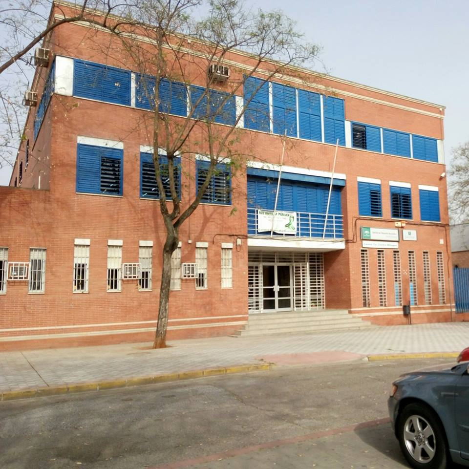

## Presentación

* **José Domingo Muñoz Rodríguez**
* Doy clases en el IES Gonzalo Nazareno (Dos Hermanas)
* Correo: josedom24@josedomingo.org
* Web: [www.josedomingo.org](https://www.josedomingo.org)
* Twitter: [pledin_jd](https://twitter.com/Pledin_JD)

# IES Gonzalo Nazareno

## IES Gonzalo Nazareno

::: columns

:::: column

::::

:::: column

- Gonzalo Nazareno (Dos Hermanas)
- Ciclos Formativos de Informática:
  * Ciclo de Grado Superior: ASIR 
      * (1º y 2º)
  * Ciclo de Grado Medio: SMR 
      * (Dos 1º y un 2º)
  * 10 profesores
  * Unos 110 alumnos.

::::

:::

# Introducción a la Virtualización

## Virtualización

### Objetivos

Aumentar el rendimiento del hardware disponible incrementando el tiempo de procesamiento de un
equipo, ya que habitualmente se desaprovecha gran parte.

### Método

Instalar varios sistemas operativos en una misma máquina real para que funcionen como máquinas virtuales.

## Técnicas de virtualización

Podríamos profundizar en los tipos de virtualización existente, pero nos vamos a quedar sólo con dos:

### Virtualización completa

Se virtualizan todos los elementos de una máquina real. En ocasiones es necesario *extensiones del procesador (vmx|svm)* que nos ofrecen mayor rendimiento. 

* Ejemplos: **Virtualbox, Hyper-V, VMWare, KVM, ...**

### Virtualización ligera

Se crean los llamados *Contenedores*. Un contenedor es un conjunto de procesos aislados que se ejecutan en un servidor, con su propio sistema de ficheros y con su configuración de red. Todos los contenedores comparten el kernel del anfitrión.

* Ejemplos: **LXC, Docker, Podman,...**

# Cloud Computing

## Cloud Computing

* El servicio disponible de forma automática y a demanda.
* Los servicios ofrecidos se comparten con otros usuarios. Pero asegurando el aislamiento y la seguridad.
* Los servicios ofrecidos se ejecutan un un cluster de ordenadores (**"nube"**).
* Los servicios son *elásticos*, Puedo crear o destruir recursos cuando sea necesario.
* Los servicios se *pagan por uso*.
* A los servicios ofrecidos con carácteristicas de **cloud** se le suelen denominar **... as a Service (...aaS)**.

## ... as a Service (...aaS)

### SaaS

* Cuando el servicio ofrecido son **aplicaciones web**. Ejemplos: gmail, dropbox, ...)

### PaaS

* Cuando el servicio que se ofrece es **una plataforma** para que los desarrolladores implanten sus aplicaciones web. Ejemplos: Heroku, OpenShiift,.... Los grandes proveedores de cloud: AWS, GGCE, Azure,... ofrecen servicios de ete tipo.

### IaaS

* Cuando el servicio ofrecido es **infraestrucutra virtualizada** (máquinas virtuales, almacenamiento, redes,...). Ejemplo: AWS, GCE, Azure, OpenStack, ...

## Tipos de despliegues

### Públicos

Una empresa ofrece servicios a terceros, encargándose de toda la gestión del Cloud. (**AWS, GCE, Azure, ...**). 

* Ventajas: elasticidad, costes, muchos servicios, no nos ocupamos de la gestión,...
* Desventajas: privacidad, seguridad, vendor lock-in, control sobre los datos, personalización, rendimiento, ...

### Privados

Una organización configura sus propios recursos de forma mucho más flexible en una nube. 

## OpenStack

## Cloud Computing

# Contenedores

## Contenedores

# Infraestructura: Evolución

## Infraestructura tradicional

## Virtualización de máquinas

## Infraestructura en nube

