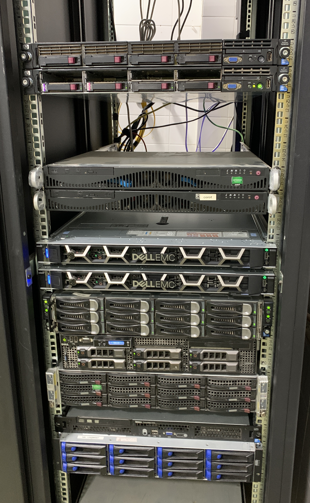
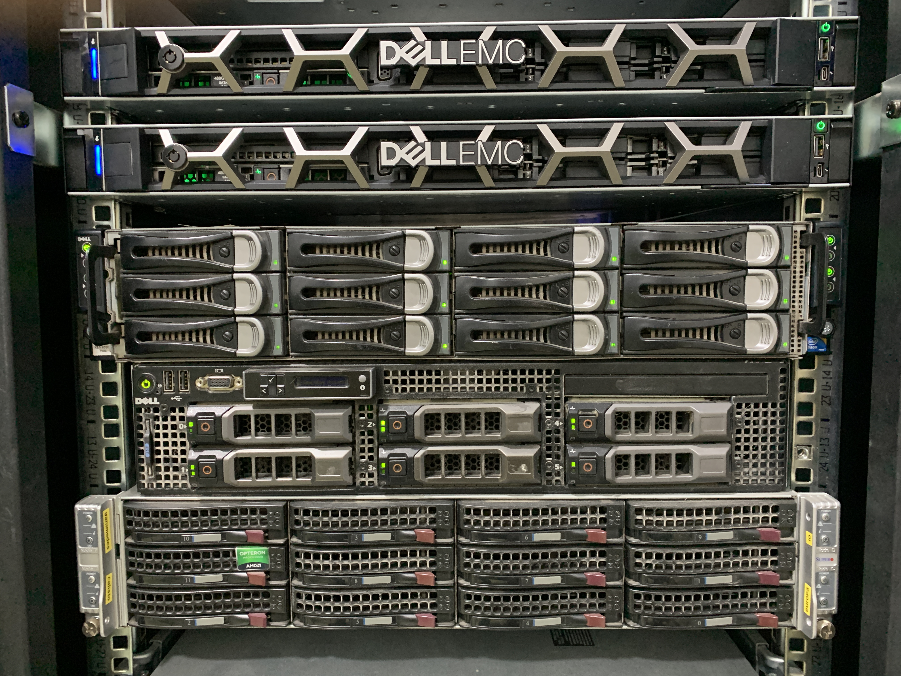

## Presentación

* **José Domingo Muñoz Rodríguez**
* Doy clases en el IES Gonzalo Nazareno (Dos Hermanas)
* Correo: josedom24@josedomingo.org
* Web: [www.josedomingo.org](https://www.josedomingo.org)
* Twitter: [pledin_jd](https://twitter.com/Pledin_JD)

# Introducción a la Virtualización

## Virtualización

### Objetivos

Aumentar el rendimiento del hardware disponible incrementando el tiempo de procesamiento de un
equipo, ya que habitualmente se desaprovecha gran parte.

### Método

Instalar varios sistemas operativos en una misma máquina real para que funcionen como máquinas virtuales.

## Técnicas de virtualización

Podríamos profundizar en los tipos de virtualización existentes, pero nos vamos a quedar sólo con dos:

### Virtualización completa

Se virtualizan todos los elementos de una máquina real. En ocasiones es necesario *extensiones del procesador (vmx|svm)* que nos ofrecen mayor rendimiento. 

* Ejemplos: **Virtualbox, Hyper-V, VMWare, KVM, ...**

### Virtualización ligera

Se crean los llamados *Contenedores*. Un contenedor es un conjunto de procesos aislados que se ejecutan en un servidor, con su propio sistema de ficheros y con su configuración de red. Todos los contenedores comparten el kernel del anfitrión.

* Ejemplos: **LXC, Docker, Podman,...**

# Cloud Computing

## Cloud Computing

* El servicio disponible de forma automática y a demanda.
* Los servicios ofrecidos se comparten con otros usuarios. Pero asegurando el aislamiento y la seguridad.
* Los servicios ofrecidos se ejecutan un un cluster de ordenadores (**"nube"**).
* Los servicios son *elásticos*, Puedo crear o destruir recursos cuando sea necesario.
* Los servicios se *pagan por uso*.
* A los servicios ofrecidos con carácteristicas de **cloud** se le suelen denominar **... as a Service (...aaS)**.

## ... as a Service (...aaS)

### SaaS

* Cuando el servicio ofrecido son **aplicaciones web**. Ejemplos: gmail, dropbox, ...)

### PaaS

* Cuando el servicio que se ofrece es **una plataforma** para que los desarrolladores implanten sus aplicaciones web. Ejemplos: Heroku, OpenShiift,.... Los grandes proveedores de cloud: AWS, GGCE, Azure,... ofrecen servicios de ete tipo.

### IaaS

* Cuando el servicio ofrecido es **infraestrucutra virtualizada** (máquinas virtuales, almacenamiento, redes,...). Ejemplo: AWS, GCE, Azure, OpenStack, ...

## Tipos de despliegues

### Públicos

Una empresa ofrece servicios a terceros, encargándose de toda la gestión del Cloud. (**AWS, GCE, Azure, ...**). 

* Ventajas: elasticidad, costes, muchos servicios, no nos ocupamos de la gestión,...
* Desventajas: privacidad, seguridad, vendor lock-in, control sobre los datos, personalización, rendimiento, ...

### Privados

Una organización configura sus propios recursos de forma mucho más flexible en una nube. 

## OpenStack

* Queremos instalar nuestro propio software para proporcionar IaaS
* Tenemos necesidad de infraestructura variable
* Software libre
* Proyecto estable, con muchos apoyos y muy buenas perspectivas de futuro
* Tiene muchas funcionalidades: \color{blue}[Openstack Components](https://www.openstack.org/software/project-navigator/openstack-components#openstack-services)\color{darkgray}
* Podemos utilizar hardware convencional
* Cada vez es más fácil de instalar

# Contenedores

## Contenedores

Un **contenedor** consiste en agrupar y aislar entre sí aplicaciones o grupos de aplicaciones que se ejecutan sobre un mismo núcleo de sistema operativo. Tipos:

* *Contenedores de Sistemas*: Se suelen usar como una máquina virtual, por ejemplo, *LXC (Linux Container)*.
* *Contenedores de Aplicaciones*: Se suelen usar para el despliegue de aplicaciones web, por ejemplo, *Docker*.

Desde el punto de vista de infraestructura: **un contenedor puede ejecutarse en una máquina física, virtual, ...**.

Si queremos gestionar contenedores que se ejecutan en un cluster de servidores usaremos los **Orquestados de contenedores**, por ejemplo: *Kubernetes*.

# Infraestructura: Evolución

## Infraestructura

**¿A qué llamamos infraestructura?**

Equipos para procesamiento, conexión y almacenamiento de datos

## Evolución

### Infraestructura tradicional

* Equipos físicos, configuración "manual", redes físicas, servidores de almacenamientos, infraestructura estática,...

### Virtualización de máquinas

*  Dentro de un equipo físico se ejecutan varias MVs, se usan redes virtuales, almacenamiento y gestión similar a la infraestructura tradicional.

### Infraestructura en nube

* Virtualización completa: MV, redes, almacenamiento; tenemos un cluster de servidores donde virtualizamos ("Nube"), infraestructura dinámica, configuración automática, el usuario sí puede gestionar su infraestructura,...

# IES Gonzalo Nazareno

## IES Gonzalo Nazareno

::: columns

:::: column
\centering

::::

:::: column

- Gonzalo Nazareno (Dos Hermanas)
- Ciclos Formativos de Informática:
  * Ciclo de Grado Superior: ASIR 
      * (1º y 2º)
  * Ciclo de Grado Medio: SMR 
      * (Dos 1º y un 2º)
  * 10 profesores
  * Unos 110 alumnos.

::::

:::

## OpenStack en el IES Gonzalo Nazareno

* Fruto de un un *Proyecto de Innovación* en que participamos en 2011.
* El proyecto nos proporcionó dinero para comprar los primeros servidores.
* Y formación sobre Cloud Computing.
* Instalamos la versión "Essex". Una de las primeras versiones estables.
* Instalación "manual" y muy compleja.
* En años sucesivos hemos desarrollado *playbooks de ansible* para hacer la instalación de forma automática.
  * \color{blue}[https://github.com/iesgn/openstack-debian-ansible/](https://github.com/iesgn/openstack-debian-ansible/)
  \color{darkgray}
* Necesidad de mantenimiento de los servidores (unas tres horas semanales).

## OpenStack ha revolucionado al IES Gonzalo Nazareno

* A los profesores implicados OpenStack ha sido la entrada al estudio y profundización de muchas tecnologías relacionadas (KVM, LVM, ISCSI, SDN, ansible,...)
* Desde el punto de vista educativo, nos ha cambiado la forma de trabajar:
  * Los alumnos tienen una plataforma donde crear diferentes escenarios.
  * Obtener máquinas de una forma ágil.
  * Escenarios reproducibles.
  * No dependencia de los equipos de los alumnos.
  * Los alumnos aprenden conceptos de cloud computing, extrapolables al cloud público.
  * Los profesores siempre tienen acceso a las máquinas (para corregir viene muy bien!!!)
  * Proyectos intermodulares y que tengan una continuidad en el tiempo.
  * Los alumnos trabajan con la API de OpenStack y con el cliente de línea de comandos.

## Proxmox en el IES Gonzalo Nazareno

* Proxmox es un *frontend* que nos ofrece un portal web y una serie de herramientas CLI para gestionar *máquinas virtuales* (KVM) y *Linux Container*.
* Proxmox nos ofrece distintas soluciones de almacenamiento para guardar los discos de las MV y contenedores.
* La utilización de redes virtuales es muy limitada.
* Posibilidad de crear un cluster de servidores para ampliar los recursos.
* Proxmox no se considera una solución de cloud computing, es una herramienta de *virtualización tradicional*.
* En determinados aspectos parecido a las soluciones ofrecidas por VMWare. 
* Pensado para que un "operador" cree máquinas virtuales que se van asignando a los usuarios. Pero configurable para que cada alumno trabaje con sus MV.
* Muy sencillo de instalar y mantener.

## Hardware disponible

::: columns

:::: column
\centering
{ height=80% }

::::

:::: column
\centering
{ height=80% }
::::

:::

## Hardware disponible

::: columns

:::: column
\centering
{ height=80% }

::::

:::: column

* OpenStack
  * Dos servidores convencionales (controlador y red)
    \tiny
    * Dell C6100 (Intel(R) Xeon E5506 - 8 núcleos) (48 Gb RAM) (HD convencional)
    
    \normalsize
  * Servidor de almacenamiento (SAN)
    \tiny
    * Dell R710 (Intel(R) Xeon E5620 - 8 núcleos) (8 Gb RAM) (HD RAID5 8Tb)

    \normalsize
  * Dos servidores de computación
    \tiny
    * Dell R440 (Intel Xeon Silver 4208 - 16 núcleos) (128 Gb RAM) (HD convencional 1T)
    * Supermicro (AMD Opteron Processor 6220 - 16 núcleos) (128 Gb RAM) (HD convencional 1T)
  
::::

:::

## Hardware disponible

::: columns

:::: column
\centering
{ height=80% }

::::

:::: column

* Proxmox
  * En la actualidad un servidor:
    * Dell R440 (Intel Xeon Silver 4208 - 16 núcleos) (128 Gb RAM) (HD convencional 1T)
  * Mejoras:
    * Almacenamiento remoto ofrecido por nuestro servidor de almacenamiento.
    * En un futuro, añadir al cluster de proxmox otro nodo:
    * Supermicro (AMD Opteron Processor 6220 - 16 núcleos) (128 Gb RAM) (HD convencional 1T)
::::

:::

## Opciones de instalación de OpenStack

* Instalación manual: \color{blue}[Documentación](https://docs.openstack.org/xena/install/)\color{darkgray}
* Instalación automatizada: \color{blue}[https://github.com/iesgn/openstack-debian-ansible/](https://github.com/iesgn/openstack-debian-ansible/)
  \color{darkgray}
* Métodos oficiales:
  * \color{blue}[OpenStack Charms Deployment Guide](https://docs.openstack.org/project-deploy-guide/charm-deployment-guide/xena/)\color{darkgray}: Específico de Ubuntu - Juju.
  * \color{blue}[Kolla Ansible Deployment Guide](https://docs.openstack.org/project-deploy-guide/kolla-ansible/xena/)\color{darkgray}: Instalación automática con ansible sobre docker.
  * \color{blue}[OpenStack-Ansible Deployment Guide](https://docs.openstack.org/project-deploy-guide/openstack-ansible/xena/)\color{darkgray}: Instalación automática con ansible sobre LXC.
* Distribuciones propias:
  * \color{blue}[RDO](https://www.rdoproject.org/)\color{darkgray} (Centos).
  * \color{blue}[microstack](https://ubuntu.com/openstack)\color{darkgray} (Ubuntu).
  * \color{blue}[Más distribuciones...](https://www.openstack.org/marketplace/distros/)\color{darkgray}.

## Consejos, trucos, como lo hicimos nosotros ...

* La instalación de OpenStack conlleva un **proceso** de aprendizaje. Nosotros tardamos más de curso en tenerlo preparado.
* Involucrar al alumnado. Tenemos una asignatura de **HLC** que la convertimos en una asignatura de **Cloud Computing**.
* *Junto a los alumnos* empezamos a estudiar diferentes temáticas que eran necesaria: virtualización, almacenamiento,...
* *Junto a los alumnos* empezamos  a hacer las pruebas de instalación en entornos de prueba.
* Recomendación: **Hacer una instalación manual**. (**Ubuntu**, openSUSE, **CentOS** o Debian)
* Utilizar entornos de prueba: máquinas virtuales (el escenario de puede crear con vagrant).
* A Continuación probar una solución automatizada: \color{blue}[solución automatizada](https://github.com/iesgn/openstack-debian-ansible/)
  \color{darkgray}. Estudiarla, y adaptarla a vuestras necesidades.
* Los métodos oficiales conllevan un conocimiento más profundo.

## Consejos, trucos, como lo hicimos nosotros ... (II)

* El proceso de instalación de OpenStack no debe recaer en una **sola persona**, se debe involucrar un **equipo**.
* OpenStack requiere un mantenimiento (En nuestro casos 3 horas de reducción).
* Se puede configurar de distintas maneras, pero nosotros decidimos la **creación de un Proyecto para cada alumno**.
* La utilización de un LDAP para la gestión de alumnos facilita la gestión.
* Desarroollo de herramientas propias (python) para automatizar la creación y borrado de los proyectos de los alumnos:  \color{blue}[iesgncloud](https://github.com/iesgn/iesgncloud)\color{darkgray}.
* Formación para los profesores.

## Elegir una versión de openstack

* Las versiones tienen 18 meses de soporte directo
* Ya no hay grandes diferencias en los componentes esenciales
* Elegir qué componentes son necesarios: keystone, nova, glance, neutron, cinder, heat, ...
* No siempre la última versión es la mejor opción, ya que puelen aparecer "bugs" en los primeros meses.
* Las opciones recomendadas en estos momentos serían Wallaby y Xena. \color{blue}[Openstack Realeases](https://releases.openstack.org/)\color{darkgray}.
* Yoga acaba de salir (marzo 2022).
* La actualización de versiones complicada. Nosotros siempre hemos empezado de 0.

