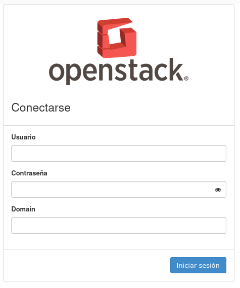
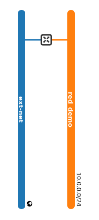

## Presentación

* **José Domingo Muñoz Rodríguez**
* Doy clases en el IES Gonzalo Nazareno (Dos Hermanas)
* Correo: josedom24@josedomingo.org
* Web: [www.josedomingo.org](https://www.josedomingo.org)
* Twitter: [pledin_jd](https://twitter.com/Pledin_JD)

# Introducción a OpenStack

## Conceptos previos. Horizon.

::: columns

:::: {.column width=70%}

* **Horizon**: Aplicación web escrita en python/django para la gestión de OpenStack.

* Acceso mediante usuario/contraseña.
* El **Dominio** nos permite escoger los usuarios del LDAP.
* Podemos realizar muchas operaciones:
  * Gestionar instancias
  * Gestiona claves ssh
  * Gestionar volúmenes
  * Gestionar redes
  * Gestionar el cortafuego de la instancia
  * Gestionar la IP flotantes para acceder a las instancias
  * ...
* Otras operaciones es necesario el uso del CLI (cliente de terminal):openstack-client.

::::

:::: column

\centering
{ height=70% }

::::

:::

## Conceptos previos. Instancias

* **Imagen**: Imagen de sistema preconfigurado que se utiliza como base para crear instancias. \color{blue}[Get images](https://docs.openstack.org/image-guide/obtain-images.html)\color{darkgray}. Normalmente ficheros qcow2 o img. El componente que gestiona las imágenes es **Glance**.
* **Instancia**: Clon de una imagen que se crea a demanda del usuario en uno de los nodos de computación del cloud.
* Las instancias son gestionadas por el componente **Nova** de Openstack.

### ¿Cómo accedemos a las instancias?
* Se puede usar distintos protocolos (ssh,RDP,...). 
* **Par de claves ssh**: Utilizadas para acceder por ssh a las instancias desde fuera del cloud.

## Conceptos previos. Configuración de la instancia

* Al crear una instancia se elige el **Sabor**: Que nos determina el nº de vCPU, RAM y HD de la máquina.
* Al crear una instancia desde una imagen se ejecuta \color{blue}[Cloud-init](https://cloud-init.io/) \color{darkgray}  que es el programa encargado de configurar la máquina.
\newline

### ¿Qué se configura?

* El hostname de la máquina.
* Se inyecta la clave pública para que podamos acceder por ssh.
* Se configura la red.
* Se puede configurar las contraseñas de los usuarios.
* ...

## Conceptos previos. Redes.

Las instancias se crean conectas a redes privada definidas por el usuario.

::: columns

:::: {.column width=70%}

* La instancia toma por DHCP una **IP fija** en el direccionamiento de la red interna.
* Para acceder desde el exterior asignamos a la instancia una **IP flotante** en el direccionamiento de la red externa.
* La **IP flotante** se configura como una regla DNAT en el router que une la red interna con la externa.
* Cada interface de red tiene un cortafuego que controlamos con el **Grupo de Seguridad** donde podemos abrir distintos puertos y protocolos.
* Las redes son gestionadas por el componente **Neutron** de Openstack.
::::

:::: column

\centering
{ height=70% }

::::

:::

# DEMO 1: Creación y gestión de una instancia

## Conceptos previos. Volúmenes.

* La instancia que hemos creado en la DEMO 1 pierde toda la información cuando la eliminamos.
* Si queremos trabajar con información persistente necesitamos usar los **Volumenes**.
* Los volúmenes son gestionados por el componente **Cinder** de Openstack.
* Varias funcionalidades:
  * Creación de volúmenes que podemos conectar a una instancia para guardar información.
  * Creación de instancias sobre volúmenes. Si eliminamos la instancia la información no se pierde.
  * ... 

# DEMO 2: Creación de una instancia sobre un volumen. Trabajo con volúmenes.
