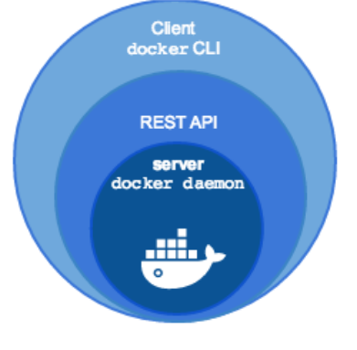
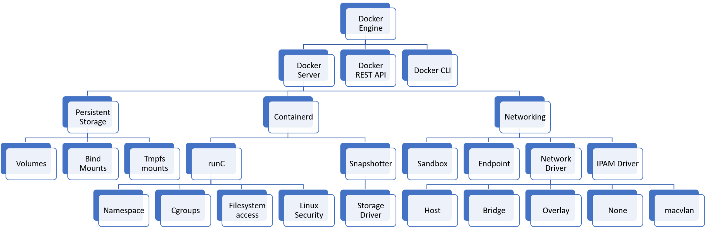

## Docker

Docker es una tecnología de virtualización "ligera" cuyo elemento básico es la utilización de contenedores en vez de máquinas virtuales y cuyo objetivo principal es el despliegue de aplicaciones encapsuladas en dichos contenedores.

Establece una nueva metodología en el despliegue de aplicaciones en contenedores:

\centering
**build, ship and run**

## Docker

* “docker”: estibador
* Pertenece a los denominados contenedores de aplicaciones
* Nuevo paradigma. Cambia completamente la forma de desplegar y distribuir una aplicación
* Docker: build, ship and run
* Lo desarrolla la empresa Docker, Inc.
* Instalación y gestión de contenedores simple
* El contenedor ejecuta un comando y se para cuando éste termina, no es un sistema operativo al uso, ni pretende serlo
* Escrito en go
* Software libre (ha ido cambiando con el tiempo)

## Software docker

::: columns

:::: {.column width=60%}

* docker engine
  * demonio docker
  * docker API
  * docker CLI
* docker registry
  * Aplicación que permite distribuir las imágenes docker
  * Registro privado (instalado en un servidor local)/ Registro público (El proyecto nos ofrece [**Docker Hub**](https://hub.docker.com/))
* docker-compose
  * Para definir aplicaciones que corren en múltiples contenedores
* docker swarm
  * Orquestador de contenedores
::::

:::: {.column width=40%}

{height=50%}

::::

:::

## Componentes de Docker

\centering
{height=40%}

* El componente **Docker Server** del **Docker Engine** esta formado por tres componentes:
  * **Persistent Storage**: Componente que gestiona el almacenamiento para los contenedores
  * **Networking**: Componente que gestiona las redes que usan los contenedores
  * **Containerd**: Es el componente que gestiona el ciclo de vida de los contenedores: creación, ejecución, eliminación,... Para ello usa el siguiente componente:
      * **runC**: Que es el encargado de ejecutar los contenedores, es similar a LXC.

## Docker en la actualidad

* Docker ha revolucionado el uso de los contenedores, para el despliegue de aplicaciones web.
* En 2015 se crea la [**Cloud Native Computing Foundation (CNCF)**](https://www.cncf.io/) como un proyecto de la Linux Fundation para ayuda en el avance de todos las iniciativas y proyectos sobre la tecnología de contenedores.
* Todas las empresas tecnológicas forman parte de la CNCF. [Ver miembros](https://www.cncf.io/about/members/)
* Aunque la empresa Docker Inc estaba triunfando con el uso de Docker, si quería seguir teniendo peso en el mundo de los contenedores se unió a la CNCF. (Julio de 2016).

## Docker en la actualidad

* Otro proyecto de la Linux Fundation es la [**Open Container Initiative (OCI)**](https://opencontainers.org/), que es la encargada de estandarizar distintos elementos de la tecnología de contenedores: [runtime-spec](http://www.github.com/opencontainers/runtime-spec), [image-spec](http://www.github.com/opencontainers/image-spec), [distribution-spec](https://github.com/opencontainers/distribution-spec).
* Docker Inc al ser miembro de la CNCF "dona" a la OCI *contairnerd* y *runC*.
* Además, las imágenes de contenedores Docker y su distribución se hacen estándar, cumpliendo el modelo desarrollado por la OCI.
* *runC* y *containerd* son proyectos de software libre independientes de docker.
* Podemos obtener docker de varias formas:
  * **Moby** (proyecto de comunidad) (docker.io de debian)
  * **docker CE** (docker engine proporcionado por Docker inc)
  * **docker EE** (docker engine + servicios de Docker inc)
* Nacen nuevos proyectos que manejan contenedores de aplicación bajo los estándares de la OCI.

## Alternativas a docker

* **rkt**: inicialmente desarrollado por CoreOS. Actualmente dentro de la CNCF: [https://github.com/rkt/rkt](https://github.com/rkt/rkt) y enfocado a ser una alternativa a containerd.
* **cri-o**: Creado por Red Hat como alternativa a containerd y pensado solo para funcionar integrado en kubernetes. [https://cri-o.io/](https://cri-o.io/)
* **podman**: Creado por Red Hat como alternativa a docker. [https://podman.io](https://podman.io)
* **pouch**: Creado por Alibaba como alternativa a docker. [https://pouchcontainer.io](https://pouchcontainer.io)
* **kata**: MVs ligeras para para proporcionar mayor aislamiento. [https://katacontainers.io/](https://katacontainers.io/)
* **nemu**: [https://github.com/intel/nemu](https://github.com/intel/nemu)
* **firecracker**: Desarrollado por AWS. [https://github.com/firecracker-microvm/firecracker](https://github.com/firecracker-microvm/firecracker)

## El mundo de los contenedores en la actualidad

* Docker ha revolucionado el uso de los contenedores, para el despliegue de aplicaciones web.
* Pero docker tiene algunas limitaciones:
  * El proceso de actualización de versiones en producción
  * ¿Cómo se balancea la carga entre contenedores iguales?
  * ¿Cómo se conectan contenedores que se ejecutan en diferentes demonios de docker?
  * ¿Se puede hacer una actualización de una aplicación sin interrupción?
  * ¿Se puede variar a demanda el número de réplicas de un determinado contenedor?

Las respuestas a estas preguntas y otras similares tiene que venir del uso de un **orquestador de contenedores**.

## Orquestadores de contenedores

Un **Orquestador de contendores** es un programa que gestiona los contenedores que se ejecutan en un cluster de servidores. Nos ofrece muchas características: actualizaciones automáticas, balanceo de carga, tolerancia a fallos, escalabilidad, ...

Distintos proyectos de software libre:

::: columns

:::: column

* Docker swarm
* Apache Mesos

::::
:::: column
* Hashicorp Nomad
* Kubernetes
::::
:::
Hoy en día se acepta generalmente que el vencedor ha sido **kubernetes**. ¿Por qué?: Gran cantidad de empresas implicadas, iniciada por Google pero donada a la CNCF con un versión inicial muy madura, un gran número de aplicaciones complementarias,...

El resto de proyectos siguen activos, como alternativas más sencillas a k8s o en su propio nicho