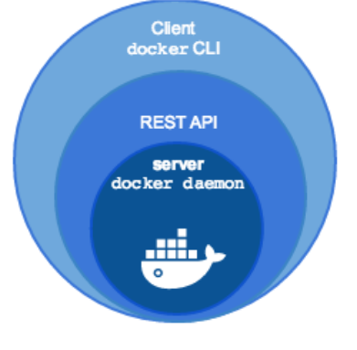

## Presentación

* **José Domingo Muñoz Rodríguez**
* Doy clases en el IES Gonzalo Nazareno (Dos Hermanas)
* Correo: josedom24@josedomingo.org
* Web: [www.josedomingo.org](https://www.josedomingo.org)
* Twitter: [pledin_jd](https://twitter.com/Pledin_JD)
* [Otros cursos...](https://plataforma.josedomingo.org)

## Virtualización ligera

Se crean los llamados *Contenedores*. Un contenedor es un conjunto de procesos aislados que se ejecutan en un servidor, con su propio sistema de ficheros y con su configuración de red. Todos los contenedores comparten el kernel del anfitrión.

* Ejemplos: **LXC, Docker, Podman,...**

## Contenedores

Un **contenedor** consiste en agrupar y aislar entre sí aplicaciones o grupos de aplicaciones que se ejecutan sobre un mismo núcleo de sistema operativo. Tipos:

* *Contenedores de Sistemas*: Se suelen usar como una máquina virtual, por ejemplo, *LXC (Linux Container)*.
* *Contenedores de Aplicaciones*: Se suelen usar para el despliegue de aplicaciones web, por ejemplo, *Docker*.

Desde el punto de vista de infraestructura: **un contenedor puede ejecutarse en una máquina física, virtual, ...**.

Si queremos gestionar contenedores que se ejecutan en un cluster de servidores usaremos los **Orquestados de contenedores**, por ejemplo: *Kubernetes*.

## Contenedores y aplicaciones

**¿Qué aplicaciones web son más idóneas para desplegar en contenedores?**

* Si tenemos aplicaciones monolíticas, vamos a usar un esquema **multicapa**, es decir cada servicio (servicio web, servicio de base de datos, ...) se va a desplegar en un contenedor.
* Realmente, las aplicaciones que mejor se ajustan al despliegue en contenedores son la desarrolladas con **microservicios**:
  * Cada componente de la aplicación ("microservicio") se puede desplegar en un contenedor.
  * Comunicación vía HTTP REST y colas de mensajes
  * Facilita enormemente las actualizaciones de versiones de cada componente
  * ...

## Docker

Docker es una tecnología de virtualización "ligera" cuyo elemento básico es la utilización de contenedores en vez de máquinas virtuales y cuyo objetivo principal es el despliegue de aplicaciones encapsuladas en dichos contenedores.

Establece una nueva metodología en el despliegue de aplicaciones en contenedores:

\centering
**build, ship and run**

## Docker

* “docker”: estibador
* Pertenece a los denominados contenedores de aplicaciones
* Nuevo paradigma. Cambia completamente la forma de desplegar y distribuir una aplicación
* Docker: build, ship and run
* Lo desarrolla la empresa Docker, Inc.
* Instalación y gestión de contenedores simple
* El contenedor ejecuta un comando y se para cuando éste termina, no es un sistema operativo al uso, ni pretende serlo
* Escrito en go
* Software libre (ha ido cambiando con el tiempo)

## Software docker

::: columns

:::: {.column width=60%}

* docker engine
  * demonio docker
  * docker API
  * docker CLI
* docker registry
  * Aplicación que permite distribuir las imágenes docker
  * Registro privado (instalado en un servidor local)/ Registro público (El proyecto nos ofrece [**Docker Hub**](https://hub.docker.com/))
* docker-compose
  * Para definir aplicaciones que corren en múltiples contenedores
* docker swarm
  * Orquestador de contenedores
::::

:::: {.column width=40%}

{height=50%}

::::

:::

## Docker en la actualidad

* Docker ha revolucionado el uso de los contenedores, para el despliegue de aplicaciones web.
* En 2015 se crea la [**Cloud Native Computing Foundation (CNCF)**](https://www.cncf.io/) como un proyecto de la Linux Fundation para ayuda en el avance de todos las iniciativas y proyectos sobre la tecnología de contenedores.
* Todas las empresas tecnológicas forman parte de la CNCF. [Ver miembros](https://www.cncf.io/about/members/)
* Aunque la empresa Docker Inc estaba triunfando con el uso de Docker, si quería seguir teniendo peso en el mundo de los contenedores se unió a la CNCF. (Julio de 2016).
* Los dos componentes fundamentales de docker: *runC* y *containerd* son proyectos de software libre independientes de docker.
* Además, las imágenes de contenedores Docker y su distribución se hacen estándar.

## Docker en la actualidad

* Podemos obtener docker de varias formas:

  * **Moby** (proyecto de comunidad) (docker.io de debian)
  * **docker CE** (docker engine proporcionado por Docker inc)
  * **docker EE** (docker engine + servicios de Docker inc)

* Nacen nuevos proyectos que manejan contenedores de aplicación bajo los estándares de la CNCF: 

  * **cri-o**: Creado por Red Hat como alternativa a containerd y pensado solo para funcionar integrado en kubernetes. [https://cri-o.io/](https://cri-o.io/)
  * **podman**: Creado por Red Hat como alternativa a docker. [https://podman.io](https://podman.io)
  * **pouch**: Creado por Alibaba como alternativa a docker. [https://pouchcontainer.io](https://pouchcontainer.io)

## El mundo de los contenedores en la actualidad

* Docker ha revolucionado el uso de los contenedores, para el despliegue de aplicaciones web.
* Pero docker tiene algunas limitaciones:
  * El proceso de actualización de versiones en producción
  * ¿Cómo se balancea la carga entre contenedores iguales?
  * ¿Cómo se conectan contenedores que se ejecutan en diferentes demonios de docker?
  * ¿Se puede hacer una actualización de una aplicación sin interrupción?
  * ¿Se puede variar a demanda el número de réplicas de un determinado contenedor?

Las respuestas a estas preguntas y otras similares tiene que venir del uso de un **orquestador de contenedores**.

## Orquestadores de contenedores

Un **Orquestador de contendores** es un programa que gestiona los contenedores que se ejecutan en un cluster de servidores. Nos ofrece muchas características: actualizaciones automáticas, balanceo de carga, tolerancia a fallos, escalabilidad, ...

Distintos proyectos de software libre:

::: columns

:::: column

* Docker swarm
* Apache Mesos

::::
:::: column
* Hashicorp Nomad
* Kubernetes
::::
:::
Hoy en día se acepta generalmente que el vencedor ha sido **kubernetes**. ¿Por qué?: Gran cantidad de empresas implicadas, iniciada por Google pero donada a la CNCF con una versión inicial muy madura, gran número de aplicaciones complementarias,...
El resto de proyectos siguen activos, como alternativas más sencillas a k8s o en su propio nicho.

\centering
**¿Es necesario docker para que funcione Kubernetes?**