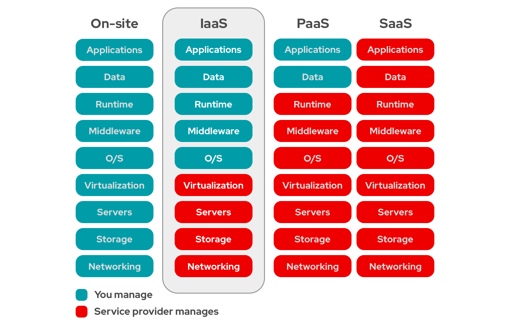
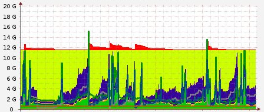

# Infraestructura: Evolución

## ¿A qué llamamos infraestructura?

**Equipos para procesamiento, conexión y almacenamiento de datos.**

## Infraestructura tradicional

* Adquisición de equipos
* Montaje físico
* Instalación y configuración "manual"
* Conexión a través de redes físicas
* Gestión del almacenamiento NAS o SAN
* Estática: Mismas configuraciones durante años
* Usuarios sin acceso directo

## Virtualización de máquinas

* Dentro de un solo equipo físico se ejecutan varias MVs
* El sw para la gestión de MVs se denomina hipervisor
* Se conectan las MVs entre sí en redes virtuales
* Sin cambios relevantes en almacenamiento
* Gestión similar a la infraestructura tradicional
* Ejemplos: KVM, Xen, Proxmox, VMWare,...

## Infraestructura en nube

* Virtualización de máquinas
* Virtualización de la red
* Virtualización del almacenamiento
* Agrupamiento de los recursos
* Dinámica
* Configuración automática
* El usuario sí puede gestionar su infraestructura

## 

{height=80%}

# Cloud Computing

## Características

* El servicio disponible de forma automática y a demanda.
* Los servicios ofrecidos se comparten con otros usuarios. Pero asegurando el aislamiento y la seguridad.
* Los servicios ofrecidos se ejecutan un un cluster de ordenadores (**"nube"**).
* Los servicios son *elásticos*, Puedo crear o destruir recursos cuando sea necesario.
* Los servicios se *pagan por uso*.
* A los servicios ofrecidos con características de **cloud** se le suelen denominar **... as a Service (...aaS)**.

## ... as a Service (...aaS)

* Modelo de negocio no basado en la venta de licencias o hardware
* Oferta de servicios con caracterísicas de cloud
* Habitualmente se definen tres capas o niveles: SaaS, PaaS e IaaS

## Software as a Service (SaaS)

* Aplicación como servicio en la nube
* El usuario utiliza una aplicación a través de la web en lugar de tenerla instalada en el propio equipo. Aviso: No todas las aplicaciones web son SaaS, deben cumplir con las características.
* Utilizado por cualquier usuario
* Ya lo usamos, pero se prevé que se use cada vez más
* Ejemplos: Servicios de Google, Office365

## Platform as a Service (PaaS)

* Plataforma de desarrollo web en la nube
* Utilizado por desarrolladores de software
* Se proporciona toda la plataforma de desarrollo y despliegue de una aplicación al desarrollador
* Ejemplos: Heroku, Openshift, CloudFoundry,...

## Infrastructure as a Service (IaaS)

* Infraestructura como servicio en la nube
* Utilizado principalmente por administradores de sistemas
* Se proporciona principalmente capacidad de cómputo, redes y diversos modos de almacenamiento
* Ejemplos: Amazon Web Services, Google Compute Engine, Microsoft Azure, OpenStack,...

## 

{height=80%}

## Tipos de despliegues

* **Público**: Una empresa ofrece servicios a terceros, encargándose de toda la gestión del Cloud.
* **Privado**: Una organización configura sus propios recursos de forma mucho más flexible en una nube. En inglés también se denomina "On premise cloud"
* **Híbrido**: Se utilizan recursos de la nube privada o de una o varias nubes públicas en función de las características de cada caso o las necesidades puntuales que haya. Normalmente utilizan una API común que permita una buena integración.

## Cloud privado us Cloud público

* Los clouds públicos están bien, pero tienen algunos aspectos negativos:
	* Privacidad
	* Seguridad
	* Vendor lock-in
	* Control sobre los datos
	* Personalización
	* ¿Rendimiento?
	* ¿Costes?
* Un cloud privado o híbrido es una opción a tener en cuenta si estos aspectos importan.

## IaaS

* **Público**: Amazon Web Services, Google Compute Engine, Microsoft Azure,...
* **Prívado**: VMware y plataformas de Software Libre, principalmente OpenStack

**IaaS es muy adecuada para servicios con demanda variable como el web.**

{height=40%}

## Ejemplo de servicio en IaaS público

**Servicio web de vídeo bajo demanda**

* Problema: Requisitos de hardware muy variables con grandes picos y valles.
* Alto coste en infraestructura tradicional.
* Solución: Clúster con un número de nodos variable en el tiempo y que se ajuste a la demanda:
	* Se incluyen balanceadores para repartir la carga
	* Se crean de forma automática nuevos servidores cuando se precisa
	* Cuando baja la demanda, se eliminan los servidores que sobren.

# OpenStack

## OpenStack

**Software libre para crear nubes públicas y privadas**

{height=40%}

## ¿Por qué OpenStack?

* Queremos instalar nuestro propio software para proporcionar IaaS
* Tenemos necesidad de infraestructura variable
* Software libre
* Proyecto estable, con muchos apoyos y muy buenas perspectivas de futuro
* Tiene muchas funcionalidades: \color{blue}[Openstack Components](https://www.openstack.org/software/project-navigator/openstack-components#openstack-services)\color{darkgray}
* Podemos utilizar hardware convencional
* Cada vez es más fácil de instalar

## Inicios de OpenStack

* El proyecto OpenStack nace sobre 2010 de dos iniciativas diferentes:
	* La empresa **RockSpace** trabaja sobre un software de almacenamiento. Almacenamiento de Objetos.
	* La **NASA** trabaja por un software para IaaS.
* En Septiembre de 2012 se cede el control del proyecto a la **OpenStack Foundation**, actualmente \color{blue}[OpenInfra Foundation](https://openinfra.dev)\color{darkgray} que acoge todos los desarrolladores, empresas,... que trabajan en OpenStack.
* Se funda para promover el desarrollo, distribución y adopción de OpenStack.
* Participación individual o como empresa.
* \color{blue}[Miembros de la OpenInfra Foundation](https://openinfra.dev/join/members/)\color{darkgray}.

## Proyecto OpenStack

* Licencia Apache 2.0, no existe versión "enterprise"
* Proceso de diseño abierto
* Repositorios públicos de código fuente
* Todos los procesos de desarrollo deben estar documentados y ser transparentes
* Orientado para adoptar estándares abiertos
* Diseño modular flexible mediante APIs web

## Versiones de OpenStack

* El nombre de la versión en un principio (hasta la versión W) eran nombres de ciudades donde se celebraba el meeting anual de OpenStack.
* A partir de la versión Wallaby, el nombre de la versión ha sido propuesto por la comunidad.
* A partir de 2023, el nombre de la versión tendrá el año, el número de versión por año, y una palabra que vuelva a empezar por A. (**2023.1 Antelope**).
* Dos versiones por año.
* \color{blue}[Release Identification/Name](https://governance.openstack.org/tc/reference/release-naming.html)
	* Zed (2022-10-05)
	* Yoga (2022-03-30)
	* Xena (2021-10-06)
	* \color{blue}[Más...](https://releases.openstack.org/)\color{darkgray}
		
## Componentes de Openstack

* **Nova**: Gestión de las máquinas virtuales (Computación).
* **Keystone**: Componente de autentificación.
* **Glance**: Gestión de imágenes.
* **Neutron**: Gestión de redes.
* **Cinder**: Gestión de almacenamiento (dispsitivos de bloque).
* **Horizon**: Aplicación web Dashboard.

Los que no tenemos instalados:

* Swift: Object Storage
* Heat: Orchestration
* Ceilometer: Telemetry 	
* Ironic: Bare metal
* Sahara: Hadoop, Spark
* Trove: DBaaS
*  \color{blue}[Openstack Components](https://www.openstack.org/software/project-navigator/openstack-components#openstack-services)\color{darkgray}

## OpenStack en el IES Gonzalo Nazareno

* Fruto de un un *Proyecto de Innovación* en que participamos en 2011.
* El proyecto nos proporcionó dinero para comprar los primeros servidores.
* Y formación sobre Cloud Computing.
* Instalamos la versión "Essex". Una de las primeras versiones estables.
* Instalación "manual" y muy compleja.
* En años sucesivos hemos desarrollado *playbooks de ansible* para hacer la instalación de forma automática.
  * \color{blue}[https://github.com/iesgn/openstack-debian-ansible/](https://github.com/iesgn/openstack-debian-ansible/)
  \color{darkgray}

## Hardware disponible

::: columns

:::: column
\centering
{ height=80% }

::::

:::: column
\centering
{ height=80% }
::::

:::

## Hardware disponible

::: columns

:::: column
\centering
{ height=80% }

::::

:::: column

* OpenStack
  * Dos servidores convencionales (controlador y red)
    \tiny
    * Dell C6100 (Intel(R) Xeon E5506 - 8 núcleos) (48 Gb RAM) (HD convencional)
    
    \normalsize
  * Servidor de almacenamiento (SAN)
    \tiny
    * Dell R710 (Intel(R) Xeon E5620 - 8 núcleos) (8 Gb RAM) (HD RAID5 8Tb)

    \normalsize
  * Dos servidores de computación
    \tiny
    * Dell R440 (Intel Xeon Silver 4208 - 16 núcleos) (128 Gb RAM) (HD convencional 1T)
    * Supermicro (AMD Opteron Processor 6220 - 16 núcleos) (128 Gb RAM) (HD convencional 1T)
  
::::

:::

## Configuración de las máquinas en OpenStack: Cloud-init

* La creación de un servidor en IaaS (instancia) es un proceso peculiar, que requiere un tratamiento específico.
* Se parte de una imagen mínima, sin contraseña establecida y con una configuración totalmente genérica.
* Imprescindible la configuración inicial:
	* Generación de la clave ssh de la instancia
	* Parámetros de red, hostname, etc.
	* Autenticación del usuario (clave ssh)
* Configuración no esencia

## El proyecto cloud-init
* cloud-init: cloud instance initialization
* Estándar de facto en nube pública o privada
* Desarrollado en python
* Proyecto liderado por Canonical
* Paquete cloud-init instalado habitualmente en las imágenes para IaaS
*  \color{blue}[Documentación](https://cloudinit.readthedocs.io) \color{darkgray}

## Datos para la instancia

Una instancia que se inicia o reinicia, puede obtener diferentes tipos de datos, en función del origen de estos:

* **Metadatos**: Obtenidos del servidor de metadatos del proveedor de nube (típicamente a través de dirección de enlace local `http://169.254.169.254`). Incluye las características propias de la instancia: nombre, configuración de red, tamaño de los discos, etc.
* **Datos de usuario** (opcional): Datos adicionales de configuración que proporciona el usuario de la instancia (*user-data*).
* **Datos del proveedor** (opcional): Datos adicionales de configuración proporcionados por el proveedor (*vendor-data*).

## user-data: cloud-config

Hay varios formatos aceptados para introducir *user-data*, el más habitual es mediante el formato YAML conocido como cloud-config.

* \color{blue}[Documentación](https://cloudinit.readthedocs.io/en/latest/topics/modules.html) \color{darkgray}

* \color{blue}[Ejemplos](https://cloudinit.readthedocs.io/en/latest/topics/examples.html) \color{darkgray}

