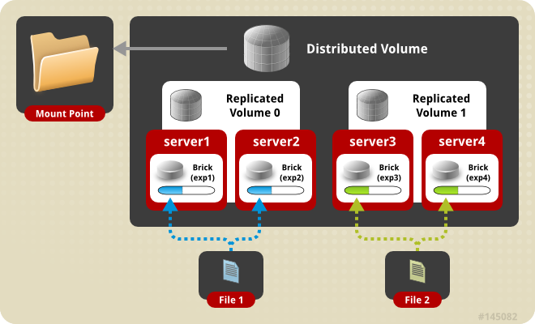

## GlusterFS

\color{blue}[GlusterFS](https://www.gluster.org/) \color{darkgray} es un sistema de archivos en red escalable y distribuído, definido para ser utilizado en el espacio de usuario, es decir, sin utilizar el espacio de almacenamiento crítico del sistema, y de esta forma no compromete el rendimiento.

\color{blue}[Documentación oficial](https://docs.gluster.org)

## GlusterFS

* Gluster es una forma sencilla de aprovisionar su propio backend de almacenamiento NAS utilizando casi cualquier hardware que elija.
* La recuperación de errores (failover) se hace de forma automática, de modo que si un servidor se cae, no se pierde el acceso a los datos. Cuando se recupera el servidor que ha fallado no hay que hacer nada para recuperar los datos, excepto esperar. Mientras tanto, la copia más actual de los datos se sigue sirviendo desde los nodos que estaban operativos.
* Se puede acceder a los datos de Gluster desde los clientes tradicionales NFS, SMB/CIFS o usando el cliente nativo.

## Ventajas

* **Simplicidad**: Es fácil de utilizar y al ser ejecutado en el espacio de usuario es independiente del núcleo.
* **Elasticidad**: Se adapta al crecimiento y reduce el tamaño de los datos.
* **Escalabilidad**: Tiene disponibilidad de Petabytes y más.
* **Velocidad**: Elimina los metadatos y mejora el rendimiento considerablemente unificando los datos y objetos.

## Conceptos

* El **"trusted pool"** (pool de confianza) es el término utilizado para definir un cluster de nodos en Gluster.
* **brick** (ladrillo): será el directorio (donde hemos montado un dispositivo de bloque) que compartirá cada nodo del clúster. 
* **Volumen**: Un volumen es una colección lógica de Bricks.

## Tipos de volúmenes (I)

* **Volumen distribuido**: Este es el tipo de volumen por defecto en GlusterFS, si no se especifica un tipo de volumen concreto. Los archivos se distribuyen en varios bricks en el volumen, de forma que el archivo 1 sólo podrá almacenarse en el brick 1 o en el brick 2, pero no en ambos, por lo que no habrá redundancia de datos. Este tipo de volumen distribuido hace que sea más fácil y barato escalar el tamaño del volumen. No obstante, este tipo de volumen, al no proporcionar redundancia, puede sufrir la pérdida de los datos en caso de que uno de los dos bricks falle, por lo que es necesario realizar un backup de los archivos con una aplicación externa a GlusterFS.

## Volumen distribuido

\centering
{height=70%}

## Tipos de volúmenes (II)

* **Volumen replicado**: Con este tipo de volumen eliminamos el problema ante la pérdida de datos que se experimenta con el volumen distribuido. En el volumen replicado se mantiene una copia exacta de los datos en cada uno de los bricks. El número de réplicas se configura por el usuario al crear el volumen, si queremos dos réplicas necesitaremos al menos dos bricks, si queremos tres réplicas necesitaremos tres bricks, y así sucesivamente. Si un brick está dañado, todavía podremos acceder a los datos mediante otro brick. Este tipo de volumen se utiliza para obtener fiabilidad y redundancia de datos.

## Volumen replicado

\centering
{height=70%}

## Tipos de volúmenes (III)

* **Volumen distribuido replicado**: En este tipo de volumen los datos se distribuyen en conjuntos duplicados de bricks. El número de bricks debe ser un múltiplo del número de réplicas. También es importante el orden en que especifiquemos los bricks porque los bricks adyacentes serán réplicas entre ellos. Este tipo de volumen se utiliza cuando se necesita una alta disponibilidad de los datos debido a su redundancia a la escalabilidad del tamaño de almacenamiento. Si tenemos ocho bricks y configuramos una réplica de dos, los dos primeros bricks serán réplicas el uno del otro, y luego los dos siguientes, y así sucesivamente. Esta configuración se denomina 4×2. Si tenemos ocho bricks y configuramos una réplica de cuatro, los cuatro primeros bricks serán réplicas entre ellos y se denominará 2×4.

## Volumen distribuido replicado

\centering
{height=70%}

## Tipos de volúmenes (IV)

* **Volumen seccionado (Striped)**: Imagina un archivo de gran tamaño que se almacena en un brick al que se accede con frecuencia desde muchos clientes al mismo tiempo. Esto provocaría demasiada carga en un solo brick y reduciría considerablemente el rendimiento. En un volumen seccionado los archivos se almacenan en diferentes bricks después de haberse dividido en secciones, de forma que un archivo grande se divide en diferentes secciones y cada sección se almacena en un brick. De este modo se distribuye la carga y el archivo puede ser recuperado más rapidamente, pero en este tipo de volumen perderemos la redundancia de los datos.

## Volumen seccionado (Striped)

\centering
{height=70%}

## Tipos de volúmenes (V)

**Volumen seccionado distribuido**: Este volumen es similar al volumen seccionado, excepto que las secciones en este caso pueden ser distribuídas en más cantidad de bricks.

## Volumen seccionado distribuido

\centering
{height=70%}

