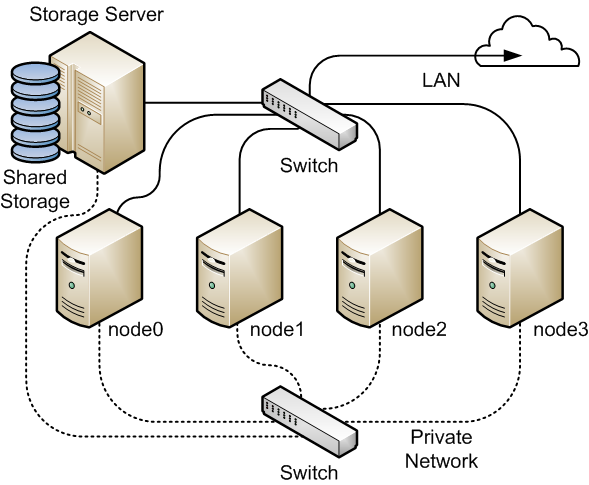

## OCFS2

**OCFS** (*Oracle Cluster File System*) es un sistema de archivos de discos compartidos o sistema de archivos distribuido para clústeres de servidores de sistemas GNU/Linux desarrollado por Oracle Corporation distribuidos bajo los términos de la GNU General Public License.

**OCFS2 (versión 2)** fue integrada dentro de la versión 2.6.16 del núcleo Linux.

Oracle Cluster File System version 2 (OCFS2) is a general-purpose, high-performance, high-availability, shared-disk file system intended for use in clusters. It is also possible to mount an OCFS2 volume on a standalone, non-clustered system. 

\color{blue}[Documentación oficial](https://docs.oracle.com/en/operating-systems/oracle-linux/7/fsadmin/ol7-ocfs2.html)

## OCFS2

Aunque OCFS2 se puede utilizar para formatear un sistema de archivo local: \color{blue}[Enlace](https://docs.oracle.com/en/operating-systems/oracle-linux/7/fsadmin/ol7-ocfs2.html#ol7-crlcl-ocfs2)\color{darkgray}. Su verdadero potencial es cuando lo utilizamos en un cluster:

\centering
{height=70%}

## Cluster OCFS2

* Tenemos que crear un cluster (*Cluster Stack*) ocfs2 indicando los nodos que van a formar parte de él.
* Utilizamos dos servicios: 
  * **o2cb**: Encargado de gestionar el cluster
  * **ocfs2**: Encargado de gestionar el sistema de fichero distribuido.
* Para formatear con ocfs2, usamos: `mkfs.ocfs2`.
* \color{blue}[Documentación oficial](https://docs.oracle.com/en/operating-systems/oracle-linux/7/fsadmin/ol7-ocfs2.html#ol7-instcfg-ocfs2)
