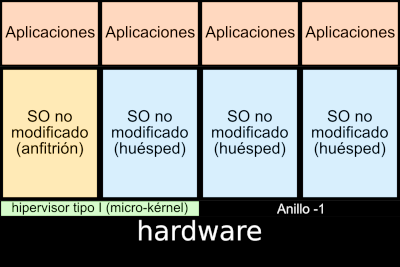

# Virtualización

## ¿Qué es la virtualización?

###

Según la Wikipedia: La virtualización utiliza el software para imitar las características del hardware y crear un sistema informático virtual.

###

Nos permite ejecutar más de un sistema virtual, y múltiples sistemas operativos y aplicaciones, en un solo servidor, aumentando el rendimiento del hardware disponible e incrementando el tiempo de procesamiento de un equipo, ya que habitualmente se desaprovecha gran parte.

## ¿Para qué se utiliza la virtualización?

* Aislamiento e independencia de servicios y contenidos.
* Laboratorio de pruebas.
* Virtualización de arquitecturas de las que no se dispone.
* Creación de clúster de máquinas y sistemas distribuidos.
* Herramientas de aprendizajes

## Ventajas y desventajas de la virtualización

### Ventajas

* Importante ahorro económico.
* Seguridad.
* Mayor aprovechamiento de recursos.
* Migración en vivo.
* Importante ahorro energético.

### Desventajas

* Muchos sistemas dependen de un sólo equipo físico.
* Penalizaciones en rendimiento.

## Conceptos de virtualización

* Al sistema operativo que ejecuta el software de virtualización se le conoce como **anfitrión (host)**. El anfitrión controla el hardware real.
* Al sistema operativo virtualizado se le conoce como **invitado o huésped (guest)**.
* Al software de virtualización se le suele llamar **Hipervisor**.
* Desde 2005, Intel y AMD han añadido soporte hardware para la virtualización: Intel Virtualization Technology (VT) y AMD Virtualization (AMD-V), y permiten a los hipervisores un rendimiento mayor en su labor de virtualizar.

# Tipos de virtualización

## Emulación

::: columns
:::: {.column width=40%}
{height=60%} 
::::
:::: {.column width=60%}

* El hipervisor imita o suplanta vía software una arquitectura al completo (procesador, memoria, conjunto de instrucciones, comunicaciones...). 
* Los programas se creen que se están ejecutando en una arquitectura concreta.
* Rendimiento bastante bajo.
* Ejemplo: QEMU, Microsoft Virtual PC, Wine, ...
::::
:::

## Virtualización por hardware
::: columns
:::: {.column width=40%}
{height=60%} 
::::
:::: {.column width=60%}

* El hipervisor simula un hardware suficiente para permitir que un sistema operativo no adaptado se ejecute de forma aislada.
* Usamos **hipervisores de tipo 1**, que controlan directamente el hardware físico del host ofreciéndolo directamente a la máquina virtual. 
* Es imprescindible que la CPU del host tenga las extensiones de virtualización. 
* Ejemplos: Xen, Kernel-based Virtual Machine (KVM), Microsoft Hyper-V, VMware ESXi,...
::::
:::

## Virtualización completa
::: columns
:::: {.column width=40%}
{height=60%} 
::::
:::: {.column width=60%}

* Al igual que la anterior: El hipervisor simula un hardware suficiente para permitir que un sistema operativo no adaptado se ejecute de forma aislada.
* Usamos **hipervisores de tipo 2**, que se instala sobre el sistema operativo del host, pero no controla directamente el hardware físico. 
* Ofrecen menos rendimiento que la virtualización por hardware. 
* Ejemplos: VMware Workstation, Parallels Desktop, VirtualBox, VMware Player, ...
::::
:::

## Virtualización parcial o paravirtualización
::: columns
:::: {.column width=40%}
{height=60%} 
::::
:::: {.column width=60%}

* El hipervisor ofrece un interfaz especial para acceder a los recursos. 
* En ocasiones, es necesario la adaptación del sistema operativo de la máquina virtual. 
* Ofrecen el máximo rendimiento, pero no se pueden usar sistemas operativos sin modificaciones o hardware especifico. 
* Ejemplos: XEN, Microsoft Hyper-V, VMware ESXi, ...
::::
:::

## Virtualización ligera o en contenedores
::: columns
:::: {.column width=40%}
{height=60%} 
::::
:::: {.column width=60%}

* También llamada **virtualización a nivel de sistema operativo**, o **virtualización basada en contenedores**. 
* Sobre el núcleo del sistema operativo se ejecuta una capa de virtualización que permite que existan múltiples instancias aisladas de espacios de usuario (**contenedor**). 
* Por lo tanto, un contenedor es un conjunto de procesos aislados, que se ejecutan en un servidor, y que acceden a un sistema de ficheros propio, tienen una configuración red propio y accede a los recursos del host (memoria y CPU).

::::
:::

## Virtualización ligera o en contenedores

* Tipos:
	* **Contenedores de Sistemas**: El uso que se hace de ellos es muy similar al que hacemos sobre una máquina virtual: se accede a ellos (normalmente por ssh), se instalan servicios, se actualizan, ejecutan un conjunto de procesos, ... Ejemplo: LXC(Linux Container).
	* **Contenedores de Aplicación**: Se suelen usar para el despliegue de aplicaciones web Ejemplo: Docker, Podman, ...

# Introducción a QEMU/KVM

## QEMU/KVM

###

**QEMU** es un emulador genérico y de código abierto de máquinas virtuales.. Se puede usar como emulador, permitiendo ejecutar sistemas operativos de una determinada arquitectura (por ejemplo ARM) sobre otra arquitectura (por ejemplo amd64). Pero también, puede ofrecer una solución de virtualización completa, usando hipervidores como KVM para utilizar las extensiones del procesador para la virtualización y ofrecer un rendimiento mayor.

###

**KVM**, la Maquina virtual basada en el kernel (Kernel-based Virtual Machine), es un hipervisor de tipo 1 integrado al kernel de Linux. Es una solución de virtualización completa para Linux, que contienen las extensiones de virtualización Intel VT o AMD-V. Se compone de un módulo del kernel kvm.ko, que provee la infraestructura de virtualización base, y un módulo específico para el tipo de procesador, kvm-intel.ko o kvm-amd.ko.

## Dispositivos paravirtualizados

* En un sistema de virtualización completa como QEMU/KVM todos los dispositivos (discos, tarjetas de red,...) están inicialmente emulados por software, de manera que la máquina virtual interactúa con un dispositivo como si lo hiciera con uno físico equivalente. **Poco rendimiento!!!**.
* KVM proporciona una alternativa al uso de dispositivos emulados, que se conocen como dispositivos paravirtualizados y se engloban bajo la denominación **virtIO**. **El rendimiento muy cercano al real**.

# Introducción a libvirt

## libvirt

* Normalmente no trabajamos directamente con las aplicaciones ofrecidas por QEMU/KVM para la gestión de recursos virtualizados. Es más fácil usar libvirt, una API intermedia que nos facilita la comunicación con QEMU/KVM.
* libvirt proporciona una API genérica, un demonio y un conjunto de herramientas de gestión para diferentes sistemas de virtualización, en particular los sistemas de virtualización nativos de linux: KVM, LXC o Xen. 

## Mecanismos de conexión a libvirt

### Acceso local con un usuario no privilegiado

Nos conectamos a la URI **qemu:///session**. Se acceden a las máquinas virtuales de ese usuario. En este modo de conexión, el usuario no suele tener permisos para crear conexiones de red.

### Acceso local privilegiado

Nos conectamos a la URI **qemu:///system**. Se acceden a las máquinas virtuales del sistema.

### Acceso remoto privilegiado por ssh

Nos conectamos a la URI **qemu+ssh:///system**. Nos permite conexiones remotos a servidor que corren libvirt.

## Aplicaciones para usar libvirt

* **virsh**: Es el cliente por línea de comandos "oficial" de libvirt. Ofrece una shell completa para el manejo de la API.
* **virt-manager**: Es una aplicación gráfica (GUI) que nos proporciona muchas de las funcionalidades para trabajar con libvirt.
* **virtinst**: Paquete que proporciona los comandos virt-clone, virt-install y virt-xml útiles para crear y copiar máquinas virtuales.
* **virt-viewer**: Programa que nos permite acceder a a la consola gráfica de una máquina virtual.
* **gnome-boxes**: Aplicación gráfica muy simple, que utilizando el acceso local con usuario no privilegiado, nos permite gestionar, de forma sencilla, máquinas virtuales.

# Introducción a LXC

## Linux Containers

**LinuX Containers (LXC)**, es una tecnología de virtualización ligera o por contenedoreS.
Todo esto ha sido posible por el desarrollo de dos componentes del nucleo de Linux:

* Los **Grupos de Control cgroups**, en concreto en Debian 11 se utiliza cgroupsv2: que limita el uso de recursos (límite de memoria, cpu, I/O o red) para un proceso y sus hijos.
* Los **Espacios de Nombres namespaces**: que proporcionan un punto de vista diferente a un proceso (interfaces de red, procesos, usuarios, etc.).

LXC pertenece a los denominados **contenedores de sistemas**, su gestión y ciclo de vida es similar al de una máquina virtual tradicional. Está mantenido por Canonical y la página oficial es linuxcontainers.org.

## LXD

**LXD, Linux Container Daemon**, es una herramienta de gestión de los contenedores y máquinas virtuales del sistema operativo Linux, desarrollada por Canonical.

* LXD ofrece una REST API que podemos usar con una simple herramienta de línea de comandos o con herramientas de terceros.
* LXD gestiona instancias, que pueden ser de tipos: contenedores, usando LXC internamente, y máquinas virtuales usando QEMU internamente.
