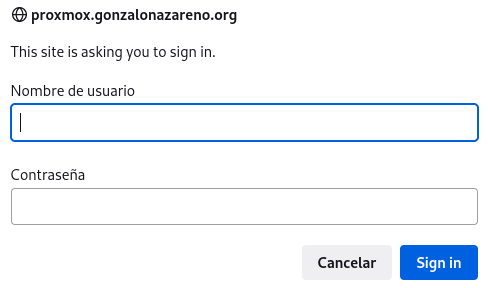
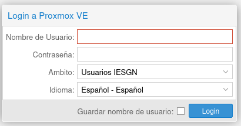
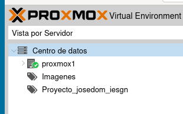

# ¿Qué es la virtualización?

## ¿Qué es la virtualización?

La virtualización utiliza el software para imitar las características del hardware y crear un sistema informático virtual.

### ¿Para qué se utiliza la virtualización?

* Aislamiento e independencia de servicios y contenidos.
* Laboratorio de pruebas.
* Virtualización de arquitecturas de las que no se dispone.
* Creación de clúster de máquinas y sistemas distribuidos.
* Herramientas de aprendizajes.

## Ventajas e inconvenientes de la virtualización

Las principales ventajas que podemos indicar serían:

* Importante ahorro económico.
* Seguridad.
* Mayor aprovechamiento de recursos.
* Migración en vivo. 
* Importante ahorro energético.

Como desventajas podríamos señalar:

* Muchos sistemas dependen de un sólo equipo físico.
* Penalizaciones en rendimiento.

## Conceptos de virtualización

* Al sistema operativo que ejecuta el software de virtualización se le conoce como anfitrión (**host**). El anfitrión controla el hardware real.
* Al sistema operativo virtualizado se le conoce como invitado o huésped (**guest**).
* Al software de virtualización se le suele llamar **Hipervisor**.
* Desde 2005, Intel y AMD han añadido soporte hardware para la virtualización: **Intel Virtualization Technology (VT) y AMD Virtualization (AMD-V)**, y permiten a los hipervisores un rendimiento mayor en su labor de virtualizar.

## Tipos de virtualización (1)

* **Emulación**: El hipervisor imita o suplanta vía software una arquitectura al completo (procesador, memoria, conjunto de instrucciones, comunicaciones...). Rendimiento muy bajo. Ejemplo: **Qemu, Microsoft Virtual PC,...**.
* **Virtualización por hardware**: Los **Hipervisores de tipo 1** controlan directamente el hardware del host, ofreciéndolo a la MV. Necesitamos a la fuerza que la CPU tenga extensiones de virtualización. Ofrece el mejor rendimiento. Ejemplo: **En Linux KVM, Proxmox utiliza internamente KVM.**

## Tipos de virtualización (2)

* **Virtualización completa**: Los **Hipervisores de tipo 2** no controlan directamente el hardware del host. Ofrecen menos rendimiento que la virtualización por hardware. Ejemplo: **Viertualbox**.
* **Virtualización ligera**: O virtualización basada en contenedores. Un contenedor es un conjunto de procesos que se ejecutan en el host, que tienen su propio sistema de ficheros y su propia configuración de red. Se pueden considerar una **mini máquina virtual**. Ejemplo: **Docker, LXC, ...**

# Introducción a Proxmox VE

## Virtualización con Proxmox VE

**Proxmox Virtual Environment**, o **Proxmox VE** es un entorno de virtualización de servidores de código abierto. Es una distribución de GNU/Linux basada en Debian que permite el despliegue y la gestión de máquinas virtuales y contenedores.

Nos permite gestionar los siguientes recursos virtualizados:

* **Máquinas virtuales**: Para ello utiliza **virtualización por hardware** con el uso del hipervisor KVM.
* **Contenedores**: Podemos gestionar **contenedores de sistema** LXC.

## Otras características

* Ofrece una consola web para la gestión de los recursos virtualizados.
* Ofrece herramientas de línea de comandos para la gestión de los recursos virtualizados.
* Permite la creación de un clúster de servidores Proxmox.
* Si tenemos configurado un clúster de servidores Proxmox tendremos características de alta disponibilidad y de migraciones en vivo.
* Permite el uso de muchos tipos de medios de almacenamiento.
* Permite la configuración de la red que van a utilizar las máquinas virtuales y los contenedores.
* Es un programa de código abierto.
* Hay una gran comunidad de soporte y ayuda.
* ...

## Proxmox en el Gonzalo Nazareno (1)

* Para acceder usamos la URL: **https://proxmox.gonzalonazareno.org**.
* Si accedes desde fuera del instituto, te va  a pedir un usuario y una contraseña (**El profesor la dice en clase**):

{height=40%}

* **ATENTOS: En clase tenéis que estar conectados a la red del departamento para que el acceso seá más rápido. No debéis estar conectadas a la Wifi de Andared!!!**

## Proxmox en el Gonzalo Nazareno (2)

{height=40%}

* Tienes que poner tu nombre de usuario y contraseña.
* En el campo **Ámbito** tienes que poner **Usuarios IESGN**.

## Vista general de Proxmox VE: Cabecera

* **Barra de búsqueda** nos permite  buscar objetos específicos (VM,
contenedores.
* **Documentacion**: nos muestran la documentación de Proxmox VE.
* **Crear VM**: Abre el asistente para crear una máquina virtual.
* **Crear CT**: Abre el asistente de creación de contenedores.
* **Usuario** identificado en la sesión: Nos permite modificar la
  configuración del usuario que ha accedido.

## Vista general de Proxmox VE: Árbol de recursos

{height=20%}

En esta zona encontramos los objetos disponibles. Los recursos lo
podemos ver con distintas vistas:

* **Vista de Servidor**: Muestra todos los objetos, agrupados por nodos (servidores del clúster). Es la vista por defecto.
* **Vista por Carpetas**: Muestra todos los objetos, agrupados por tipo (Nodos, Conjunto de Recursos / Pools, MV, Almacenamiento)
* **Vista Pool**: Muestra máquinas virtuales y contenedores, agrupados por pools de recursos. Te deben aparecer dos pools o proyectos:
  * **Imágenes**: Plantillas de MV que pondrán los profesores para que podamos crear máquinas de forma sencilla.
  * **Proyecto_tu_usuario_iesgn**: Será el pool donde crearás tus MV y contenedores.

## Vista general de Proxmox VE: 

* **Panel central**: En la parte central de la interfaz de usuario podremos visualizar distintos aspectos del recurso o característica seleccionada.
* **Panel de Log**: En la parte inferior podemos visualizar las tareas y los logs de las tareas que estamos realizando.

