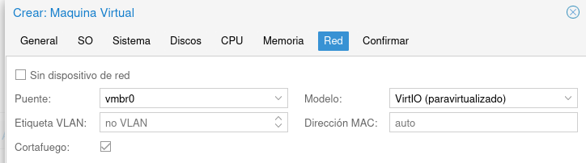

# Práctica 1

## Almacenamiento y redes disponibles

\centering
{height=40%}

* **Almacenamiento**: Tenemos dos espacios de almacenamiento:
  * **local**: Aquí se almacenan las ISOS, copias de seguridad, plantillas de contenedores,...
  * **local-lvm**: Se guardan los discos duros de las MV y contenedores.
* **Redes**: Tenemos varios switch virtuales (**Puentes**). Tenemos que usar **vmbr0** que nos proporciona que la MV esté conectada a nuestra red del departamento (**por DHCP**).

# Creación de una MV Linux en Proxmox

## Crear una máquina virtual

\centering
{height=30%}

## Identificar la máquina virtual

* Hay que indicar obligatoriamente el **nombre** y el **conjunto de recursos**.

\centering
{height=30%}

## Elegimos el sistema operativo (ISO)

* Elegimos la **ISO** que vamos a utilizar para realizar la instalación. La ISO la escogeremos del medio de almacenamiento local. También seleccionamos el **tipo de sistema operativo y la versión**.

\centering
{height=30%}

## Configuración del sistema

* Elegimos la tarjeta gráfica, el tipo de máquina, la BIOS y el controlador VirtIO SCSI, **dejamos los valores por defecto**.

\centering
{height=30%}

## Selección de discos

* Escogemos los discos que tendrá la máquina virtual. Por defecto se añade un disco. Podemos añadir más discos.
* El disco se creará en el almacenamiento **local-lvm** y debemos indicar el **tamaño**.
* Los otros valores lo dejamos por defecto.

\centering
{height=40%}

## Selección de la CPU

* Un **zócalo (Socket) de CPU** es una ranura física en la placa base de una PC donde puede conectar una CPU. 
* Esta CPU puede contener uno o varios **núcleos (Cores)**, que son unidades de procesamiento independientes. 
* **Podemos elegir el número de Sockets y Cores de la CPU de nuestra máquina**. 
* Además, podemos emular distintos tipos de CPU, por el momento elegimos la opción por defecto.

\centering
{height=30%}

## Configuración de la memoria

* Indicamos la cantidad de memoria que tendrá nuestra máquina virtual (en MiB no MB (!)).

\centering
{height=30%}

## Configuración de red

* En un principio nuestra máquina estará conectada al bridge externo **vmbr0** por lo que tomará una dirección IP del servidor DHCP de nuestra red. 
* No configuramos VLAN. 
* El modelo de la tarjeta (VirtIO) y la dirección MAC lo dejamos con las opciones predeterminadas.

\centering
{height=30%}

## Comienzo de la instalación

* Iniciamos la máquina:

\centering
{height=30%}

* Y desde la **Consola** podemos ver el monitor de la máquina para comenzar con la instalación:

\centering
{height=30%}

# Gestión y configuración de MV

## Gestión de máquinas virtuales

* **Botón derecho sobre la máquina virtual**

\centering
{height=50%}


## Gestión de máquinas virtuales

* **Iniciar**: Iniciamos la ejecución de una máquina virtual.
* **Pause**: Pausa la ejecución de la máquina virtual. Podremos
  reanudar la ejecución con la opción **Resume**.
* **Hibernate**: Se guarda el estado de la máquina en memoria y se
  para. La próxima vez que iniciemos la máquina se recuperará el
  estado anterior de la máquina.
* **Cierre ordenado**: Se termina la ejecución de la máquina de forma
  ordenada.
* **Parar**: Se termina inmediatamente la ejecución de la máquina.
* **Clonar**: Nos permite clonar la máquina.
* **Convertir a plantilla**: Nos permite crear una plantilla a partir de
  la máquina para crear nuevas máquinas. 
* **Consola**: Nos permite acceder a una consola para trabajar con la
  máquina.

## Gestión de máquinas virtuales

* **Panel lateral**

\centering
{height=50%}

## Gestión de máquinas virtuales

* **Resumen**: Resumen y monitorización de la máquina elegida.
* **Consola**: Nos permite acceder a una consola para trabajar con la máquina.
* **Hardware**: Nos permite ver y cambiar la configuración
  hardware. Lo estudiaremos en el siguiente apartado.
* **Opciones**: Nos permite modificar opciones de la máquina
  virtual.
* **Historial de Tareas**: Nos muestra el historial de tareas que se han
  realizado sobre la máquina.
* **Copia de seguridad**: Nos permite realizar una copia de seguridad. Lo
  estudiaremos en un módulo posterior.
* **Snapshot**: Nos permite crear un snapshot de la máquina para
  recuperar posteriormente su estado. Lo estudiaremos en un módulo
  posterior.

## Eliminar una máquina virtual

* Para eliminar una máquina virtual tenemos que pararla, y escoger la opción
**Eliminar** del botón **Más**:

\centering
{height=30%}


* Para eliminarla se nos pedirá el identificador de la máquina virtual
para la confirmación.

## Opciones de máquinas virtuales

El cambio de un parámetro puede requerir el reinicio de la máquina virtual para que se haga efectivo. Veamos algunos de ellos:

* **Nombre**: Podemos cambiar el nombre de la máquina.
* **Tipo de OS**: Nos permite modificar el tipo y versión del sistema operativo.
* **Orden de arranque**: Configuramos el orden de arranque de los dispositivos de almacenamiento de la máquina.
* ...

\centering
{height=50%}

## Hardware de la máquina virtual

* Podemos ver y modificar  las características del hardware y dispositivos conectados a la máquina virtual (RAM, CPU, BIOS, Display, ...).
* Podemos añadir nuevos dispositivos y eliminarlos.
* El cambio de hardware requiere reinicio de la máquina.

\centering
{height=50%}

## Qemu-guest-agent

* El programa **Qemu-guest-agent** es un demonio que podemos instalar en las máquinas virtuales creadas en Proxmox que nos proporciona que haya una comunicación entre Proxmox y la máquina virtual. 
* Nos permite obtener en la interfaz de Proxmox la dirección IP de la máquina, entre otras cosas.
* Para que funcione debemos activar una opción en la MV:

{height=30%}

* En la MV debian/ubuntu:

```bash
apt install qemu-guest-agent
```

## Qemu-guest-agent

* Comprobamos que funciona:

\centering
{height=50%}

# Práctica 1

## ¿Qué tienes que hacer?

1. Crea una nueva máquina virtual con Debian o Ubuntu desde una imagen ISO.
  * Recuerda que en el **Conjunto de Recursos** tienes que escoger tu proyecto.
  * Disco de 10 Gb.
  * 1 CPU
  * Memoria 1Gb.
  * Red: Conectada al puente vmbr0.
2. Realiza la instalación del sistema operativo. No instales entorno gráfico.
3. Instala en la máquina virtual el programa **Qemu-guest-agent** y configura la máquina virtual para que funcione de forma correcta.
4. Durante la instalación o posteriormente instala ssh a tu máquina virtual.
5. ssh es un mecanismo que nos permite acceder de forma remota a una máquina, si queremos entrar con el usuario **usuario** a nuestra máquina, desde nuestra máquina real tenemos que ejecutar: **ssh usuario@ip_de_la_maquina**.

## ¿Qué tienes que entregar?

1. Una captura de pantalla, donde se accede a la máquina desde la consola de Proxmox.
2. Una captura de pantalla de la sección Hardware de la máquina, para ver sus características.
3. Una captura desde la línea de comandos donde se vea la dirección IP, la puerta de enlace y el servidor DNS configurado en la máquina.
4. Una captura de pantalla donde se vea el correcto funcionamiento del programa **Qemu-guest-agent**.
5. Una captura de pantalla donde se compruebe que desde tu máquina física usando ssh, se accede a la máquina virtual que has creado.