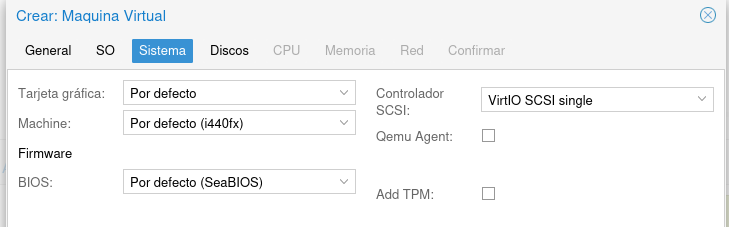
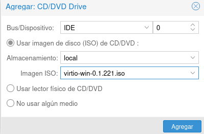
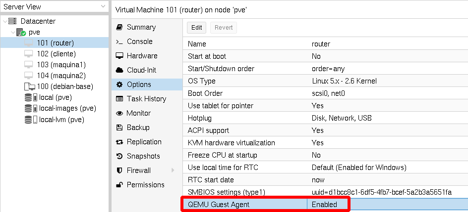

# Práctica 2

## Windows en Proxmox

* Los pasos que vamos a realizar son parecidos a los que hicimos al instalar una máquina Linux en Proxmox. Pero tnemos que tener en cuenta lo siguiente:
  * Para que la máquina Windows tenga más rendimiento vamos a configurar el Disco Duro y la red de tipo **VirtIO**.
  * Windows no tiene los drivers para estos dispositivos.
  * Tenemos que añadir un CDROM a la máquina con los drivers VirtIO

## Creación de una MV Windows en Proxmox

* Creamos una nueva máquina virtual, indicando el nombre y nuestro **conjunto de recursos**.
* Elegimos una imagen ISO para instalar una versión de Windows.
* Al seleccionar el sistema operativo, elegimos como sistema operativo Microsoft Windows y la versión que vamos a instalar.

\centering
{height=30%}

## Configuración del sistema

* Elegimos la tarjeta gráfica, el tipo de máquina, la BIOS y el controlador VirtIO SCSI, **dejamos los valores por defecto**.

\centering
{height=30%}

## Selección de discos

* Escogemos los discos que tendrá la máquina virtual. 
* El tipo de disco **Bus/device** escogemos **VirtIO Block**.
* El disco se creará en el almacenamiento **local-lvm** y debemos indicar el **tamaño**.
* Los otros valores lo dejamos por defecto.

\centering
{height=40%}

## Selección de la CPU, memoria y red

* Configuramos la CPU y la memoria igual que hicimos con la máquina Linux.
* Conectamos la máquina al bridge externo **vmbr0** pero elegimos el **modelo** como **VirtIO**.

\centering
{height=40%}

## Comienzo de la instalación (I)

* **Antes de comenzar la instalación** tenemos que añadir un CDROM con los drivers VirtIO. 
* Elegimos la máquina, apartado **Hardware**, botón **Agregar** -> **Dispositivo CD/DVD**.

\centering
{height=40%}

## Comienzo de la instalación (II)

* Tenemos que asegurarnos que la máquina va a iniciar con la ISO de Windows.
* Para ello, en la sección **Opciones** -> **Orden de arranque** nos aseguramos que el CD de la ISO de windows esté por encima que el CD de la ISO de los drivers VirtIO.
* **Ya podemos iniciar la máquina para realizar la instalación**.

\centering
{height=40%}

## Configurar el disco VirtIO (I)

* Iniciamos la instalación hasta que llegamos a la pantalla donde tenemos que escoger el disco duro donde vamos a realizar la instalación.

\centering
{height=40%}

## Configurar el disco VirtIO (II)

* Como vemos no se puede detectar el disco duro.
* Windows no reconoce el dispositivo VirtIO.
* Tenemos que cargar los controladores de dispositivo VirtIO del CDROM que hemos añadido.
* Elegimos la opción **Cargar contr.**, le damos a **Examinar** y elegimos del CDROM donde tenemos los drivers VirtIO la carpeta de nuestra arquitectura (**amd64**) y la **versión de Windows**.

\centering
{height=40%}

## Configurar el disco VirtIO (II)

* Y ya podemos continuar con la instalación de Windows porque ya detecta el disco duro:

\centering
{height=40%}

## Configuración red (I)

* Una vez instalada la máquina, nos damos cuenta **no tenemos conexión de red**.  Debido a que Windows no tiene los drivers para el controlador VirtIO.
* Para instalar los drivers: Actualizamos el controlador del dispositivo **Controladora Ethernet** en el **Administrador de dispositivos**:

\centering
{height=40%}

## Configuración red (II)

* Escogemos la carpeta del CDROM donde hemos montado los drivers VirtIO: **NetKVM\<carpeta con el nombre de tu versión de windows>\amd64**:

\centering
{height=40%}

## Qemu-guest-agent (I)

* El programa **Qemu-guest-agent** es un demonio que podemos instalar en las máquinas virtuales creadas en Proxmox que nos proporciona que haya una comunicación entre Proxmox y la máquina virtual. 
* Nos permite obtener en la interfaz de Proxmox la dirección IP de la máquina, entre otras cosas.
* Para que funcione debemos activar una opción en la MV:

\centering
{height=30%}

## Qemu-guest-agent (II)

En la MV windows:

* Vamos al Administrador de Dispositivos (Device Manager).
* Buscamos "PCI Simple Communications Controller"

\centering
{height=40%}

## Qemu-guest-agent (III)

* Botón derecho-> Actualizar Controlador (Update Driver) -> Seleccionar la iso montada en **DRIVE:\vioserial\<carpeta con el nombre de tu versión de windows>\amd64**.

\centering
{height=40%}

## Qemu-guest-agent (IV)

A continuación, instalamos el programa:

* Con el explorador de ficheros nos posicionamos en la unidad del CDROM correspondiente a la ISO montada.
* El instalador se encuentra en el directorio **guest-agent**.
* Ejecutamos el instalador **qemu-ga-x86_64.msi (64-bit)**.

\centering
{height=40%}

# Práctica 2

## ¿Qué tienes que hacer?

1. Crea una nueva máquina virtual con Windows10 o Windows2019 desde una imagen ISO.
  * Recuerda que en el **Conjunto de Recursos** tienes que escoger tu proyecto.
  * Disco de 20 Gb.
  * 1 CPU
  * Memoria 2Gb.
  * Red: Conectada al puente vmbr0.
2. recuerda que el disco duro y la red lo debes configurar de tipo **VirtIO**.
3. Realiza la instalación del sistema operativo.
4. Instala en la máquina virtual el programa **Qemu-guest-agent** y configura la máquina virtual para que funcione de forma correcta.

5. ssh es un mecanismo que nos permite acceder de forma remota a una máquina, si queremos entrar con el usuario **usuario** a nuestra máquina, desde nuestra máquina real tenemos que ejecutar: **ssh usuario@ip_de_la_maquina**.

## ¿Qué tienes que entregar?

1. Una captura de pantalla, donde se accede a la máquina desde la consola de Proxmox.
2. Una captura de pantalla de la sección Hardware de la máquina, para ver sus características.
3. Una captura desde la línea de comandos donde se vea la dirección IP, la puerta de enlace y el servidor DNS configurado en la máquina.
4. Una captura de pantalla donde se vea el correcto funcionamiento del programa **Qemu-guest-agent**.
5. Una captura de pantalla donde se compruebe que desde tu máquina física usando ssh, se accede a la máquina virtual que has creado.