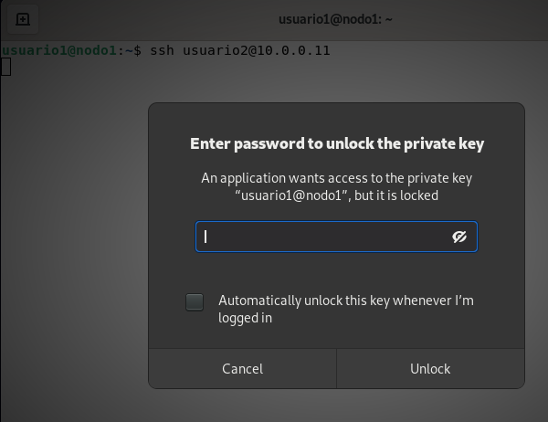

# Práctica 4

## Clonación

* Lo habitual al crear una máquina virtual es hacerlo a partir de una **imagen ISO**. 
* La **clonación y las plantillas** nos permiten la **creación rápida** de máquinas virtuales del mismo tipo.
* La clonación nos permite crear **una nueva máquina** a partir de de otra máquina (**se hace una copia del disco**).
* La nueva máquina es **igual que la original**, pero podremos cambiarles sus características (hostname, memoria, ...).

## Clonación

\centering
{height=70%}

## Plantilla

* Otra manera de crear rápidamente nuevas máquinas virtuales es usar una **plantilla** para su creación.
* Si partimos de una máquina que ya tenemos configurada, la podemos convertir en una **plantilla** y a partir de ella crear **nuevas máquinas**.
* Las plantillas son de **solo lectura** por lo que ya no podremos usar de nuevo la máquina original. 
* Si creamos una nueva máquina a partir de una plantilla, está ocupará muy poco almacenamiento en disco.
* Esto se consigue haciendo una **Clonación con Vinculación** desde la plantilla.
* El disco de la nueva máquina virtual estará vinculado al disco de la plantilla de la que procede. **Estaremos ahorrando espacio de almacenamiento**.

## Plantilla

\centering
{height=70%}


## Snapshot

* Un **snapshot (instantánea)** nos posibilita guardar el estado de una máquina virtual en un determinado momento.
* De esta forma en el futuro puedo volver a un estado anterior de la misma.
* Si elegimos un snapshot podremos borrarlo (**Eliminar****), modificar su información (**Editar**) y, lo más importante, hacer que la máquina virtual vuelva al estado en la que se tomó el snapshot con la opción **Revertir**.

## Snapshot

\centering
{height=70%}


## Creación de las claves ssh en el cliente (II)

\scriptsize
```
  usuario1@nodo1:~$ ssh-keygen
  Generating public/private rsa key pair.
  Enter file in which to save the key (/home/usuario1/.ssh/id_rsa): 
  Created directory '/home/usuario1/.ssh'.
  Enter passphrase (empty for no passphrase): 
  Enter same passphrase again: 
  Your identification has been saved in /home/usuario1/.ssh/id_rsa
  Your public key has been saved in /home/usuario1/.ssh/id_rsa.pub
  The key fingerprint is:
  SHA256:FfyzzFqODXZi+sFeLei+1ILURDTmzHwt8khSUvj+TjY usuario1@nodo1
  The key's randomart image is:
  +---[RSA 3072]----+
  |        .=O      |
  |        .X.o .   |
  |        ..X.o .  |
  |         *.=o.   |
  |        S.oo.o   |
  |       . o*o*.   |
  |        .+*@E .  |
  |        .+o*+o   |
  |         o*o.    |
  +----[SHA256]-----+
```

## Creación de las claves ssh en el cliente (III)

\scriptsize
```
  usuario1@nodo1:~$ ls -al .ssh
  total 16
  drwx------ 2 usuario1 usuario1 4096 Jan 24 16:04 .
  drwxr-xr-x 3 usuario1 usuario1 4096 Jan 24 16:02 ..
  -rw------- 1 usuario1 usuario1 2655 Jan 24 16:04 id_rsa
  -rw-r--r-- 1 usuario1 usuario1  568 Jan 24 16:04 id_rsa.pub
  ...
```

\normalsize 
* **id_rsa** es la **clave privada** del usuario adecuadamente protegida (permisos 0600). **No la pierdas, esta clave te identifica. ¡Guárdala bien!.**
* **id_rsa.pub** es la clave pública del usuario.

## Configuración del servidor SSH (I)

* Para que desde el **nodo1** (cliente) el **usuario1** pueda conectarse por ssh con el **usuario2** del **nodo2** (servidor), es necesario que el **usuario1** copie su **clave pública** en un fichero del **usuario2** en el **nodo2**.
* El **usuario1** copia su clave pública en el fichero **~/.ssh/authorized_keys** del home del **usuario2** en el **nodo2**.
* Para realizar la copia usamos el comando **ssh-copy-id**:

\scriptsize
```
  usuario1@nodo1:~$ ssh-copy-id -i .ssh/id_rsa.pub usuario2@10.0.0.11
  ...
  usuario2@10.0.0.11's password: 

  Number of key(s) added: 1
  ...
```

## Configuración del servidor SSH (II)

* Podemos comprobar que en el **nodo2** se ha creado el fichero **~/.ssh/authorized_keys** en el home del **usuario2**.

\scriptsize
```
  usuario2@nodo2:~$ ls -al .ssh
  total 12
  drwx------ 2 usuario2 usuario2 4096 Jan 24 16:26 .
  drwxr-xr-x 3 usuario2 usuario2 4096 Jan 24 16:26 ..
  -rw------- 1 usuario2 usuario2  568 Jan 24 16:26 authorized_keys
```

\normalsize 
* **Nota**: Podríamos copiar el contenido de la clave pública del cliente al servidor de forma manual, sin utilizar el comando **ssh-copy-id**. Simplemente tendríamos que copiar en el portapapeles el contenido del fichero id_rsa.pub en el cliente y pegarlo en el fichero **.ssh/authorized_keys** del servidor.


## Accediendo por ssh sin contraseña

* Ahora desde el cliente (**nodo1**) podremos acceder desde el **usuario1** (utilizando su clave privada) al **usuario2** del servidor (**nodo2**) sin necesidad de introducir la contraseña de ese usuario.
* Se nos pedirá la frase de paso de la clave privada:

\scriptsize
```
  usuario1@nodo1:~$ ssh usuario2@10.0.0.11
  Enter passphrase for key '/home/usuario1/.ssh/id_rsa': 

  ...

  usuario2@nodo2:~$ 
```

## Accediendo por ssh sin contraseña desde Gnome

* Si accedemos desde Gnome, la primera vez aparecerá una ventana donde se nos pedirá la frase de paso. Se guarda y no vuelve a pedirla en esta sesión.

\centering
{height=50%}


# Práctica 4

## ¿Qué tienes que hacer?

Configura el acceso ssh a una máquina proxmox utilizando claves ssh para que no te pida la contraseña. La clave privada generada debe tener frase de paso.

1. Crea una nueva máquina virtual en Proxmox con el sistema operativo Linux. O utiliza una que ya tengas instalada.
2. En tu ordenador, crea las claves SSH de tu usuario.
3. Copia la clave pública de tu usuario a la máquina virtual ( a un usuario de la máquina virtual).
4. Prueba a acceder por SSH a la máquina virtual y comprueba que no tienes que introducir la contraseña (sólo tienes que meter la frase de paso).

## ¿Qué tienes que entregar?

1. Una captura de pantalla con el contenido del directorio **.ssh** del usuario en tu ordenador.
2. Una captura de pantalla con el contenido del fichero **.ssh/authorized_keys** en el usuario de la máquina virtual.
3. una captura de pantalla con el acceso por ssh sin que te pidan la contraseña.
4. **Enseña al profesor el acceso SSH sin que te pida la contraseña.**

