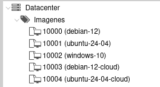

# Práctica 4

## Clonación

* Lo habitual al crear una máquina virtual es hacerlo a partir de una **imagen ISO**. 
* La **clonación y las plantillas** nos permiten la **creación rápida** de máquinas virtuales del mismo tipo.
* La clonación nos permite crear **una nueva máquina** a partir de de otra máquina (**se hace una copia del disco**).
* La nueva máquina es **igual que la original**, pero podremos cambiarles sus características (hostname, memoria, ...).

## Clonación

\centering
{height=70%}

## Plantilla

* Otra manera de crear rápidamente nuevas máquinas virtuales es usar una **plantilla** para su creación.
* Si partimos de una máquina que ya tenemos configurada, la podemos convertir en una **plantilla** y a partir de ella crear **nuevas máquinas**.
* Las plantillas son de **solo lectura** por lo que ya no podremos usar de nuevo la máquina original. 
* Si creamos una nueva máquina a partir de una plantilla, está ocupará muy poco almacenamiento en disco.
* Esto se consigue haciendo una **Clonación con Vinculación** desde la plantilla.
* El disco de la nueva máquina virtual estará vinculado al disco de la plantilla de la que procede. **Estaremos ahorrando espacio de almacenamiento**.

## Plantilla

\centering
{height=70%}

## Snapshot

* Un **snapshot (instantánea)** nos posibilita guardar el estado de una máquina virtual en un determinado momento.
* De esta forma en el futuro puedo volver a un estado anterior de la misma.
* Si elegimos un snapshot podremos borrarlo (**Eliminar****), modificar su información (**Editar**) y, lo más importante, hacer que la máquina virtual vuelva al estado en la que se tomó el snapshot con la opción **Revertir**.

## Snapshot

\centering
{height=70%}

## Plantillas predefinidas

* Tenemos acceso a un **Conjunto de Recurso** llamado **Imágenes** donde los profesores pueden poner **plantillas** para crear nuevas máquinas.
* Podemos tener varias plantillas creadas: **debian/ubuntu**, **windows**, **debian/ubuntu (cloud)**.
* En las imágenes Linux, podemos encontrar en los comentarios **el usuario y la contraseña** (**Esto es muy inseguro!!!**)
* Las imágenes de tipo **cloud** nos permiten configurar el usuario/contraseña y otros parámetros con un sistema que se llama **cloud-init**.
  

\centering
{height=30%}

## Creando nuevas máquinas virtuales a partir de las plantillas Imágenes

* Si creamos una nueva máquina virtual desde la plantilla **windows**, cuando iniciamos la máquina tendremos que indicar **una nueva contraseña**.
* Si creamos una nueva máquina virtual desde la plantilla **debian/ubuntu** tendremos escrito el usuario/contraseña en los comentarios.
* Si creamos una nueva máquina virtual desde las **plantillas tipo cloud**, vamos a usar el mecanismo de **Cloud-Init** para indicar **usuario/contraseña**.
* Si algún profesor sube alguna plantilla nueva, os **tendrá que informar del usuario/contraseña**.

## Configuración de nuevas máquinas Linux usando Cloud-Init

* Si creamos una nueva MV a partir de la plantillas **tipo cloud** no sabremos qué usuario y contraseña tiene.
* **Antes de iniciar la nueva máquina**, podemos configurar en el apartado **Cloud-Init**:
  * El usuario (por defecto es **usuario**).
  * La contraseña.
  * Podemos además indicar nuestra clave SSH pública, para que podamos acceder a la máquina por SSH sin indicar la contraseña.
  * Al iniciar estas máquinas se actualizarán de forma automática los paquetes.

\centering
{height=35%}

# Práctica 4

## ¿Qué tienes que hacer?

1. Crea una nueva máquina llamada **maquina1** a partir de la plantilla de **Imágenes** **de tipo cloud de debian**. Configúrala con el **Cloud-init** para crear un usuario con tu nombre, una nueva contraseña y para configurar tu clave SSH pública.
2. Prueba a acceder por SSH a esa máquina, para comprobar que no te pide contraseña.
3. A partir de **máquina1** haz una clonación para crear la **maquina2**.
4. Vuelve acceder por SSH, ¿te pide la contraseña? ¿Por qué?
5. Instala en **maquina2** el servidor web **apache2**, accede desde tu navegador a la IP de la máquina y comprueba que el servidor web está funcionando.
6. Convierte la **maquina2** en una plantilla.

## ¿Qué tienes que hacer?

7. A partir de la plantilla **maquina2**, crea la máquina **maquina3**. Accede a la IP que ha obtenido y verifica que tiene apache2 instalado.
8. Crea un snapshot de la **maquina3**.
9. Accede por ssh a **maquina3** y elimina el fichero **/var/www/html/index.html**. ¿Qué pasa al acceder desde el navegador web?
10. Revierte el snapshot y comprueba que el acceso a la web ya funciona.
11. Para terminar crea una máquina Windows a partir de la plantilla de **Imágenes**.
## ¿Qué tienes que entregar?

1. Captura de pantalla de la sección **Cloud-init** de la **maquina1**.
2. Captura de pantalla del acceso por ssh a la **maquina1** donde se vea que no ha pedido contraseña.
3. Muestra una captura de pantalla donde se vea la **maquina2** después de la clonación de la **maquina1**.
4. Captura de pantalla del acceso por ssh a la **maquina2**. Responde a las preguntas: ¿te pide la contraseña? ¿Por qué?
5. Captura de pantalla donde se vea la ip de la **maquina2** y captura de pantalla donde se vea el acceso web a **maquina2**.
6. Muestra una captura de pantalla donde se vea la **maquina2** convertida en plantilla.

## ¿Qué tienes que entregar?

7. Captura de pantalla donde se vea la ip de la **maquina3** y captura de pantalla donde se vea el acceso web a **maquina3**.
8. Captura de pantalla donde se vea el snapshot creado de la **maquina3**.
9. Captura de pantalla donde se vea el acceso web a **maquina3** después de borrar el fichero index.html.
10. Captura de pantalla donde se comprueba que has revertido el snapshot. Vuelve a mostrar la captura de pantalla donde se ve el acceso web.
11. Captura de pantalla del Windows funcionando.

