# Práctica 5

## Apache Guacamole

* **Guacamole** es una aplicación web que nos permite hacer conexiones SSH y RDP.
* Podemos usarla para acceder desde casa a **nuestras máquinas y contenedores de Proxmox**.
* Para acceder a Guacamole:

\centering
\color{blue}
https://remoto.gonzalonazareno.org

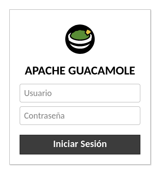{height=40%}

## Conexión SSH

* Si estamos trabajando con una máquina **Debian 12** o **Ubuntu 22.04** tenemos que hacer una modificación en la configuración del servidor SSH.
* Editamos el fichero **/etc/ssh/shhd_config** y añadimos las siguientes líneas:
```
    PubkeyAcceptedKeyTypes +ssh-rsa 
    HostKeyAlgorithms +ssh-rsa
```
* Si vamos a acceder con **usuario-contraseña**:

```
    PasswordAuthentication yes
```
* Si queremos acceder con el usuario **root**:
```
    PermitRootLogin=yes
```

* Y reiniciamos el servicio:
```
    systemctl restart ssh
```

## Creación de conexión SSH

* Pulsamos en nuestro nombre de usuario y **Configuración**

\centering
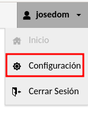{height=30%}

\raggedright

* Elegimos **Conexiones** -> **Nueva Conexión**

\centering
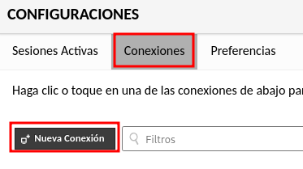{height=30%}


## Configuración de conexión SSH

* Indicamos un **nombre significativo** y el protocolo **SSH**

\centering
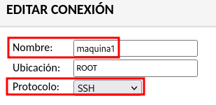{height=30%}

## Configuración de conexión SSH

* En **Parámetros** -> **Red**-> **Nombre del host** indicamos la dirección IP.
* En **Parámetros** -> **Autentificación** si queremos, podemos poner **Usuario** (No es recomendable poner la **Contraseña**).
* También podemos poner **La clave SSH privada** (No es recomendable poner **La frase de paso**).

\centering
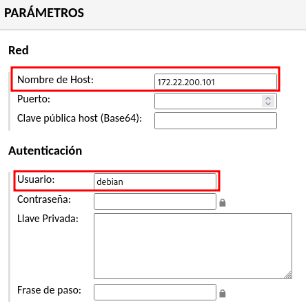{height=50%}

## Acceso por SSH

* Volvemos a **Inicio**

\centering
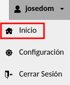{height=30%}

\raggedright
* Y hacemos doble click sobre la conexión que hemos creado:

\centering
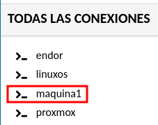{height=30%}

## Acceso por SSH

\centering
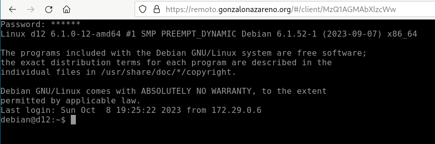{height=80%}


## Creación de conexión RDP

* Vamos a conectarnos a una máquina Windows donde hemos activado la conexión remota RDP.
* Creamos una nueva conexión **Configuración** -> **Conexiones** -> **Nueva Conexión**
* Ponemos un **nombre** y elegimos el protocolo **RDP**.

\centering
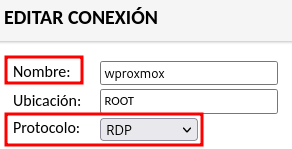{height=30%}

## Configuración de conexión RDP

* En **Parámetros** -> **Red**-> **Nombre del host** indicamos la dirección IP.
* En **Parámetros** -> **Autentificación** si queremos, podemos poner **Usuario** (No es recomendable poner la **Contraseña**).
* Escogemos la opción **Ignorar certificado del servidor**.

\centering
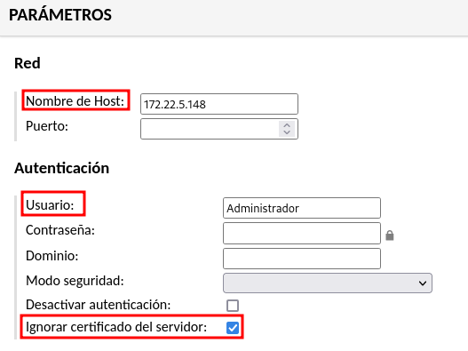{height=50%}

## Configuración de conexión RDP

* En **Configuración básica** -> **Disposición teclado -> **Español (Qwerty)**

\centering
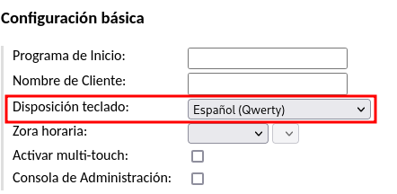{height=50%}


## Acceso por RDP

* Volvemos a **Inicio**

\centering
{height=30%}

\raggedright
* Y hacemos doble click sobre la conexión que hemos creado:

\centering
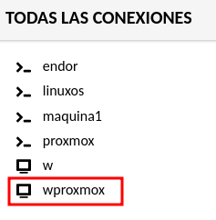{height=30%}

## Acceso por RDP

\centering
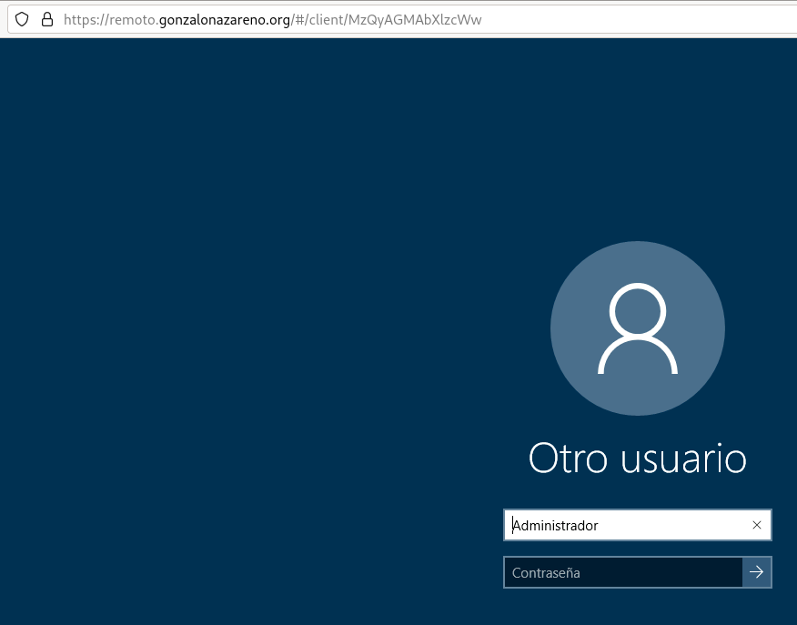{height=80%}

## Copiar y pegar en Guacamole
* Para que aparezca el **portapapeles** tenemos que pulsar simultáneamente las teclas **CRTL + ALT + SHIFT**.
* Todo lo que escribas en el **portapapeles** lo podrás pegar en la máquina.
* Todo lo que copies en la máquina aparecerá en el **portapapeles**.

\centering
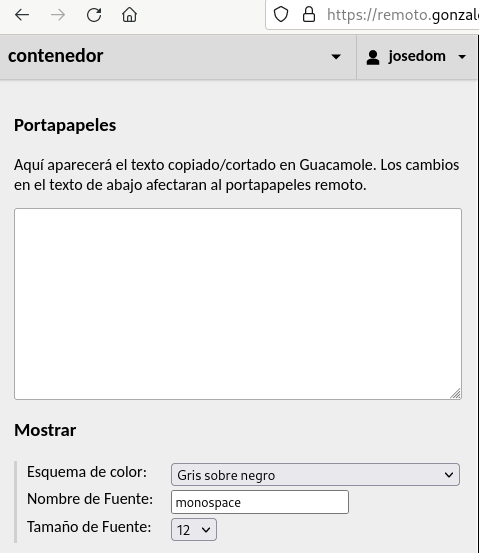{height=50%}


# Práctica 5

## ¿Qué tienes que hacer?


1. Crea una máquina virtual a partir de la plantilla **debian12-cloud**. El hostname de la máquina debe ser **debian-tunombre**.
2. Crea una máquina virtual a partir de la plantilla **ubuntu2204-cloud**. El hostname de la máquina debe ser **ubuntu-tunombre**.
3. Crea una máquina virtual a partir de la plantilla **WindowsServer1019**.
4. Configura tres conexiones en Guacamole para conectar a dichas máquinas.

## ¿Qué tienes que entregar?

1. Una captura de pantalla donde se vea a accediendo a la máquina debian.
2. Una captura de pantalla donde se vea a accediendo a la máquina ubuntu.
3. Una captura de pantalla donde se vea a accediendo a la máquina windows.