# Práctica 6

## Contenedores en Proxmox

* **La virtualización basada en contenedores** trabaja con **contenedores**.
* Un **contenedor** es un conjunto de procesos que se ejecutan en el host, que tienen su propio sistema de ficheros y su propia configuración de red. 
* Se pueden considerar una **mini máquina virtual**. 
* Todos los contenedores son **Linux**.
* Ejemplos: **Docker, LXC, ...**
* En **Proxmox** trabajamos con contenedores **LXC**.

# Creación de un contenedor en Proxmox

## Crear un contenedor

\centering
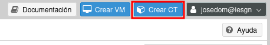{height=30%}

## Identificar el contenedor

* Hay que indicar obligatoriamente:
  * El **nombre del Host**
  * El **conjunto de recursos**.
  * La **contraseña** del usuario **root**.
* Si quieres puedes indicar tu **clave ssh pública** para el acceso por ssh.

\centering
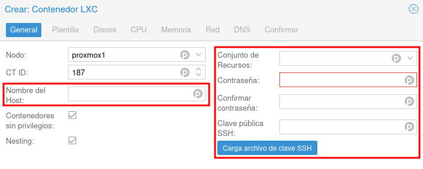{height=30%}

## Elegimos el sistema operativo (PLANTILLA)

* Elegimos la **plantilla** que vamos a utilizar para crear el contenedor. 

\centering
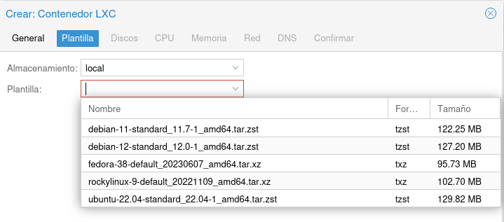{height=30%}

## Selección de discos

* Escogemos los discos que tendrá la máquina virtual. Por defecto se añade un disco. Podemos añadir más discos.
* El disco se creará en el almacenamiento **local-lvm** y debemos indicar el **tamaño**.

\centering
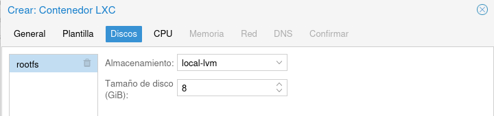{height=30%}

## Selección de la CPU

* **Podemos elegir el número de Nucleos de la CPU de nuestro contenedor**. 

\centering
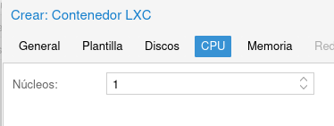{height=30%}

## Configuración de la memoria

* Indicamos la cantidad de memoria que tendrá nuestra máquina virtual (en MiB no MB (!)).

\centering
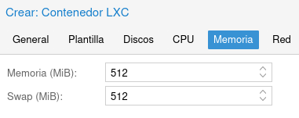{height=30%}

## Configuración de red

* En un principio nuestra máquina estará conectada al bridge externo **vmbr0** por lo que tomará una dirección IP del servidor DHCP de nuestra red. 
* No configuramos VLAN. 
* Por lo tanto, En el campo **IPv4** elegimos **DHCP**.

\centering
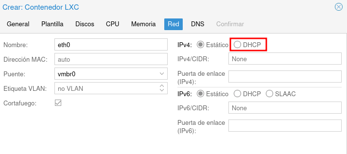{height=30%}

* Por último la configuración **DNS** la dejamos por defecto.

## Creación del contenedor

\centering
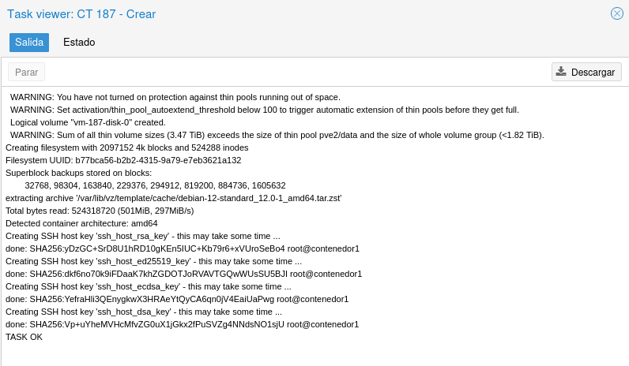{height=70%}

# Gestión y configuración del contenedor

## Gestión de máquinas virtuales

* **Botón derecho sobre el contenedor**

\centering
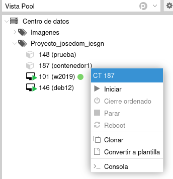{height=50%}

## Gestión de máquinas virtuales

* **Panel lateral**

\centering
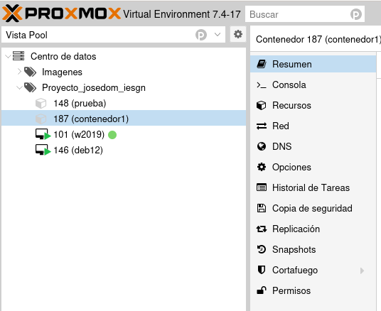{height=50%}

## Gestión de máquinas virtuales

* **Resumen**: Resumen y monitorización del contenedor elegido.
* **Consola**: Nos permite acceder a una consola para trabajar con el contenedor.
* **Recursos**: Nos permite ver y cambiar la configuración hardware.
* **Red**: Nos permite cambiar la configuración de red del contenedor.
* **DNS**: Nos permite cambiar la configuración de DNS del contenedor.
* **Opciones**: Nos permite modificar opciones del contenedor.
* **Historial de Tareas**: Nos muestra el historial de tareas que se han realizado sobr el contenedor.
* **Copia de seguridad**: Nos permite realizar una copia de seguridad. 
* **Snapshots**: Nos permite crear un snapshot del contenedor para recuperar posteriormente su estado.

## Eliminar un contenedor

* Para eliminar un contenedor tenemos que pararla, y escoger la opción
**Eliminar** del botón **Más**:

\centering
{height=30%}

* Para eliminarla se nos pedirá el identificador del contenedor para la confirmación.

## Inicio del contenedor

* Recuerda que al crear el contenedor tenemos el usuario **root**.

\centering
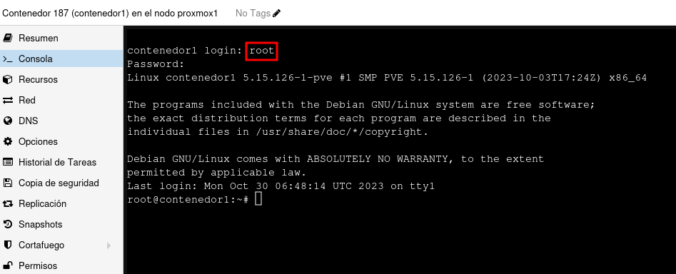{height=70%}

# Práctica 6

## ¿Qué tienes que hacer?

1. Crea una nuevo contenedor a partir de la plantilla **Debian 12** que se llame **contenedor1**. No indiques tu clave SSH pública en la creación.
2. Copia tu clave pública SSH manualmente en el contenedor.
3. Acceder por SSH al **contenedor1**.
4. Crea una conexión SSH en guacamole para acceder al **contenedor1**.
5. Crea una nuevo contenedor a partir de la plantilla **Ubuntu 22.04** que se llame **contenedor2**. Indica tu clave SSH pública en la creación.
6. Acceder por SSH al **contenedor2**.
7. Crea una conexión SSH en guacamole para acceder al **contenedor2**.

## ¿Qué tienes que entregar?

1. Una captura de pantalla, donde se accede al **contenedor1** desde la consola de Proxmox.
2. Una captura de pantalla donde se ve el acceso SSH al **contenedor1**.
3. Una captura de pantalla donde se ve el acceso SSH al **contenedor1** con Guacamole.
4. Una captura de pantalla, donde se accede al **contenedor2** desde la consola de Proxmox.
5. Una captura de pantalla donde se ve el acceso SSH al **contenedor2**.
6. Una captura de pantalla donde se ve el acceso SSH al **contenedor2** con Guacamole.