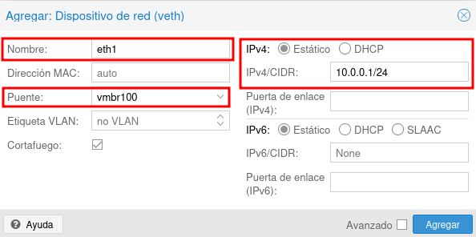
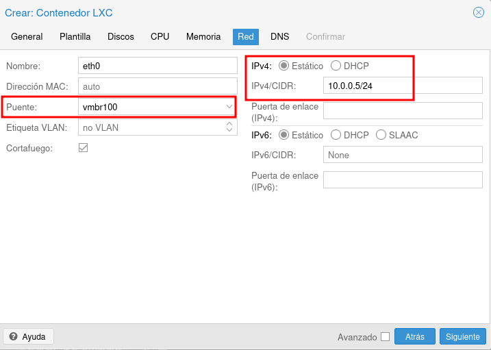

# Práctica 7

## Switch virtuales

* Un **puente o bridge/switch** es un dispositivo de interconexión de redes. 
* **Linux Bridge** es un software que tiene la misma funcionalidad que un bridge físico.
* Nuestras MV y contenedores se han conectado al puente **vmbr0** que nos da salida a internet.
* Podemos conectar nuestras MV y contenedores a otros puentes para hacer escenarios más complejos.
* Cada alumno tendrá asignado un puente **vmbr1XX** para conectar sus MV y contenedores.

# Conexión de una máquina virtual instalada desde una ISO a la red interna

## Conexión de una máquina virtual a la red interna

\centering
{height=30%}

* La máquina **router** ya está creada y está conectada al bridge **vmbr0**, le vamos a añadir una nueva interfaz de red conectada al bridge **vmbr100** y la vamos a configurar con la ip **10.0.0.1/24**.

## Añadir una nueva interfaz de red a una máquina

\centering
{height=70%}

## Añadir una nueva interfaz de red a una máquina

Elegimos al bridge al que va a estar conectada esta nueva interfaz (recuerda elegir el **driver VirtIO**):

\centering
{height=30%}

## Configuración de la nueva interfaz

* En la red interna a la que hemos conectado la máquina no existe ningún **servidor DHCP**.
* Tendremos que hacer una configuración manual del direccionamiento de esta interfaz de red. 

\centering
{height=30%}

## Configuración de la nueva interfaz

* La nueva interfaz se llama **ens19** y es la que tenemos que configurar.
* Para ello modificamos el fichero **/etc/network/interfaces** y añadimos el siguiente contenido:

\centering
{height=30%}

## Configuración de la nueva interfaz

* Levantamos la interfaz con el comando **ifup ens19**

\centering
{height=50%}

# Conexión de una máquina virtual creada desde una plantilla de "Imágenes" a la red interna

## Añadir una nueva interfaz de red a una máquina

* Creamos una MV desde la imagen **debian-12-cloud**.
* Antes de arrancar añadimos una nueva interfaz.

\centering
{height=70%}

## Configuración de la nueva interfaz

* Nos vamos a **cloud-init** y configuramos la máquina.
* En **cloud-init** configuramos la segunda interfaz de red (**net1**):

\centering
{height=50%}

## Configuración de la nueva interfaz

* Compramos que ha sido configurada:

\centering
{height=70%}

# Conexión de un contenedor a la red interna

## Añadir una nueva interfaz de red a un contenedor

* Tenemos un contenedor conectado a **vmbr0**, vamos a añadir una nueva red.

\centering
{height=70%}

## Añadir una nueva interfaz de red a un contenedor

* Indicamos el **nombre de la interfaz, el puente y la configuración estática.**

\centering
{height=70%}

## Añadir una nueva interfaz de red a un contenedor

* Accedemos al contenedor y ya tenemos la interfaz configurada:

\centering
{height=70%}

# Creación de una máquina virtual/contenedor en la red interna

## Creación de una MV/contenedor en la red interna

\centering
{height=30%}

* La máquina **router** ya la hemos creado.
* Ahora vamos a crear la máquina/contenedor **cliente** conectada sólo a la red interna al puente **vmbr100** con una **ip estática** **10.0.0.X/24**..

## Creación de una máquina virtual en la red interna

* Si estamos creando una máquina virtual **desde una ISO** tendremos que tenerla conectada a **vmbr0** para que tenga acceso a internet, y podemos realizar la instalación:
* Si estamos creando una máquina virtual desde las plantillas:
  * Una vez creada, **antes de ejecutarla**,
  * Elimino la interfaz conectada a **vmbr0**.
  * Añado una interfaz conectada a **vmbr100**.
  * Y la configuro de **forma estática** desde el **cloud-init**.

## Creación de una máquina virtual en la red interna

* Si estamos creando un contenedor, en su creación elegimos el puente al que nos conectamos y la configuración estática:

\centering
{height=70%}

## Comprobación de que tenemos conectividad entre los equipos conectados al mismo puente

* Por ejemplo desde el contenedor que hemos creado podemos hacer ping a otra máquina:

\centering
{height=70%}

# Configuración de escenario router/nat

## Escenario

\centering
{height=30%}

* **¿Qué tenemos que hacer para que las mv/contenedores conectadas a la red interna tengan salida a intenet?:**
  * La puerta de enlace de **cliente** tiene que ser la dirección del **router**, en nuestro caso la **10.0.0.1/24**.
  * Configura la máquina **router** para que haga SNT y enrrute los paquetes.

## Configuración de la puerta de enlace en una MV creada desde una ISO

* Modificamos el fichero **/etc/network/intefaces** de esta forma:

\centering
{height=30%}

* Y reiniciamos la red con **systemctl restart networking**.
* Y comprobamos que ya tenemos la ruta por defecto:

\centering
{height=10%}

## Configuración de la puerta de enlace en una MV creada desde una plantilla de "Imágenes"

* Antes de **iniciar la máquina** configuramos la red en el **cloud-init** indicando la **puerta de enlace**:

\centering
{height=30%}

## Configuración de la puerta de enlace en un contenedor 

* Al crear el contenedor configuramos la red indicando la **puerta de enlace**:

\centering
{height=70%}

## Activar el bit de forwarding

* En el **router**:
* Activamos el **bit de forwarding**. 
* Modificamos el fichero **/etc/sysctl.conf** y descomentamos la línea **net.ipv4.ip_forward=1**. 
* Para confirmar el cambio ejecutamos **sysctl -p**.

## Configuración de SNAT

* En el **router**, añadimos una regla en el cortafuego para realizar el SNAT. Para ello instalamos iptables:

  **apt install iptables**

* Añadimos en el fichero **/etc/network/interface** la regla:

  **post-up iptables -t nat -A POSTROUTING -s 10.0.0.0/24 -o ens18 -j MASQUERADE**

Los paquetes que vengan de la red interna 10.0.0.0/24, y saliendo por la primera interfaz se enmascaran, es decir su dirección de origen se cambian por la dirección de la interfaz de salida. 

## Configuración de SNAT

* Reiniciamos la red para activar la configuración.
  **Nota: Cambia el nombre de la interfaz de red o cualquier otro dato si en tu escenario es necesario.**

  **ifdown ens19**
  **ifup ens19**

* Comprobamos que la regla se ha ejecutado:

\centering
{height=40%}

    
## Configuración de SNAT

* Ahora podemos comprobar que el cliente tiene acceso al exterior:

\centering
{height=40%}

## Resolución DNS

* Para que los **clientes** tengan resolución DNS:
* Añadimos al fichero **/etc/resolv.conf** está línea:

  **nameserver 172.22.0.1**

* Ya hora puedes ejecutar un **ping dit.gonzalonazareno.org**.
* Ejecuta un **apt update** para comprobar que todo funciona.

# Práctica 7

## ¿Qué tienes que hacer?

* Vamos a crear el siguiente escenario:

\centering
{height=30%}

* Donde le máquina **router** las creado desde la imagen **debian-12-cloud**.
* La máquina cliente es un contenedor.
* Realiza la configuración mostrada en el esquema y comprueba que la máquina cliente le puede hacer ping al router.
* **VOLUNTARIA**: Configura la máquina **router** para que el cliente tenga salida al exterior.

## ¿Qué tienes que entregar?

1. La configuración ip de la máquina router.
2. La configuración ip del contenedor.
3. Una captura de pantalla haciendo ping al router desde el cliente.
4. Si has hecho la parte voluntaria:
  * La ruta por defecto del cliente.
  * Una comprobación de que el cliente tiene acceso al exterior usando un nombre (un ping a un nombre de dominio).
  