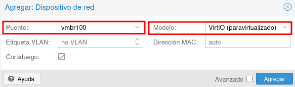

# Práctica 7

## Switch virtuales

* Un **puente o bridge/switch** es un dispositivo de interconexión de redes. 
* **Linux Bridge** es un software que tiene la misma funcionalidad que un bridge físico.
* Nuestras MV y contenedores se han conectado al puente **vmbr0** que nos da salida a internet.
* Podemos conectar nuestras MV y contenedores a otros puentes para hacer escenarios más complejos.
* Cada alumno tendrá asignado un puente **vmbr1XX** para conectar sus MV y contenedores.

## Conexión de una máquina virtual a la red interna

\centering
{height=30%}

* La máquina **router** ya está creada y está conectada al bridge **vmbr0**, le vamos a añadir una nueva interfaz de red conectada al bridge **vmbr100** y la vamos a configurar con la ip **10.0.0.1/24**.
* La máquina **cliente** será un contenedor y la vamos a crear conectada al bridge **vmbr100** con la dirección 10.0.0.2/24.

## Añadir una nueva interfaz de red a una máquina

\centering
{height=70%}

## Añadir una nueva interfaz de red a una máquina

Elegimos al bridge al que va a estar conectada esta nueva interfaz (recuerda elegir el **driver VirtIO**):

\centering
{height=30%}

## Configuración de la nueva interfaz

* En la red interna a la que hemos conectado la máquina no existe ningún **servidor DHCP**.
* Tendremos que hacer una configuración manual del direccionamiento de esta interfaz de red. 

\centering
{height=30%}

# Práctica 7

## ¿Qué tienes que hacer?

## ¿Qué tienes que entregar?

