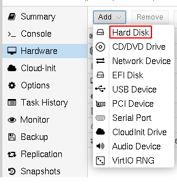
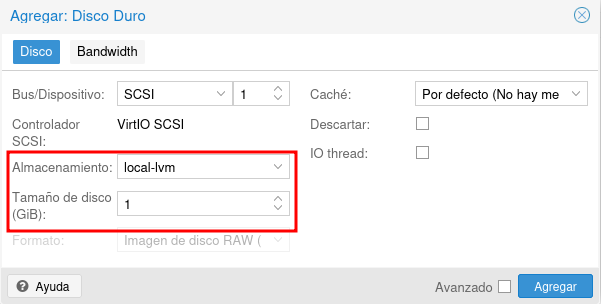
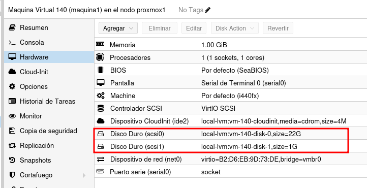
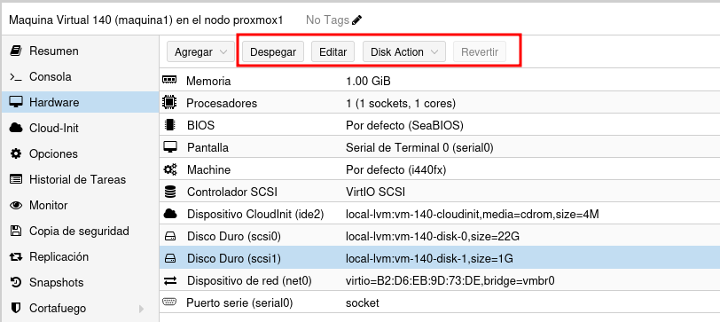
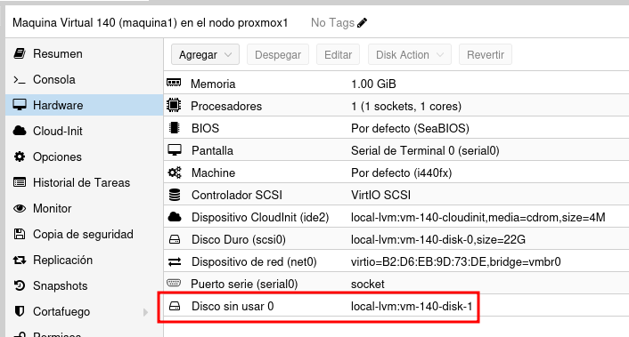
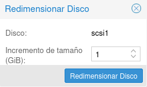
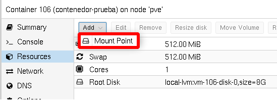
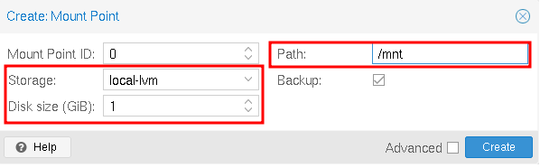
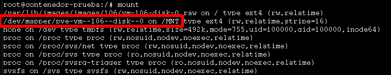

# Práctica 8

## Añadir nuevos discos a una máquina virtual

* En el apartado Hardware de cualquier máquina virtual podemos añadirle nuevos discos duros:

\centering
{height=50%}

## Añadir nuevos discos a una máquina virtual

* Al añadir el nuevo disco, tendremos que elegir en qué fuente de almacenamiento se va a guardar su información y el tamaño del disco:

\centering
{height=50%}

## Añadir nuevos discos a una máquina virtual

* Al añadir comprobamos que la máquina tiene dos discos:

\centering
{height=50%}

## Formateo y uso del disco en la máquina virtual

* Si accedemos a la máquina virtual podemos comprobar que tenemos un nuevo disco:

\tiny
```code
    root@debian:~# lsblk
    NAME   MAJ:MIN RM  SIZE RO TYPE MOUNTPOINT
    ...
    sdb      8:16   0    1G  0 disk 
```

\normalsize

* Podemos formatear el disco:

\tiny
```code
    root@debian:~# mkfs.ext4 /dev/sdb
```

\normalsize

* Y montar el disco para su utilización:

\tiny
```code
    root@debian:~# mount /dev/sdb /mnt
```

\normalsize

* Podemos ver las características del disco montado:

\tiny
```code
    root@debian:~# df -h
    S.ficheros     Tamaño Usados  Disp Uso% Montado en
    ...
    /dev/sdb         974M    24K  907M   1% /mnt
```

## Gestión de los discos de una máquina virtual

* Si elegimos un disco en el apartado Hardware de una máquina virtual, observamos que tenemos varias operaciones que podemos realizar sobre él:

\centering
{height=50%}

## Gestión de los discos de una máquina virtual

* **Despegar**: Nos permite desconectar el disco de la máquina. El fichero de imagen o el volumen lógico no se borra, sino que aparece como disco no usado.

\centering
{height=50%}

* Un disco no usado lo podemos borrar (opción **Eliminar**), o lo podemos editar (opción **Editar**). Si lo editamos y le damos a la opción **Añadir** lo volveremos conectar a la máquina.

## Redimensión de un disco

* Podemos aumentar el tamaño de un disco con la opción **Disk Action -> Resize**.

\centering
{height=30%}

## Redimensión de un disco

* Recuerda que el aumento de tamaño del disco es independiente del aumento del sistema de ficheros.
* Podemos comprobar que el disco ahora es de 2Gb:

\tiny
```code
    root@debian:~#lsblk
    NAME   MAJ:MIN RM  SIZE RO TYPE MOUNTPOINT
    ...
    sdb      8:32   0    2G  0 disk 
```

\normalsize

* Pero que el sistema de archivo sigue siendo de 1Gb:


\tiny
```code
    root@debian:~# df -h
    S.ficheros     Tamaño Usados  Disp Uso% Montado en
    ...
    /dev/sdb         974M    24K  907M   1% /mnt
```

## Redimensión de un disco

* Como lo habíamos formateado con ext4, tenemos que ejecutar las siguientes instrucciones con el disco desmontado:

\tiny
```code
    root@debian:~# umount /mnt 
    root@debian:~# e2fsck -f /dev/sdb
    root@debian:~# resize2fs /dev/sdb
    root@debian:~# mount /dev/sdb /mnt
    root@debian:~# df -h
    S.ficheros     Tamaño Usados  Disp Uso% Montado en
    ...
    /dev/sdb         2,0G   3,0M  1,9G   1% /mnt
```

\normalsize

* Y comprobamos que hemos aumentado el tamaño del sistema de ficheros.

## Añadir almacenamiento a un contenedor LXC

* Para ello escogemos el contenedor y elegimos la opción **Recursos** y añadimos un **Punto de Montaje**:

\centering
{height=70%}

## Añadir almacenamiento a un contenedor LXC

* A continuación, elegimos la fuente de almacenamiento donde vamos a crear el volumen, su tamaño y el directorio donde se va a montar en el contenedor:

\centering
{height=70%}

## Añadir almacenamiento a un contenedor LXC

* Y comprobamos que se ha montado el volumen en el directorio indicado:

\centering
{height=70%}

# Práctica 8

## ¿Qué tienes que hacer?

1. Añade un disco de 1Gb a una máquina virtual.
2. Accede a la máquina virtual, formatea el nuevo disco y móntalo en un directorio **/srv**.
3. Redimensiona el disco a 2Gb.
4. Redimensiona el sistema de fichero del disco anterior para que tenga también 2 Gb.
5. Añade un disco de 3Gb a un contenedor y móntalo en el directorio **/mnt**.
6. **VOLUNTARIO**: Añade un nuevo disco a una máquina Windows, dale formato y conectado a una unidad.

## ¿Qué tienes que entregar?

1. Captura de pantalla donde se vea que la máquina virtual tiene un nuevo disco conectado ed 1Gb. Salida del comando **lsblk** para comprobar que la máquina tiene el nuevo disco.
2. Instrucciones que has ejecutado para formatear y montar el disco.
3. Salida del comando **df -h** para comprobar que esta montado en la máquina virtual.
4. Después de redimensionar el disco, salida del comando **lsblk**.
5. Explica las instrucciones ejecutadas para redimensionar el sistema de fichero y la salida del comando **df -h** para comprobarlo.
6. Muestra la salida del comando **df -h** en el contenedor para comprobar que tiene montado un nuevo disco.
7. Si hacer la parte voluntaria capturas de pantalla donde se demuestre que el Windows tiene el nuevo disco.  