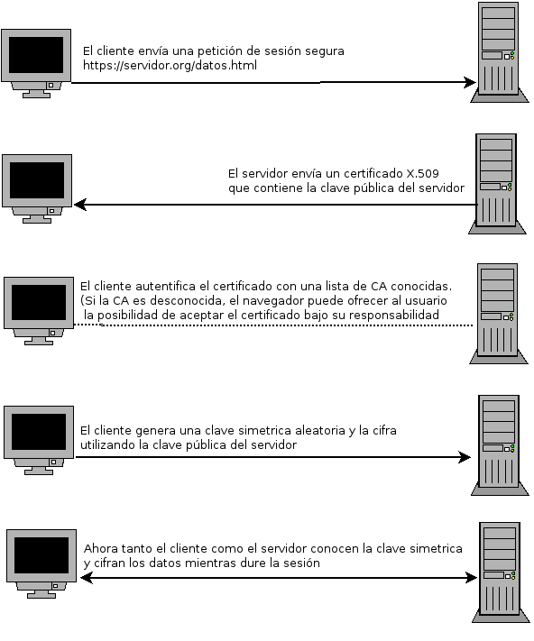
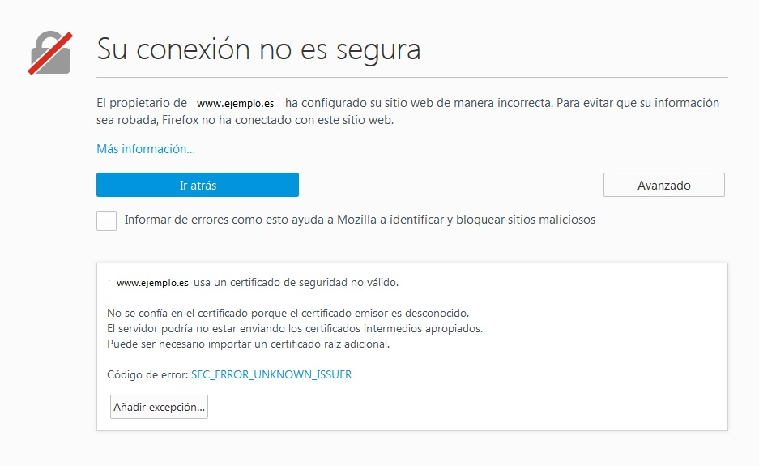
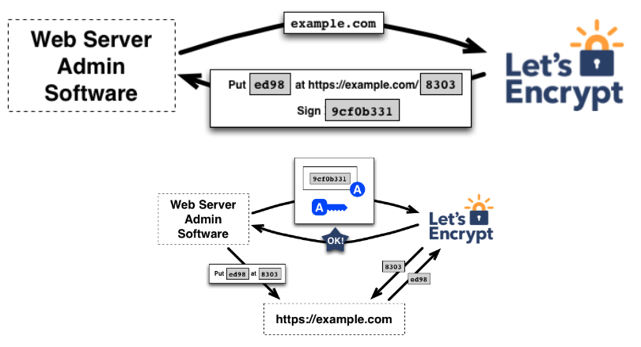
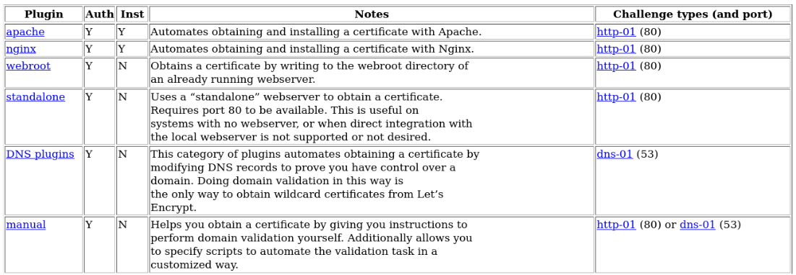

# Introducción a HTTPS

## Protocolo HTTPS

El uso del protocolo HTTPS nos va a permitir dos cosas:

1. Cifrar el contenido que se trasmite entre el cliente y el servidor.
2. Confiar en la autenticidad de la página web que estamos visitando.

* Utiliza el protocolo SSL (actualmente TLS) para el cifrado de datos.
* El servidor utiliza por defecto el puerto 443/tcp.


## Características de HTTPS

* Utiliza mecanismos de cifrado de clave pública y las claves públicas se denominan **certificados**.
* El formato de los certificados está especificado por el estándar X.509 y normalmente son emitidos por una entidad denominada **Autoridad Certificadora (CA)**.
* La función principal de la CA es demostrar la autenticidad del servidor y que pertenece legítimamente a la persona u organización que lo utiliza. 
* El navegador contiene una lista de certificados de CA en las que confía y acepta inicialmente sólo los certificados de los servidores emitidos por alguna de estas CA.
* Una vez aceptado el certificado de un servidor web, el navegador utiliza éste para comunicar la **clave simétrica** entre servidor y cliente.
* La clave simétrica se utiliza para cifrar los datos que quiere enviar al servidor mediante el protocolo HTTPS.

## Esquema HTTPS

{height=90%}

## Pasos para la creación de certificados

1. Se genera una clave privada y una clave pública.
2. Se genera un fichero de solicitud de firma de certificado **(Certificate Signing Request o CSR)**. Este fichero contiene la clave pública.
3. Al realizar el fichero CSR tenemos dos opciones: 
	* Indicar el nombre del servidor al que queremos generar el certificado (ej: **dit.gonzalonazareno.org**)
	* Algunos CA pueden generar certificados wildcard (ej: ***.gonzalonazareno.org**).
4. La CA realizará un proceso para verificar que el dueño de la página cuyo nombre se ha solicitado el certificado es administrada por la persona, institución o empresa legítima. Según el proceso que realice para verificar el propietario de la página el coste será mayor.
5. Enviamos el fichero CSR para que sea firmado ppor la CA (usando su clave privada) y obtenemos el certificado (clave pública firmada).
6. En el navegador cargamos la clave pública de la CA para verificar la autenticidad del certificado y confiar en la página.

## Conexión no segura

Si el certificado es inválido o no tenemos la clave pública del CA para verificarlo:

{height=75%}

# HTTPS con Let’s Encrypt

## ¿Qué es Let’s Encrypt?

Let’s Encrypt se trata de una **autoridad de certificación**, conocidas con las siglas CA, libre y gratuita impulsada por la **Fundación Linux**, que permite generar **certificados SSL gratuitos y automáticos** para nuestros sitios web. El objetivo de la comunidad que está detrás es el de promover que el tráfico de Internet sea seguro.

## ¿Cómo funciona Let’s Encrypt?

Let’s Encrypt utiliza el protocolo **ACME (Automatic Certificate Management Environment)**, el cual se basa en un proceso en dos pasos, por un lado:

1. La validación del dominio y 
2. la solicitud del certificado. 

Tenemos dos agentes:

* Let’s Encrypt CA
* Un agente en el servidor: **Certbot**

## Validación del dominio

Let’s Encrypt identifica el administrador del servidor por claves RSA. El proceso sería el siguiente:

1. La primera vez que el software del agente interactúa con Let’s Encrypt, genera un nuevo par de claves.
2. El agente demuestra al Let’s Encrypt CA que el servidor controla uno o más dominios. 
3. Para hacer esta demostración se utilizan algún tipo de reto:
	* **HTTP-01 challenger**: Colocar un fichero con una determinada información en una URL específica del servidor que el Let’s Encrypt CA puede verificar.
	* **DNS-01 challenger**: Crear un registro en el DNS con una determinada información.

## HTTP-01 challenge

* Let’s Encrypt CA manda un token al agente y le pide que lo ponga en un fichero determinado, en una ruta accesible en el servidor web. Además del token, se gaurdá la firma del token realizada con la clave privada del agente.

    `http://<YOUR_DOMAIN>/.well-known/acme-challenge/<TOKEN>`

* Si Let’s Encrypt CA es capaz de acceder al puerto 80 y obtener dicho fichero con la información esperada y valida la firma, se confirma que somos el administrador del dominio.

## HTTP-01 challenge

{height=90%}

## Solicitud del certificado

Una vez el agente tenga un par de claves autorizadas; solicitar, renovar, y revocar certificados es simple:

* El agente construye un CSR que le manda al AC Let’s Encrypt para que emita un certificado para el dominio.
* El csr envíado por el agente va firmado por la clave privada del agente.
* Cuando el Let’s Encrypt CA recibe una solicitud, verifica la firma. Si todo se ve bien, emite un certificado para el dominio.

## El agente Certbot

* \color{blue}[https://certbot.eff.org/](https://certbot.eff.org/)\color{darkgray}
* `apt install certbot`
* Certbot es el agente que instalamos en el servidor para gestionar la validación del dominio y la gestión de los certificados automáticamente.
* Trabaja con varios plugins
* Puede crear una tarea cron para la renovación del certificado cada 3 meses.

## Plugins de Certbot

{height=90%}

## Certbot

\scriptsize
```
$ certbot certificates
Certificate Name: fp.josedomingo.org
    Domains: fp.josedomingo.org
    Expiry Date: 2021-02-19 08:09:37+00:00 (VALID: 87 days)
    Certificate Path: /etc/letsencrypt/live/fp.josedomingo.org/fullchain.pem
    Private Key Path: /etc/letsencrypt/live/fp.josedomingo.org/privkey.pem
...
```
