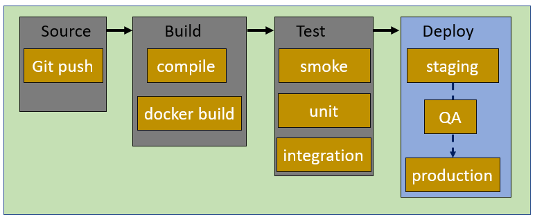
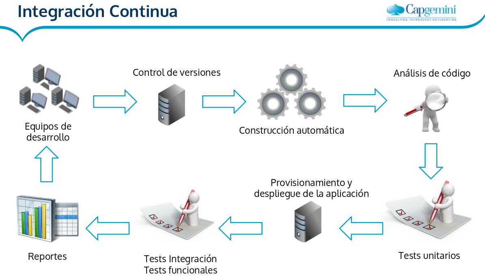

# IC / DC

## Conceptos

* **Integración continua (IC)**: Práctica de desarrollo software donde los miembros del equipo integran su trabajo frecuentemente, al menos una vez al día. Requiere que cada vez que alguien haga un commit se construya la aplicación entera y que se ejecuten una serie de tareas automatizados: Las pruebas y el despliegue se automatizan.
* **Entrega continua (EC)**: Es el siguiente paso de IC, y consiste en preparar la aplicación web para su puesta en producción. El paso a producción se hace de forma manual.
* **Despliegue continuo (DC)**: Es similar a la anterior pero en este caso también se automatiza el despliegue final en producción.
* \color{blue}[VÍDEO: Integración continúa, entrega continúa y despliegue continuo](https://www.youtube.com/watch?v=REMAgB7m1ig)\color{darkgray}

## CI/CD pipeline

* Un **pipeline CI/CD** automatiza el proceso de entrega de software.
* Genera código, ejecuta pruebas y le ayuda a desplegar de forma segura una nueva versión del software.
* Se reduce los errores manuales.
* Introduce la automatización y la supervisión continua a lo largo del ciclo de vida de un producto de software.

## Etapas (stage) en un pipeline IC/DC

* Un pipeline IC/DC es una  especificación ejecutable de los pasos que cualquier desarrollador debe realizar para entregar una nueva versión de cualquier software.
* Cuando alguna de las tareas ejecutadas falla se nos notifica por algún medio de comunicación.
* Las tareas ejecutadas suelen pertenecer a distintas etapas:

## Etapas (stage) en un pipeline IC/DC

{height=75%}

## Etapas (stage) en un pipeline IC/DC

### Source Stage

* El pipeline de CI/CD se  activa mediante un repositorio de código. 
* **Cualquier cambio** en el programa desencadena una notificación a la herramienta CI/CD que ejecuta un pipeline equivalente. 
* Pueden existir otros iniciadores: inicio manual, inicio programado,...

### Build Stage

* Etapa donde se construye el software: Por ejemplo mediante la compilación.
* Si no se supera la etapa de compilación, significa que hay un error de configuración fundamental en el proyecto.
* En esta etapa también podemos crear una imagen docker para el despliegue.

## Etapas (stage) en un pipeline IC/DC

### Test Stage

* La etapa de prueba incluye la ejecución de pruebas automatizadas para validar la corrección del código y el comportamiento del software. 
* Esta etapa evita que errores fácilmente reproducibles lleguen a los clientes.
* Es responsabilidad de los desarrolladores escribir pruebas automatizadas.
* \color{blue}[VÍDEO: Qué es TDD - Test-driven development](https://www.youtube.com/watch?v=q6z3jFZl8oI/)\color{darkgray}

### Deploy Stage

* Etapa donde se hace el despliegue de la aplicación.

## Etapas (stage) en un pipeline IC/DC

{height=75%}

## Herramientas de IC/DC

* **GitHub actions**:  \color{blue}[Documentación de GitHub Actions](https://docs.github.com/es/actions)\color{darkgray}
* **Jemkins**: \color{blue}[VÍDEO: ¿Qué es Jenkins?](https://www.youtube.com/watch?v=RET4vHRMDek)\color{darkgray}
* gitlab
* bamboo
* CricleCI
* ...
