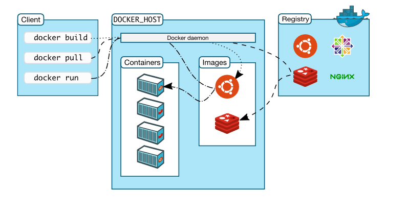

## Registros de imágenes

## Registros de imágenes: Docker Hub

* Las **imágenes de Docker** son plantillas de solo lectura, es decir, una imagen puede contener el sistema de archivo de un sistema operativo como Debian, pero esto solo nos permitirá crear los contenedores basados en esta configuración. 

* El **Registro docker** es un componente donde se almacena las imágenes generadas por el Docker Engine. Pueden ser privados o públicos. El proyecto nos ofrece **Docker Hub**.

## nombre de las imágenes

El nombre de una imagen suele estar formado por tres partes:

  **usuario/nombre:etiqueta**

* `usuario`: El nombre del usuario que la ha generado. Coincide con el usuario de Docker Hub. Las **imáges oficiales** en Docker Hub no tienen nombre de usuario.
* `nombre`: Nombre significativo de la imagen.
* `etiqueta`: Nos permite versionar las imágenes.  Si no indicamos etiqueta, por defecto se usa la etiqueta **`latest`**.

## Gestión de imágenes

Para crear un contenedor es necesario usar una imagen que tengamos descargado en nuestro registro local. Por lo tanto al ejecutar `docker run` se comprueba si tenemos la versión indicada de la imagen y si no es así, se precede a su descarga.

Las principales instrucciones para trabajar con imágenes son:

* `docker images`: Muestra las imágenes que tenemos en el registro local.
* `docker pull`: Nos permite descargar la última versión de la imagen indicada.
* `docker rmi`: Nos permite eliminar imágenes. No podemos eliminar una imágen si tenemos algún contenedor creada a partir de ella.
* `docker inspect`: nos da información sobre la imágen indicada:
  

## ¿Cómo se organizan las imágenes?

* Las imágenes están hechas de **capas ordenadas**. Puedes pensar en una capa como un conjunto de cambios en el sistema de archivos. 
* Si tienes muchas imágenes basadas en capas similares, como Sistema Operativo base o paquetes comunes, entonces todas éstas capas comunes será almacenadas solo una vez.
* Cuando un nuevo contenedor es creado desde una imagen, todas las capas de la imagen son únicamente de lectura y una delgada capa lectura-escritura es agregada arriba. Todos los cambios efectuados al contenedor específico son almacenados en esa capa. 
* **No podemos eliminar una imágen cuando tenemos contendores creados a aprtir de ella**.

## ¿Cómo se organizan las imágenes?

## ¿Cómo se organizan las imágenes?

## Creación de instancias desde imágenes

Hay dos tipos de imágenes según la utilidad que nos ofrecen.

* Ejecutaremos contenedores de distintos sistemas operativos (Ubuntu, CentOs, Debian, Fedora....). No tienen definida el proceso que debe ejecutar el contenedor.

  * docker run ubuntu /bin/echo 'Hello world'

* Ejecutaremos contenedores que tengan servicios asociados (Apache, MySQL, Tomcat....). Tienen definido el proceso que tienen que ejecutar al crear el contenedor

  *  docker run -d --name my-apache-app -p 8080:80 httpd:2.4