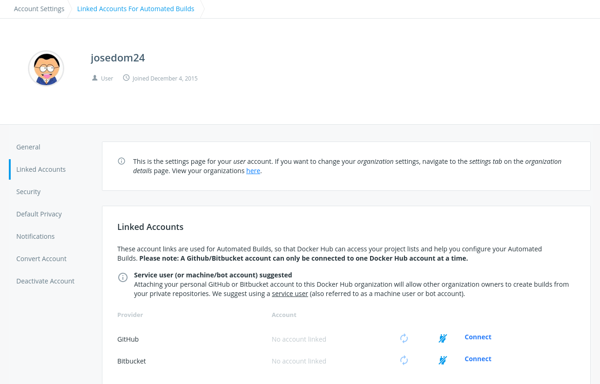
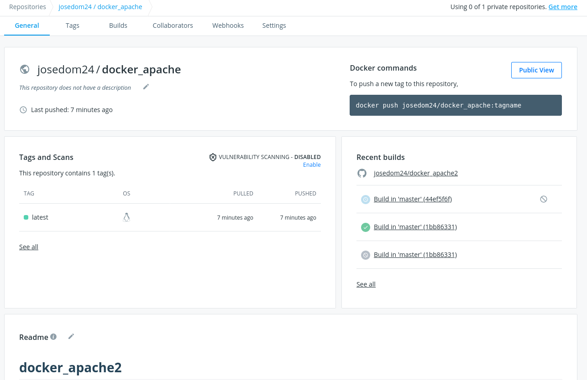
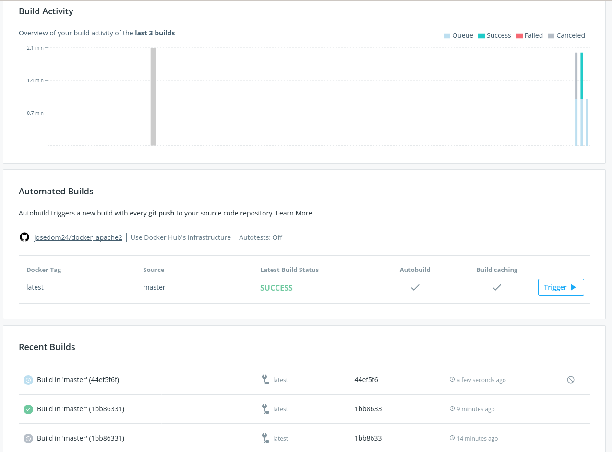
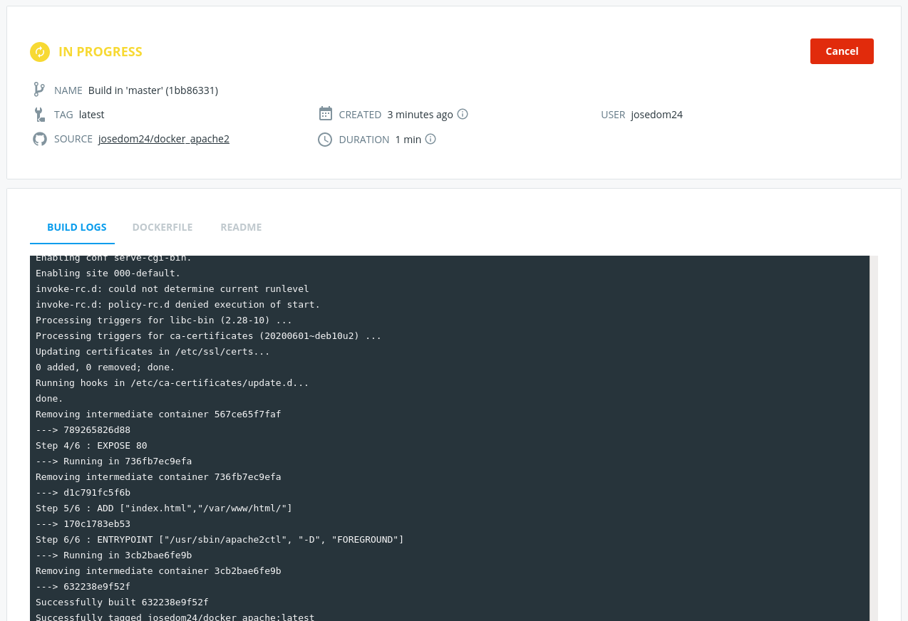

## Creación de imággnes en Docker Hub

La página Docker Hub nos ofrece un sistema de **integración continúa** para la creación automática de imágenes. Lo que vamos a hacer es conectar nuestro repositorio de DockerHub con un repositorio de GitHub, donde tengamos el contexto para la construcción de la imagen (**`Dcokerfile`** y ficheros necesarios). Los pasos serán:

## Conectamos a la cuenta de GitHub (I)

Conectamos nuestra cuenta de Docker Hub con nuestra cuenta de GitHub. Para ello en la sección `Account Settings` - `Linked Accounts`:

{height=60%} 

## Conectamos a la cuenta de GitHub (II)

Pulsamos sobre `Connect` de GitHub, y autorizamos a DockerHub que acceda a nuestros repositorios:

{height=60%} 

## Crear un repositorio Docker Hub

Crear un nuevo repositorio en Docker Hub: Ponemos un nombre y conectamos a un repositorio GitHub con el contexto.

{height=60%} 

## Sección Build

En la sección `Build` del repositorio vemos las distintas *build* que vamos generando.

{height=60%} 

## Build automático

Cada vez que hagamos un push en el repositorio GitHub se creará un nuevo *build* y se creará una nueva imagen.

{height=60%} 

