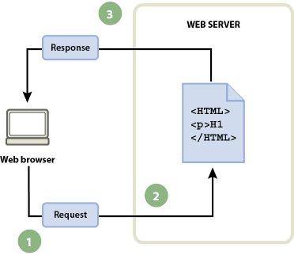

# Introducción a las aplicaciones web

## Página web us Aplicación web

* Una **Página Web** es un documento al que se puede acceder a través de un navegador web  a través de internet o una intranet. Se suele decir que el contenido es estático (sólo cambia si el el desarrollador web cambia el contenido del documento).
* Una **Aplicación Web** nos ofrece páginas web que se generan de forma dinámica según unas circunstancias (por ejemplo si el usuario está logueado, según la información obtenida de una base de datos...). Nos ofrecen una determinada funcionalidad (blog, wiki, ...). Son programas que desarrollamos utilizando lenguajes de programación web:
	* Se pueden ejecutar en el servidor: PHP, Python, Java, Ruby, Go, ...
	* Se pueden ejecutar en el cliente: JavaScript, TypeScript,...

## Desarrollo de aplicaciones web

* **Específicas**: Son desarrolladas para gestionar un problema específico. En la actualidad en el desarrollo de aplicaciones web se utilizan **frameworks**: symfony (PHP), django (python), flask(python), RoR (Ruby on Rails),...

* **CMS**: Sistema de gestión de contenido. Son aplicaciones desarrolladas por un tercero que nos ofrecen una funcionalidad general. Ejemplos: blogs, portales, wiki, comercio electrónico, educación a distancia, gestión de  proyectos,... Las más conocidas: wordpress, joomla, mediawiki, prestashop, moodle, redmine, ...

## Protocolo HTTP / HTTPS

Para acceder a las Páginas Web o Aplicaciones Web necesitamos usar el protocolo HTTP/HTTPS:

* Un **cliente** (por ejemplo, **un navegador web**) realiza una **petición HTTP** solicitando un recurso a un **servidor web**.
* El **servidor web** recibe la petición y genera una **respuesta HTTP** devolviendo si es posible el recurso.

\small

**Nota: Se profundizará en el protocolo HTTP en el módulo de Servicios de Red e Internet.**

\normalsize

## Acceso a páginas web estáticas

::: columns
:::: {.column width=40%}
{height=60%} 
::::
:::: {.column width=60%}
1. El cliente realiza una **petición HTTP**.
2. El servidor web recibe la petición y busca el recurso que se ha solicitado.
3. El servidor web devuelve una **respuesta HTTP**.
::::
:::

## Acceso a aplicación web dinámicas

::: columns
:::: {.column width=40%}
{height=60%} 
::::
:::: {.column width=60%}
1. El cliente realiza una **petición HTTP**.
2. Si el recurso solicitado es un programa escrito en algún lenguaje de programación web pasamos al paso 3. Si se solicita un recurso estático (hoja de estilo, pdf, imagen...) se devolverá como en el caso anterior.
3. El **servidor de aplicaciones** es el programa responsable de ejecutar el programa. 
4. La salida de dicho programa suele ser una página web (por eso la llamamos **dinámica**).
5. El servidor web devuelve una **respuesta HTTP** con la página generada.
::::
:::

## Acceso a aplicación web dinámicas con acceso a base de datos

::: columns
:::: {.column width=40%}
{height=60%} 
::::
:::: {.column width=60%}

* Los tres primeros pasos iguales...
4. El programa puede realizar una consulta a una base de datos.
5. La consulta la recibe el gestor de base de datos.
6. La base de datos devuelve el resultado de la consulta.
7. Que utiliza el programa para construir la página dinámica.
* Los dos últimos pasos iguales...
::::
:::

## Ventajas y desventajas de las páginas web estática

* **No** ofrecen ninguna funcionalidad (o una funcionalidad limitada, solo la que puede ofrecer javascript porque se ejecuta en el cliente).
* El desarrollo es sencillo: escritas en HTML y el diseño usando hojas de estilo.
* El mantenimiento puede ser complicado, por ejemplo cuando queremos cambiar la estructura de muchas páginas de nuestro sitio web.
* El desarrollo y mantenimiento se puede hace más sencillo, usando **Generadores de Páginas Web Estáticas**. Son programas que a partir del contenido de nuestra página y de plantillas generan de forma automática el código HTML para subirlo al servidor web.
* La ventaja fundamental es que el acceso a estás páginas es muy rápida.

## Ventajas y desventajas de las aplicaciones web dinámicas

* Principal ventaja: Ofrecen muchas funcionalidades. Se está pasando de usar aplicaciones de escritorio a aplicaciones web, ya que las funcionalidades ofrecidas cada vez nos permiten realizar más tareas.
* Si necesitamos solucionar un problema concreto necesitamos desarrollar una aplicación web desde 0, pero si necesitamos una funcionalidad general (blog, wiki, comercio electrónico,...) podemos usar CMS ya desarrollados.
* Suele ser sencillo desarrollar el diseño de los CMS (con distintos temas) y sólo nos tenemos que preocupar de desarrollar el contenido que se suele guardar en una base de datos.
* Si estamos usando CMS es necesario actualizar la aplicación cada cierto tiempo para no tener problemas de seguridad.
* La desventaja fundamental es que el acceso es más lento: la ejecución del código es lenta y el acceso a la base de datos aún más.

## Generadores de páginas estáticas

En los últimos años se han desarrollado programas de ordenador que nos permiten de forma sencilla generar sitios web estáticos.

* Están programados en distintos lenguajes
* Incluyen un motor de plantillas para facilitar la generación del código html.
* Por lo tanto es fácil encontrar distintos temas (ficheros de hojas de estilos) para cambiar el aspecto de las páginas generadas.
* El usuario final sólo se debe preocupar del contenido.
* Normalmente el contenido se escribe en un lenguaje de marcas sencillo como es Markdown. 
* Una vez generado el sitio estático sólo tenemos que desplegar el sitio en nuestro servidor en producción.

Tenemos muchos generadores de páginas estáticas: Jekyll, Hugo, Pelican, ...  Puedes encontrar una lista completa en: \color{blue}[Site Generators](https://jamstack.org/generators/).