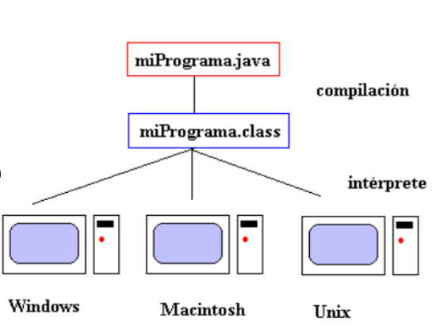
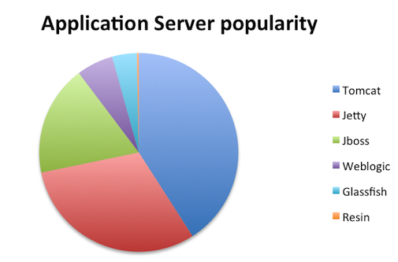

# Introducción a Java

## Java

Java es un lenguaje de programación de propósito general y orientado a objetos. Fue creado en 1995 por Sun Microsystems y actualmente es uno de los lenguajes de programación más populares en uso, especialmente para aplicaciones de escritorio y aplicaciones web.

* Es un producto de Oracle.
*  \color{blue}[Página oficial](https://www.java.com/es/)\color{darkgray}

## Ejecución de aplicaciones Java

::: columns

:::: {.column width=60%}

* La traducción se hace en dos pasos.
* Paso 1: Se compila el código fuente a un código intermedio (bytecode).
* Paso 2: El bytecode se interpreta y ejecuta por una "máquina virtual".
* Java es multiplataforma: existe una "máquina virtual" para cada plataforma.
* No es necesario tener el código fuente.
::::

:::: {.column width=40%}

{height=50%}

::::

:::

## Conceptos Java

* **Java Runtime Environment (JRE)** son el conjunto de aplicaciones que se instalan en un equipo para que puedan ejecutarse en él aplicaciones java. Los dos componentes principales de un JRE son:

	* **Java Virtual Machine**: Aplicación que ejecuta el código java en bytecode y que está adaptada a la plataforma sobre la que opera.
    * **Bibliotecas Java**
* **Java Development Kit (JDK)** son el conjunto de programas para desarrollar aplicaciones y entre otros incluye el compilador javac que convierte un programa fuente java a bytecode. Al instalar el JDK se instala también el componente JRE. 
* **OpenJDK**: OpenJDK es la versión libre de la plataforma de desarrollo Java bajo concepto de lenguaje orientado a objetos. OpenJDK 11 y 17 son las veriones en Debian 11.

# Introducción a Tomcat

## Tomcat

::: columns

:::: {.column width=60%}

* Tomcat es un servidor de aplicaciones Java. 
* Definición formal: Apache Tomcat (también llamado Jakarta Tomcat o simplemente Tomcat) funciona como un contenedor de servlets desarrollado bajo el proyecto Jakarta en la Apache Software Foundation. Tomcat implementa las especificaciones de los servlets y de JavaServer Pages (JSP) de Oracle Corporation (aunque creado por Sun Microsystems). 
* Existen más servidores de aplicaciones Java.
::::

:::: {.column width=40%}

{height=50%}

::::

:::

## Conceptos Tomcat

* **JSP**: JavaServer Pages (JSP) es una tecnología que ayuda a los desarrolladores de software a crear páginas web dinámicas basadas en HTML y XML, entre otros tipos de documentos. JSP es similar a PHP, pero usa el lenguaje de programación Java.
* **Servlet**: Un servlet es una clase en el lenguaje de programación Java, utilizada para ampliar las capacidades de un servidor. Aunque los servlets pueden responder a cualquier tipo de solicitudes, estos son utilizados comúnmente para extender las aplicaciones alojadas por servidores web., Los servlets se ejecutan en el servidor.

## Conceptos Tomcat

* **Ficheros WAR y JAR**: Son ficheros comprimidos que contienen aplicaciones JAVA. Los ficheros WAR (Web Application Archive) contienen una aplicación web java para desplegarlar en Tomcat. Los ficheros JAR (Java Application Archive) contienen aplicaciones java para ejecutarlas en el terminal o en el escritorio.
* **JDBC: Java Database Connectivity**, es una API que permite la ejecución de operaciones sobre bases de datos desde el lenguaje de programación Java, independientemente del sistema operativo donde se ejecute o de la base de datos a la cual se accede, utilizando el dialecto SQL del modelo de base de datos que se utilice. Existen también conectores MySQL, PostgreSql.
	* \color{blue}[Conector MySql](https://www.mysql.com/products/connector/)\color{darkgray}
	* \color{blue}[Conector PostgreSQL](https://jdbc.postgresql.org/)\color{darkgray}
