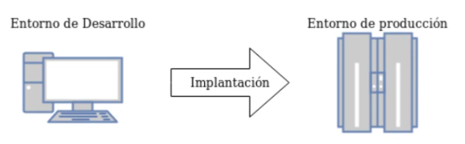

# Entornos virtuales en Python

## PyPI y pip

* El **Python Package Index** o **PyPI**, es el repositorio de paquetes de software oficial de paquetes Python.

* **pip**: Sistema de gestión de paquetes utilizado para instalar y administrar paquetes de PyPI.

## Instalación de módulos python

* Utilizar el que este empaquetado en la distribución que estés usando. ¿Y si necesitamos una versión determinada?

\scriptsize
```bash
    $ apt-cache show python3-requests
    ...
    Version: 2.25.1+dfsg-2
```
\normalsize

* Instalar **pip** en nuestro equipo, y como *root* instalar el paquete python que nos interesa. ¡¡¡Podemos romper dependencias de los paquetes del sistema.


\scriptsize
```
    $ pip_search requests
    requests     2.27.1
```
\normalsize
* **Utilizar entornos virtuales**

## Entornos virtuales

Es un mecanismo que me permite gestionar programas y paquetes python **sin tener permisos de administración**, es decir, **cualquier usuario sin privilegios** puede tener uno o más **“espacios aislados”** (ya veremos más adelante que los entornos virtuales se guardan en **directorios**) donde poder instalar distintas versiones de programas y paquetes python. Para crear los entornos virtuales vamos a usar el módulo **venv**.

## Creando entornos virtuales python

* Instalamos el módulo **venv**:

\scriptsize
```bash
    $ apt install python3-venv
```
\normalsize

* Como un **usuario sin privilegios** creamos el entorno (se va a crear un directorio que podemos guardar en un directorio **venv**):

\scriptsize
```bash
    $ python3 -m venv entorno_prueba
```
\normalsize

* Para activar y desactivar el entono virtual:

\scriptsize
```bash
    $ source entorno_prueba/bin/activate
    (entorno_prueba)$ deactivate
```
\normalsize

## Instalando paquetes en un entorno virtual

* En un entorno virtual activo, puedo instalar un paquete:

\scriptsize
```bash
    (entorno_prueba)$ pip install requests
```
\normalsize
* Si queremos ver los paquetes instalados:

\scriptsize
```bash
    (entorno_prueba)$ pip list
```
\normalsize
* Puedo guardar los paquetes instalados en un fichero...
\scriptsize
```bash
    (entorno_prueba)$ pip freeze > requirements.txt
```
\normalsize
* ... para instalar los mismos paquetes en otro ordenador:
\scriptsize
```bash
    (otro_entorno)$ pip install -r requirements.txt
```
\normalsize

## ¿Por qué usamos entornos virtuales?

{height=50%} 

* Necesito las mismas librerías y versiones en **desarrollo y producción**.
* Los entornos suelen tener **distintos SO**.
* Solución: **ENTORNOS VIRTUALES**.

# Flask

## ¿Qué es flask?

Flask es un **framework** python que nos permite construir **páginas web dinámicas**.

* Incluye un **servidor web de desarrollo** para que puedas probar tus aplicaciones sin tener que instalar un servidor web.
* Buen manejo de **rutas**: Con el uso de un decorador python podemos hacer que nuestra aplicación con URL simples y limpias.
* Flask se apoya en el motor de plantillas **Jinja2**.
* Flask es **Open Source** y está amparado bajo una **licencia BSD**.

## Instalación de Flask

Creo un entorno virtual, lo activo e instalo el paquete flask:

\scriptsize
```bash
    $ python3 -m venv flask
    $ source flask/bin/activate
    (flask)$ pip install flask
    (flask)$ flask --version
    Python 3.9.2
    Flask 2.0.3
    Werkzeug 2.0.3

```
\normalsize
Cuando terminamos de trabajar podemos desactivar el entorno:


\scriptsize
```bash
    (flask)$ deactivate
```
\normalsize

## ¿Cómo vamos a trabajar con Flask? - URLS

* En PHP las **url corresponden a ficheros** en el servidor:
\center
\scriptsize
```
https://dit.gonzalonazareno.org/moodle/course/view.php?id=25
```
\normalsize
* En python flask la **URL son virtuales**, no  corresponden a ficheros en el servidor.
\center
\scriptsize
```
https://dit.gonzalonazareno.org/gestiona/grupos/asir1
```
* Flask, examina la URL del navegador, comprueba que hemos definido la ruta, y ejecuta un programa que suele terminar mostrando una página web dinámica.

## ¿Cómo vamos a trabajar con Flask? - Rutas y vistas

* **Rutas**: Vamos a declarar las **URLS** con las que podemos acceder a la aplicación.
 **Vista**: Si la URL que ponemos en el navegador corresponder con alguna de las que hemos declarado se ejecuta una función, que llamamos vista.

 \scriptsize
```python
        @app.route('/')
        def inicio():
            ...

        @app.route('/articulos')
        def articulos():
            ...

        @app.route('/acercade')
        def acercade():
            ...
```
\normalsize

## ¿Cómo vamos a trabajar con Flask? - Acciones en las vistas

* En la vista **se puede ejecutar algún código**:
    * Buscar información en una BD.
    * Buscar información en un servicio web
    * Gestionar la información enviada desde un formulario
    * Gestionar enviada en la URL
    * Cualquier operación adicional
* De estas operaciones podemos obtener distintas **variables** con **información**.

## ¿Cómo vamos a trabajar con Flask? - Resultados de las vistas

* Después de ejecutar el código que hemos puesto en la vista, se nos devolverá un resultado:
    * Generar una página web dinámica a partir de una **plantilla** a la que podemos enviar la información que hemos generado. Las **plantillas** son parecidas a las páginas html, pero tienen lógica (for, if, ...)
    * Generar una **redirección** que nos lleve a otra URL.
    * Generar una **respuesta http de error** (por ejemplo **404**).

# Ejemplos para aprender Flask

## Ejemplo 1: Mi primer programa en flask

**Estructura de ficheros y directorios**

* Nuestra aplicación es *app.py* (pero se puede llamar como quieras).
* Una carpeta *templates* donde están las plantillas html5 que vamos a servir.
* Una carpeta *static* donde está el contenido estático: css, imágenes, js, ...

## Ejemplo 1: Mi primer programa en flask

* *app.py*


\tiny
```python

from flask import Flask, render_template
app = Flask(__name__)	

@app.route('/')
def inicio():
    return render_template("inicio.html")

@app.route('/articulos')
def articulos():
    return render_template("articulos.html")

@app.route('/acercade')
def acercade():
    return render_template("acercade.html")

@app.route('/error')
def error():
    return abort(404)

@app.route('/redireccion')
def redireccion():
    return redirect("/articulos")

app.run("0.0.0.0",5000,debug=True)
```
\normalsize

## Ejemplo 1: Mi primer programa en flask

1. El objeto *app* de la clase *Flask* representa nuestra aplicación Web. 
2. El método *render_template* genera una página html a partir de una plantilla.
3. El método *abort* genera una respuesta HTTP de error (404).
4. El método *redirect* genera una redirección a otra página.
3. El decorador *router* nos permite filtrar la petición HTTP recibida, de tal forma que si la petición se realiza a la URL coincide con alguna ruta especificada se ejecutará la función (*vista*).
    * Por ejemplo: si accedemos a **/** se ejecutará la función **inicio**.
    * Por ejemplo: si accedemos a **/articulos** se ejecutará la función **ariculos**.
    * ...
4. La función *vista* que se ejecuta devuelve una respuesta HTTP. En este caso devuelve una plantilla html.
5. Finalmente si ejecutamos este módulo se ejecuta el método *run* que ejecuta un servidor web para que podamos probar la aplicación, accediendo a la IP de la máquina al puerto 5000.

## Ejemplo 1: Mi primer programa en flask

* **Modo “debug”**

Si activamos este modo durante el *proceso de desarrollo* de nuestra aplicación tendremos a nuestra disposición una herramienta de depuración que nos permitirá estudiar los posibles errores cometidos

\scriptsize
```
(flask)$ python3 app.py 
... 
   WARNING: This is a development server. Do not use it in a production deployment.
...
 * Running on http://192.168.100.248:5000/ (Press CTRL+C to quit)
...
 * Debugger is active!
 * Debugger PIN: 113-693-875
```
\normalsize

El Debugger PIN lo utilizaremos para utilizar la herramienta de depuración.

## Ejemplo 1: EJERCICIO

### Ejercicio

* Introduce una nueva ruta que se llame **/informacion** que muestre la página **informacion.html**.
* Esa nueva página tiene que visualizar una imagen.
* Ejecuta el programa y comprueba que al entrar a la ruta se visualiza de manera correcta la nueva página.


## Ejemplo 2: Uso de herencia de plantillas

**Herencia de plantillas**

La herencia de plantillas nos permite hacer un esqueleto de plantilla, para que todas las páginas de nuestro sitio web sean similares.

* Vamos a crear una plantilla *base.html* donde indicaremos las partes comunes de todas nuestras páginas, e indicaremos los *bloques* que las otras plantillas pueden reescribir.
* Cada plantilla se *heredará de la plantilla base* y *reescribirá los bloques* indicados.

## Ejemplo 2: Uso de herencia de plantillas

* *base.html*

\scriptsize
```html
<!doctype html>
<html lang="es">
<head>
    <meta charset="utf-8">
    <title></title>
    <link rel="stylesheet" href="/static/css/pure/pure-min.css">
    <link rel="stylesheet" href="/static/css/pure/grids-responsive-min.css">
    <link rel="stylesheet" href="/static/css/styles.css">
</head>
<body>
<div id="layout" class="pure-g">
    ...
		</div>
        <div>
            <!-- A wrapper for all the blog posts -->
            
        ...
</div>
</body>
</html>
```
\normalsize

## Ejemplo 2: Uso de herencia de plantillas

* *inicio.html*

\scriptsize
```html

Ejemplo 2 - Inicio

<div class="posts">
    <h1 class="content-subhead">Flask</h1>

    <!-- A single blog post -->
    <section class="post">
        <header class="post-header">
            <h2 class="post-title">Página Principal</h2>
            <p class="post-meta">
            ...
            
        </div>
    </section>
</div>

```
\normalsize

## Ejemplo 2: EJERCICIO

### Ejercicio

* Introduce una nueva ruta que se llame **/informacion** que muestre la página **informacion.html**.
* Crea la platilla **informacion.html** usando herencia de plantillas.
* Esa nueva página tiene que visualizar una imagen.
* Ejecuta el programa y comprueba que al entrar a la ruta se visualiza de manera correcta la nueva página.

## Ejemplo 3: Trabajando con las plantillas

* Las plantillas html que usamos utilizan el lenguaje **jinja2**.
* En la función *inicio* hemos enviado variables al template *inicio.html*.
* Si queremos poner el valor de una variable en un tamplate usamos:

\scriptsize
```
    {{ variable }}
```
\normalsize

* Podemos usar instrucciones if dentro de una plantilla:

\scriptsize
```
    
        ...
    
        ...
    
```
\normalsize

* Para poner un comentario:

\scriptsize
```
    {# Comentario #}
```

## Ejemplo 3: Trabajando con las plantillas

* *app.py*

\scriptsize
```python
...
@app.route('/')
def inicio():
    persona = "juan"
    num1=10
    num2=14
    return render_template("inicio.html",nombre=persona,
                                         edad=12,
                                         numero1=num1,
                                         numero2=num2,
                                         resultado=num1+num2) 
```
\normalsize

## Ejemplo 3: Trabajando con las plantillas

* *inicio.html*

\scriptsize
```html
...
        <div class="post-description">
            
		        <h2>Página principal</h2>
	        
		        <h2>Hola, {{nombre|title}}</h2>
		        
			        
				        <h3>Tienes {{edad}} años. Es mayor de edad</h3>
			        
				        <h3>Tienes {{edad}} años.</h3>
    			    
	    	    
            
          
            <p>La suma del {{numero1}} y el {{numero2}} es {{resultado}}.</p>
```
\normalsize

## Ejemplo 3: Trabajando con las plantillas

* En la función *articulos* hemos enviado una *lista* al template *articulos.html*.
* Podemos usar instrucciones *for* dentro de las plantillas:

\scriptsize
```
    
        ...
    
```
\normalsize

* La variable **loop.index** nos devuelve el número de la iteración.
* La variable lógica **loop.first** es *True* si estamos en la primera iteración.
* La variable **loop.length** no da el número total de iteraciones.

## Ejemplo 3: Trabajando con las plantillas

* *app.py*

\scriptsize
```python
...
@app.route('/articulos')
def articulos():
    lista = ["sandía","manzana","platano","piña","kiwi"]
    return render_template("articulos.html",lista=lista)
...
```
\normalsize

## Ejemplo 3: Trabajando con las plantillas

* *articulos.html*

\tiny
```html
...
    <h1>Mostramos la segunda fruta</h1>
    <p>{{lista[1]}}</p>
    <h1>Frutas</h1>
    <ul>
        {# Empezamos un bucle #}
        
            <li>{{elem}}</li>
        
    </ul>
    <p>Lista con índice</p>
    <ul>
        
            <li>{{loop.index}} - {{ elem }}</li>
        
    </ul>
    <p>Podemos saber si estamos en la primera iteración o en la última</p>
    <p>Ademas podemos saber cuantas iteraciones se van dar:</p>
    <ul>
        
            
                <p>Tenemos {{loop.length}} elementos en la lista.</p>
                <li><strong>{{loop.index}}/{{loop.length}} - {{ elem }}</strong></li>
            
                <li>{{loop.index}}/{{loop.length}} - {{ elem }}</li>
            
        
    </ul>
```
\normalsize

## Ejemplo 3: Trabajando con las plantillas

* En la función *acercade* hemos enviado una *lista de diccionarios* al template *acercade.html*.
* La lista la recorremos con un for. 
* Para acceder al valor de los campos de un diccionario se usa el punto:

\scriptsize
```
    {{ enlace.url }}
        ...
    {{ enlace.texto }}
```
\normalsize

## Ejemplo 3: Trabajando con las plantillas

* *app.py*

\scriptsize
```python
...
@app.route('/acercade')
def acercade():
    enlaces=[{"url":"http://www.google.es","texto":"Google"},
			{"url":"http://www.twitter.com","texto":"Twitter"},
			{"url":"http://www.facbook.com","texto":"Facebook"},
			{"url":"http://www.josedomingo.org","texto":"Pledin"},
			{"url":"https://dit.gonzalonazareno.org/moodle","texto":"Moodle"}
			]
    return render_template("acercade.html",enlaces=enlaces)

...
```
\normalsize

## Ejemplo 3: Trabajando con las plantillas

* *articulos.html*

\scriptsize
```html
...
    <div class="post-description">
        
            <ul>
            
    	        <li><a href="{{ enlace.url }}">{{ enlace.texto }}</a></li>
            
	        </ul>
        
            <p>No hay enlaces</p>
        
    </div>
```
\normalsize

## Ejemplo 3: EJERCICIO

### Ejercicio

* Introduce una nueva ruta que se llame **/informacion** que muestre la página **informacion.html**.
* Crea la platilla **informacion.html** usando herencia de plantillas.
* Esa nueva página tiene que visualizar una imagen.
* A la platilla **informacion.html** le vamos a mandar una lista:

\scriptsize
```python
        lista = [ "java", "php", "python", "ruby" ]
```
\normalsize

* La plantilla generará una lista ordenada con los elementos de la lista, poniendo el primer elemento en negrita.
* Ejecuta el programa y comprueba que al entrar a la ruta se visualiza de manera correcta la nueva página.

## Ejemplo 4: Envío de información con GET

* En el fichero *app.py* hemos importado el objeto *request* que nos permite obtener *información de la petición HTTP*.

\scriptsize
```
    from flask import Flask, render_template, request
```
\normalsize

* Dos formas de enviar información por la URL:
    * **Usando parámetros en la URL**.
    * **Usando rutas dinámicas**.

* En el template *inicio.html* hemos incluidos dos enlaces:
    * Uno que manda información a la ruta *articulos* usando parámetros GET.
    * Otro que manda información a la ruta *acercade* usando rutas dinámicas.

## Ejemplo 4: Envío de información con GET

**Envío de información con parámetros en la URL**

* *incio.html*

\scriptsize
```html
    ...
    <p>Mandar información a artículos usando el método GET:</p>
    <ul>
        <li><a href="/articulos?nombre=Manzana&precio=10">Artículo Manzana</a></li>
        ...
```
\normalsize

* *aap.py*

\scriptsize
```python
    @app.route('/articulos')
    def articulos():
        nombre=request.args.get("nombre")
        precio=request.args.get("precio")
        return render_template("articulos.html",nombre=nombre,precio=precio)
```

## Ejemplo 4: Envío de información con GET

**Envío de información con rutas dinámicas**

* *incio.html*

\scriptsize
```html
    ...
    <p>Mandar información a artículos usando el método GET:</p>
    <ul>
        ...
        <li><a href="/acercade/Pepe/20">Acerca de Pepe</a></li>
```
\normalsize

* *aap.py*

\scriptsize
```python
    @app.route('/acercade/<nombre>/<edad>')
    def acercade_con_nombre(nombre,edad):
        return render_template("acercade.html",nombre=nombre,edad=edad)
```
## Ejemplo 4: EJERCICIO

### Ejercicio

Vamos a incluir dos nuevas rutas a las que vamos a mandar información en la URL.

* En la página principal debes poner dos enlaces  a las diferentes páginas (para probar como funcionan).
* **Página potencia**: Se accede con la URL **/potencia?base=xxx&exponente=xxx**. Se muestra una página dinámica donde se muestra un título "Calcular potencia", se muestra la base y el exponente y se muestra el resultado:
    * Si el exponente es positivo, el resultado es la potencia.
    * Si el exponente es 0, el resultado es 1.
    * Si el exponente es negativo, devuelve un error 404.
* **Página cuenta letras**: Se accede con la URL **/cuenta/palabra/letra**. Si la letra no es una cadena con un carácter se devuelve un error 404. Se muestra una página donde hay un título "Cuanta letras", y muestra el siguiente mensaje. En la palabra ********* aparece *** veces el carácter ***.

## Ejemplo 5: Patrón de diseño: Lista - Detalle

En este ejercicio vamos a aprender a generar una lista (de alumnos, de artículos, de ...). Cada elemento será un enlace que nos mostrará información del elemento seleccionado.

* Por ejemplo, tenemos información de alumnos.
* Mostraremos una **lista** de enlaces con los nombre de los alumnos, el enlace mnadará a una ruta donde enviaremos su código (clave primaria).
* En esa ruta (**vista**) recibirá el código, podrá buscar información del alumno y mostrarla.

La lista de enlace se puede hacer usando:

* Parámetros en la URL, o
* Rutas dinámicas

## Ejemplo 5: Patrón de diseño: Lista - Detalle

* Ruta */lista_url* genera la lista usando parámetros en la URL. Le mandamos una variable *lista_notas* con información de los alumnos.

* *lista_url.html*

\scriptsize
```html
    ...
    
	    <ul>
	    
		  	<li><a href="/alumno?id={{nota.id}}">{{nota.nombre}}</a></li>
		
		</ul>
	
	    <p>No tenemos alumnos.</p>
```
\normalsize

## Ejemplo 5: Patrón de diseño: Lista - Detalle

* Ruta `/alumno` recibe por parámetros el id del alumno y muestra el template *alumno.html* que recibe la información del alumno. Si no recibe un id válido devuelve un 404.

* *app.py*

\scriptsize
```python
    ...
    @app.route('/alumno')
    def alumno():
        id=int(request.args.get("id"))
        for alumno in notas:
            if alumno["id"]==id:
                return render_template("alumno.html",alum=alumno)
        return abort(404)
```
\normalsize

## Ejemplo 5: Patrón de diseño: Lista - Detalle

* Ruta */lista_dinamica* genera la lista usando rutas dinámicas. Le mandamos una variable *lista_notas* con información de los alumnos.

* *lista_dinamica.html*

\scriptsize
```html
    ...
    
		<ul>
		
		   	<li><a href="/alumno/{{nota.id}}">{{nota.nombre}}</a></li>
		
		</ul>
	
	    <p>No tenemos alumnos.</p>
    
```
\normalsize

## Ejemplo 5: Patrón de diseño: Lista - Detalle

* Ruta `/alumno/<id>` ruta dinámica que recibe el id del alumno y muestra el template *alumno.html* que recibe la información del alumno. Si no recibe un id válido devuelve un 404.

* *app.py*

\scriptsize
```python
    ...
    @app.route('/alumno/<id>')
    def alumno_dinamico(id):
	    for alumno in notas:
		    if alumno["id"]==int(id):
			    return render_template("alumno.html",alum=alumno)
	    return abort(404)

```
\normalsize