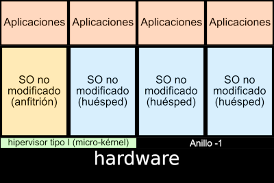
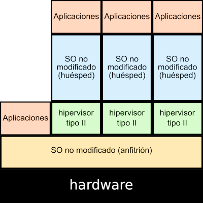
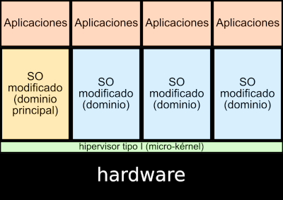

# ¿Qué es la virtualización?

## ¿Qué es la virtualización?

La virtualización utiliza el software para imitar las características del hardware y crear un sistema informático virtual.

### ¿Para qué se utiliza la virtualización?

* Aislamiento e independencia de servicios y contenidos.
* Laboratorio de pruebas.
* Virtualización de arquitecturas de las que no se dispone.
* Creación de clúster de máquinas y sistemas distribuidos.
* Herramientas de aprendizajes.

## Ventajas e inconvenientes de la virtualización

Las principales ventajas que podemos indicar serían:

* Importante ahorro económico.
* Seguridad.
* Mayor aprovechamiento de recursos.
* Migración en vivo. 
* Importante ahorro energético.

Como desventajas podríamos señalar:

* Muchos sistemas dependen de un sólo equipo físico.
* Penalizaciones en rendimiento.

## Conceptos de virtualización

* Al sistema operativo que ejecuta el software de virtualización se le conoce como anfitrión (**host**). El anfitrión controla el hardware real.
* Al sistema operativo virtualizado se le conoce como invitado o huésped (**guest**).
* Al software de virtualización se le suele llamar **Hipervisor**.
* Desde 2005, Intel y AMD han añadido soporte hardware para la virtualización: **Intel Virtualization Technology (VT) y AMD Virtualization (AMD-V)**, y permiten a los hipervisores un rendimiento mayor en su labor de virtualizar.

## La virtualización en la enseñanza de las TIC

El uso de mecanismos de virtualización revolucionó las metodologías que hemos empleado en la enseñanza de las TIC:

* Los alumnos pueden crear infraestructura virtual que simula un escenario real.
* Podemos instalar diferentes sistemas operativos en una sola máquina.
* No es necesarios dispositivos físicos para la realización de muchas prácticas.
* Se pueden usar máquinas virtuales para probar nuevas cosas, con la ventaja que si "rompemos" algo se eliminan y se vuelven a crear.
* ...

# Tipos de virtualización

## Emulación

## Virtualización por hardware

## Virtualización completa

## Virtualización parcial o paravirtualización

## Virtualización ligera

# Introducción a Proxmox VE

## Virtualización con Proxmox VE

**Proxmox Virtual Environment**, o **Proxmox VE** es un entorno de virtualización de servidores de código abierto. Es una distribución de GNU/Linux basada en Debian que permite el despliegue y la gestión de máquinas virtuales y contenedores.

Nos permite gestionar los siguientes recursos virtualizados:

* **Máquinas virtuales**: Para ello utiliza **virtualización por hardware** con el uso del hipervisor KVM.
* **Contenedores**: Podemos gestionar **contenedores de sistema** LXC.

## Otras características

* Ofrece una consola web para la gestión de los recursos virtualizados.
* Ofrece herramientas de línea de comandos para la gestión de los recursos virtualizados.
* Ofrece una API REST que nos permite la gestión de los recursos virtualizados desde un programa diseñado por nosotros.
* Permite la creación de un clúster de servidores Proxmox.
* Si tenemos configurado un clúster de servidores Proxmox tendremos características de alta disponibilidad y de migraciones en vivo.
* Permite el uso de muchos tipos de medios de almacenamiento.
* Permite la configuración de la red que van a utilizar las máquinas virtuales y los contenedores.
* Es un programa de código abierto.
* Hay una gran comunidad de soporte y ayuda.
* ...

## Proxmox VE en un centro educativo

Un sistema de virtualización como Proxmox VE puede ser muy adecuado para las enseñanzas de las TIC en nuestros centros educativos:

* Por un lado, nos beneficiamos de todas las características que estudiamos sobre la virtualización.
* Nos permite que los recursos virtualizados que usan los alumnos no se estén ejecutando en sus máquinas físicas.
* No tenemos la limitación de recursos de las máquinas de los alumnos.
* Si una máquina física de un alumno se estropea podrá seguir usando los recursos virtualizados sin problemas, porque se están ejecutando en un servidor o en un clúster de servidores.
* Los profesores tenemos acceso a las máquinas de los alumnos (¡Para corregir viene muy bien!).
* Los alumnos usan un sistema de virtualización ampliamente implantado en muchas empresas.
