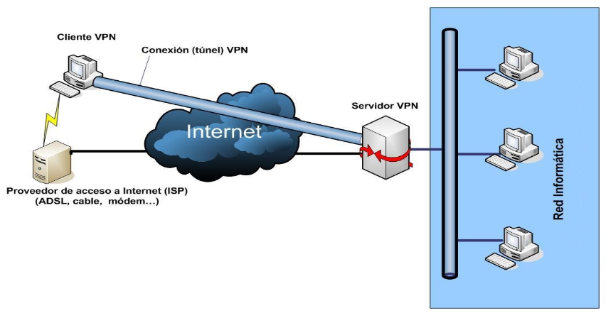
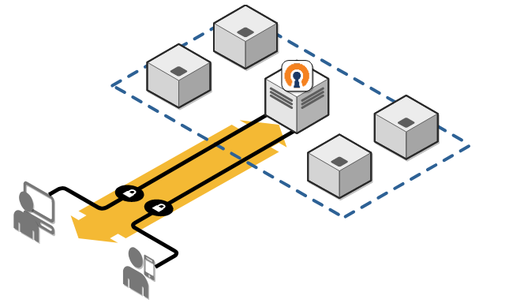
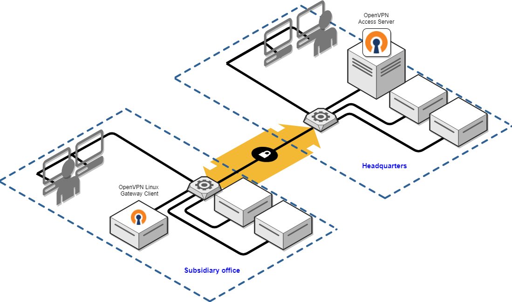

## Introducción

* Cada vez más empresas cuentan con diferentes sucursales o filiales distribuidas por uno o varios países y con empleados móviles que no trabajan desde la oficina
* Es necesario contar con comunicaciones fiables, seguras y rápidas
* Hasta hace poco las empresas contrataban líneas dedicadas para construir WANs:
  * Fiables, seguras y tienen un alto rendimiento
  * CARAS, MUY CARAS.

## Introducción

**¿Por qué no aprovechar las líneas ya existentes?**

Una **VPN, Virtual Private Network**, es una red privada que usa una red pública (normalmente Internet) para conectar sucursales o usuarios.

{height=60%} 

## Tipos de VPN

Existen 3 tipos de VPN:

* **Conexiones de clientes de acceso remoto**
  * Dan solución a los trabajadores móviles que deben poder usar los recursos de la red interna desde localizaciones remotas
* **Comunicación site-to-site**
  * Dos o más redes locales son unidas a través de una VPN formando una intranet extendida. Oficinas remotas.
* **Acceso controlado dentro de una red local**
  * Usado en muchas ocasiones para proteger la red wifi

## Clientes de acceso remoto

{height=60%} 

## Site-to-site

{height=60%} 

## Ventajas y limitaciones de las VPN
* Ventajas
  * Ahorro de costes
  * Escalabilidad
* Limitaciones
  * Requieren una comprensión detallada de conceptos de seguridad de redes y una cuidadosa instalación y configuración
  * El rendimiento y la fiabilidad dependen del ISP
  * Problemas de compatibilidad

## VPN tunneling protocols
* VPN se basan en el concepto de tunneling, que implica establecer y mantener una conexión lógica entre dos extremos en la que se ven implicados nodos intermedios 
* Los paquetes se encapsulan dentro de un datagrama o de una trama utilizando un protocolo VPN
* Estos protocolos deben proporcionar:
  * Autenticación (usuario/equipo)
  * Compresión de datos
  * Cifrado de datos
  * Direccionamiento dinámico
  * Gestión de claves
* Protocolos: PPTP,L2F,L2TP,IPSEC,SSTP...

## Soluciones VPN
* Hardware
  * Ofrecen alto rendimiento y facilidad de configuración 
* Software
  * Mayor flexibilidad a la hora de su configuración
  * FreeS/Wan (IPSec)
  * OpenVPN (openvpn)
  * Wireguard (Muy nuevo, utiliza un protocolo propio Wireguard)