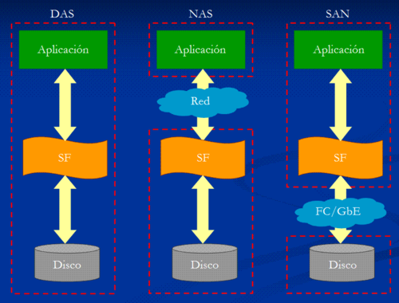
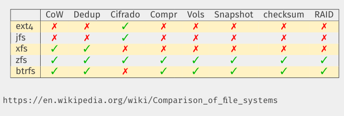
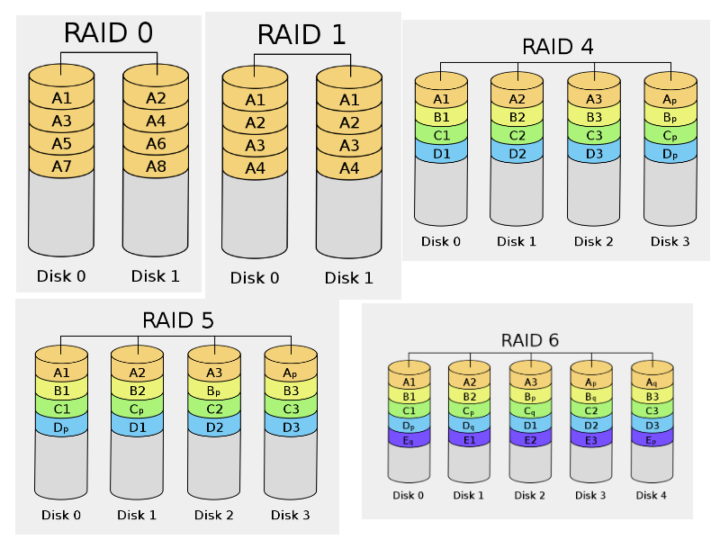
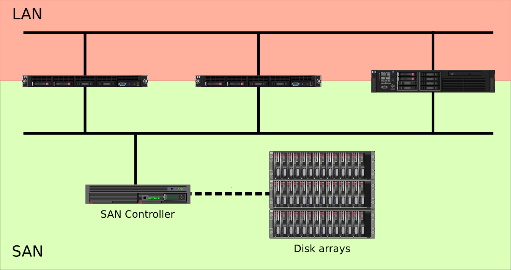

# Sistemas de ficheros 

## Fichero

* Es un conjunto de datos almacenados en un dispositivo de almacenamiento.
* Un fichero posee un nombre y metadatos.
* El tipo de datos contenidos está definido por su formato y en ocasiones por su
extensión.
* Normalmente el formato está definido en la cabecera (**magic number**).
* Un fichero solo con datos ASCII o UTF8 se conoce como texto plano (plain text).
* Los ficheros con datos reciben el nombre de ficheros regulares.

`file fichero.pdf`

\color{blue}[https://asecuritysite.com//forensics/magic](https://asecuritysite.com//forensics/magic/)\color{darkgray}

## Ficheros especiales

Aparte de los ficheros regulares, en UNIX **"todo es un fichero"**:

* Enlaces
* sockets
* Dispositivos (En /dev)
* Ficheros virtuales (En /proc o /sys)
* Ficheros virtuales en memoria (Tipo tmpfs o ramfs)

## Directorios

* Los directorios son contenedores de ficheros y se pueden anidar (subdirectorios).
* El directorio principal es el directorio raíz o /.
* Los directorios se organizan formando un árbol a partir del directorio raíz.
* Los ficheros se definen de forma única por el nombre que incluye su ruta completa desde el directorio raíz, p.ej. `/usr/share/doc/apt/copyright`.
* La estructura de los directorios es estricta y definida en el **Linux FilesystemHierarchy Standard (FHS)** de la Linux Foundation (\color{blue}[https://refspecs.linuxfoundation.org/fhs.shtml](https://refspecs.linuxfoundation.org/fhs.shtml)\color{darkgray})
* Las diferentes distros de GNU/Linux deben seguir la FHS

## Dispositivos de bloques

* Los dispositivos son ficheros especiales ubicados en **/dev**.
* **Dispositivos de caracteres** (character devices)
* **Dispositivos de bloques** (block devices)
	* E/S en bloques de datos
	* Uso de buffer
	* Usados para los dispositivos de almacenamiento
* Discos duros, disquetes, CDs, DVDs, particiones, volúmenes lógicos, RAID, etc.

## Linux Virtual FileSystem (VFS)

* Capa del kérnel que proporciona una interfaz única a usuarios y programas.
* Implementa un único árbol aunque esté formado por varios dispositivos de bloques y/o tipos de sistemas de fichero.
* syscalls: open(2), stat(2), read(2), write(2) y chmod(2)
* Montar y desmontar

## Sistemas de ficheros

* Controla cómo se almacenan y obtienen los datos.
* Capa lógica.
	* Responsable de la interacción con los usuarios y programas.
	* API.
	* Modelo de seguridad.
* Implementación: Enlaza la capa lógica con los dispositivos de almacenamiento
* Los dispositivos de bloques se formatean con un sistema de ficheros.

## Fuentes de almacenamiento

* **DAS** (Direct Attached Storage):Dispositivo de almacenamiento conectados directamente al ordenador o servidor. 
* **NAS** (Network Attached Storage): Se comparte por red almacenamiento, normalmente sistema de ficheros.
* **SAN** (Storage Area Network): En una red de almacenamiento se comparte dispositivos de bloques.
* **Cloud** (Object Storage): Almacenamiento en la nube con características de cloud computing.

## Comparativa DAS, NAS y SAN

{ height=80% } 

## Sistemas de ficheros para DAS

* ext2/3/4
* xfs
* jfs
* reiserfs
* vfat
* zfs
* btrfs

## ext4

* Sistema de ficheros por defecto en linux
* Características principales:
	* Compatible con ext2/3
	* Utiliza journaling
	* Hasta 1 EiB con ficheros de 16 TiB
	* Mejoras en el rendimiento frente a ext2/3
	* Herramientas del espacio de usuario: e2fsprogs: mkfs.ext4 fsck.ext4 tune2fs resize2fs dumpe2fs debugfs ...
* No supone una mejora radical frente a ext3

## xfs

* Desarrollado originalmente por SGI
* Utilizado por defecto en RHEL 7
* Hasta 8 EiB
* Utiliza journaling
* Permite redimensionado en “caliente”
* Presume de tener mejor rendimiento que ext4
* Herramientas del espacio de usuario: xfsprogs: mkfs.xfs fsck.xfs xfs_db xfs_growfs xfs_info ...

## vfat

* Sistema de ficheros de MS-DOS/Windows
* No guarda información de propietarios: sistema monousuario
* Enormes limitaciones
* Utilizado masivamente en dispositivos extraíbles
* VFS permite su utilización “transparente” en linux
* Herramientas del espacio de usuario: dosfstools: mkfs.vfat fsck.vfat dosfslabe

## Funcionalidades avanzadas (I)

### Copy on Write (CoW)

* Se descomponen los datos a almacenar en diferentes bloques.
* Al crear la copia solo se crea un nuevo puntero que apunta al conjunto de datos originales.
* Cuando los datos copiados se modifican, se van creando nuevos bloques con las modificaciones.

### Deduplicación

* Utiliza las propiedades CoW de un sistema de ficheros.
* Identifica bloques idénticos y los reorganiza con CoW.
* Permite aprovechar la característica CoW sin intervención del usuario.

## Funcionalidades avanzadas (II)

### Cifrado

* Permite el cifrado de ficheros al vuelo sin utilizar software adicional.

### Compresión

* Almacena los ficheros comprimidos para optimizar el uso del espacio.

### Gestión de volúmenes

* Equivalente a LVM
* Permite gestionar volúmenes y sistemas de ficheros de forma independiente de los dispositivos de bloques físicos.
* Un dispositivo de bloques físico puede contener varios volúmenes o un volumen puede estar distribuido en varios dispositivos de bloques físicos.

## Funcionalidades avanzadas (III)

### Instantáneas (snapshots)

* Utiliza instantáneas de forma nativa.

### Sumas de comprobación (checksums)

* Utilizadas para verificar la integridad de los ficheros.

### Redundancia (RAID)

* RAID software nativo en el sistema de ficheros.
* Sin necesidad de usar mdadm.

## Comparativa

{ height=80% }

## ZFS

* Sistema de ficheros avanzado desarrollado por Sun Microsystems. Se incluye en OpenSolaris. 
*  2010: Oracle compra Sun Microsystems y abandona OpenSolaris. ZFS vuelve a
ser software cerrado.
* Se crea Illumos (2010)(fork libre de OpenSolaris) y OpenZFS (2013) (fork libre de ZFS).
* 2015: Aparece ZFS on Linux, versión de OpenZFS para linux.

## ZFS

* Es un sistema completo de almacenamiento que no requiere otras herramientas.
* Gestiona los dispositivos de bloques directamente.
* Incluye su propia implementación de RAID, CoW, deduplicación, instantáneas, compresión, cifrado, soporte nativo de nfs, cifs o iscsi, ...
* Siempre consistente sin necesidad de chequeos.
* Se autorepara de forma continua.
* Muy escalable.
* Exigente en recursos.

## Btrfs

* Es un sistema completo de almacenamiento que no requiere otras herramientas.
* Licencia GPL y completamente integrado en el kérnel linux.
* Hace años que se considera estable, aunque aún le falten algunas características de ZFS.
* Gestiona los dispositivos de bloques directamente.
* Incluye su propia implementación de RAID, CoW, deduplicación, instantáneas, compresión, cifrado, ...
* Autoreparación
* No está extendido su uso como cabría esperar.


# LVM

## LVM
LVM es una implementación de un gestor de volúmenes lógicos para el núcleo Linux:

* Redimensionado de grupos lógicos.
* Redimensionado de volúmenes lógicos.
* Instantáneas de sólo lectura (LVM2 ofrece lectura y escritura).
* RAID0 de volúmenes lógicos.

## Componentes de LVM

Un LVM se descompone en tres partes:

* **Volúmenes físicos (PV)**: Son los dispositivos de bloque que vamos a usar.
* **Grupos de volúmenes (VG)**: Nos permiten agrupar los volúmenes físicos para crear nuestros volúmenes lógicos.
* **Volúmenes lógicos (LV)**: Es un dispositivos de bloque que podemos formatear

## Taller 1: Gestión de pool de almacenamiento lógico en KVM/libvirt

* Cuando estudiamos virtualización Linux utilizamos pool de almacenamientos de tipo **dir** y los volúmenes eran ficheros **qcow2**.
* En este taller vamos a crear un pool de almacenamiento de tipo lógico, donde los volúmenes serán volúmenes lógicos creados en un grupo de volúmenes.
* Los ficheros del disco de la máquina virtual se guardará en el volumen lógico.
* **¿Qué ventajas puede tener este tipo de almacenamiento en una máquina virtual?**

# RAID

## Introducción

* RAID es un sistema que aumenta la fiabilidad de los datos almacenados en discos utilizando mecanismos de redundancia.
* RAID hace dos cosas principalmente:
	* **Duplicar (mirroring)** los datos en varios discos, reduciendo el riesgo asociado al fallo de un disco.
	* **Mejorar el rendimiento dividiendo (stripping)** los datos en varios discos, que trabajan simultáneamente con un flujo unico de datos.

## Tipos de RAID

* **Hardware**: Está implementado completamente dentro de la controladora de disco (controladora RAID), mediante hardware y firmware especializado. Una controladora RAID hardware debe presentar al sistema operativo los discos como un único dispositivo de almacenamiento.
* **Software**: Lo implementa mediante software el sistema operativo de forma independiente de la controladora de disco.
* **BIOS**: Está implementado parcialmente dentro de la controladora de disco, pero utilizan controladores de software específicos para poder comunicarse adecuadamente con el sistema operativo.

## Conceptos

* **Paridad**: Los datos de paridad se utilizan para conseguir redundancia de los datos. Si una unidad falla, es posible recuperar los datos combinando los datos de las otras unidades y los de paridad (operaciones XOR).
* **Disco de reserva**: Disco que se pone en funcionamiento automáticamente al fallar un disco que esté en RAID. Utilizando un **hot spare** se reduce mucho el tiempo de recuperación de los datos.

## Niveles de RAID

{ height=75% }

# NAS

## Introducción

El **almacenamiento conectado en red**, Network Attached Storage (**NAS**), es una tecnología de almacenamiento dedicada a compartir la capacidad de almacenamiento de un servidor con máquinas clientes a través de una red (normalmente TCP/IP).

* Protocolos usados: NFS, SMB/CIFS, ...
* Se comparte sistemas de ficheros completos.
* Normalmente para realizar copias de seguridad y compartir ficheros.

# SAN

## Introducción

Una **red de área de almacenamiento**, en inglés Storage Area Network (**SAN**), es una red de almacenamiento integral. 

* Red dedicada de almacenamiento que proporciona **dispositivos de bloques** a los servidores.
* Los elementos típicos de una SAN son:
	* Red dedicada alta velocidad (cobre o fibra óptica)
	* Equipos o servidores que proporcionan el almacenamiento
	* Servidores que utilizan los dispositivos de bloques
* Los protocolos más utilizados son iSCSI y Fibre Channel Protocol (FCP).

## Esquema de SAN

{ height=75% }

## iSCSI

* Proporciona acceso a dispositivos de bloques sobre TCP/IP.
* Se utiliza fundamentalmente en redes de almacenamiento.
* Alternativa económica a Fibre Channel.
* Utilizado típicamente en redes de cobre de 1 Gbps o 10 Gbps.

## Elementos de iSCSI

* **Unidad lógica (LUN)**: Dispositivo de bloques a compartir por el servidor iSCSI.
* **Target**: Recurso a compartir desde el servidor. Un target incluye uno o varios LUN.
**Initiator**: Cliente iSCSI.
* Multipath
* **IQN** es el formato más extendido para la descripción de los recursos. Ejemplo: **iqn.2020-01.org.gonzalonazareno:sdb4**
* **iSNS**: Protocolo que permite gestionar recursos iSCSI como si fueran Fibre Channel.

## Implementaciones iSCSI

* iSCSI tiene soporte en la mayoría de sistemas operativos.
* En Linux usamos **open-iscsi** como initiator.
* Existen varias opciones en Linux para el servidor iSCSI:
	* Linux-IO (LIO)
	* **tgt**
	* scst
	* istgt

# Sistemas de ficheros en clúster y \newline distribuidos

## DRBD: Sistemas de dispositivos de bloques compartidos

* **DRBD** (*Distributed Replicated Block Device*) es un sistema de almacenamiento replicado distribuido para la plataforma Linux.
* Es parecido a un RAID1, pero en este caso, se hace la duplicación de los datos entre diferentes **dispositivos de bloque** en diferentes hosts a través de la red.
* Modos de funcionamiento:
	*  **Modo "Un sólo primario" (Single-primary)**: Un nodo primario, donde se escribe, y otro secundario donde se va copiando. Si el primario falla, el secundario pasa a primario.
	* **Modo "Dos primarios" (Dual-primary)**: En este caso los dos nodos se configuran como primario, en los dos nodos se puede escribir de forma simultánea.

## Sistemas de ficheros en clúster

* **Sistemas de ficheros en clúster**: Permite el acceso y la gestión de archivos en un entorno de clúster.
* Un **clúster** es un grupo de máquinas que trabajan juntas para presentar una **sola imagen de sistema**, es decir,todos los nodos comparten una misma configuración de software y de hardware.
*  **Escalabilidad y Disponibilidad**: los datos se pueden replicar entre varios nodos del clúster para evitar la pérdida de datos en caso de fallos en un nodo individual.
* En un clúster DRBD configuado como **dual-primary** necesitamos sistemas de ficheros distribuidos para que no haya corrupción de datos.
* Ejemplos: OCFS2, GFS2, ...

## Sistemas de ficheros distribuidos

* **Sistemas de ficheros distribuidos**: Permite el acceso y la gestión de archivos en un entorno distribuido.
* **Un sistema distribuido** es un grupo de máquinas que trabajan juntas pero **no necesariamente tienen una sola imagen de sistema**, es decir, cada nodo puede tener una configuración de software y de hardware diferente.
* **Escalabilidad y Disponibilidad**: Los datos se distribuyen entre varios nodos para evitar la sobrecarga en un solo nodo y mejorar la tolerancia a fallos.
* Ejemplos: GlusterFS, CephFS, Windows DFS, Lustre, ...

## OCFS2

* **OCFS** (*Oracle Cluster File System*) es un sistema de archivos distribuido de alto rendimiento desarrollado por Oracle Corporation. Es un sistema de archivos nativo de clúster que permite a varios nodos del clúster acceder y modificar los mismos archivos al mismo tiempo.
* **OCFS2 (versión 2)** fue integrada dentro de la versión 2.6.16 del núcleo Linux.
* Aunque OCFS2 se puede utilizar para formatear un sistema de archivo local: \color{blue}[Enlace](https://docs.oracle.com/en/operating-systems/oracle-linux/8/shareadmin/shareadmin-ManagingtheOracleClusterFileSystemVersion2inOracleLinux.html#config-file-ocfs2)\color{darkgray}. Su verdadero potencial es cuando lo utilizamos en un cluster.

## Cluster OCFS2

* Tenemos que crear un cluster (*Cluster Stack*) ocfs2 indicando los nodos que van a formar parte de él.
* Utilizamos dos servicios: 
  * **o2cb**: Encargado de gestionar el cluster
  * **ocfs2**: Encargado de gestionar el sistema de fichero distribuido.
* Para formatear con ocfs2, usamos: `mkfs.ocfs2`.
* \color{blue}[Documentación oficial](https://docs.oracle.com/en/operating-systems/oracle-linux/7/fsadmin/ol7-ocfs2.html#ol7-instcfg-ocfs2).

## GFS2

* **GFS2** (*Global File System 2*) es un sistema de archivos distribuido de alto rendimiento diseñado para entornos de clúster. Es una evolución del sistema de archivos GFS original y es desarrollado por Red Hat.

* Lo instalamos en debian:

\scriptsize
```
apt install gfs2-utils dlm-controld
```

## GFS2

Para formatear un dispositivo de bloque (por ejemplo `/dev/drbd1`):

\scriptsize
```
mkfs.gfs2 -p lock_dlm -j 2 -t mycluster:web /dev/drbd1
```
\normalsize

* `-p lock_dlm`: Indica que vamos a usar el programa DLM (*Distributed Lock Manager*) para gestionar los cambios del sistema de archivo.
* `-j 2`: Se va a reservar espacio para 2 journals (registro donde se almacena información necesaria para recuperar los datos afectados por una transición en caso de que falle) uno para cada nodo.
* `-t mycluster:web`: El nombre de la tabla de bloqueo (lock) (`web`) en el cluster `mycluster` (nombre del cluster).

\color{blue}[Documentación](https://access.redhat.com/documentation/es-es/red_hat_enterprise_linux/8/html-single/configuring_gfs2_file_systems/index)

## GlusterFS

* **[GlusterFS](https://www.gluster.org/)** es un sistema de archivos en red escalable y distribuído, definido para ser utilizado en el espacio de usuario, es decir, sin utilizar el espacio de almacenamiento crítico del sistema, y de esta forma no compromete el rendimiento. 
* Gluster es una forma sencilla de aprovisionar su propio backend de almacenamiento NAS utilizando casi cualquier hardware que elija.
* La recuperación de errores (failover) se hace de forma automática, de modo que si un servidor se cae, no se pierde el acceso a los datos. Cuando se recupera el servidor que ha fallado no hay que hacer nada para recuperar los datos, excepto esperar. Mientras tanto, la copia más actual de los datos se sigue sirviendo desde los nodos que estaban operativos.
* Se puede acceder a los datos de Gluster desde los clientes tradicionales NFS, SMB/CIFS o usando el cliente nativo.

## GlsuterFS

Ventajas:

* **Simplicidad**: Es fácil de utilizar y al ser ejecutado en el espacio de usuario es independiente del núcleo.
* **Elasticidad**: Se adapta al crecimiento y reduce el tamaño de los datos.
* **Escalabilidad**: Tiene disponibilidad de Petabytes y más.
* **Velocidad**: Elimina los metadatos y mejora el rendimiento considerablemente unificando los datos y objetos.

\color{blue}[Taller de GlusterFS](https://github.com/josedom24/taller_glusterfs)


# Almacenamiento de objetos en la nube

## Almacenamiento de objetos

* El **almacenamiento de objetos en la nube** es un servicio de almacenamiento en línea en el que los datos se almacenan en forma de **objetos**, en lugar de archivos o bloques. 

* Los **objetos** se componen de tres partes: 
	* una etiqueta de datos, 
	* una serie de metadatos y 
	* los datos en sí.

* Los **objetos** son almacenados en un contenedor o un "bucket" y se pueden acceder a través de una interfaz de programación de aplicaciones (API). Los objetos son ideales para almacenar grandes cantidades de datos no estructurados, como imágenes, videos, música, backups, entre otros.

## Ventajas de almacenamientos de objetos

Ventajas:

* Escalabilidad ilimitada
* Accesibilidad desde cualquier lugar con conexión a internet
* Alto rendimiento
* Bajos costos de almacenamiento
* Posibilidad de replicar los datos en varias zonas geográficas para aumentar la disponibilidad y tolerancia a fallos.

Ejemplos de proveedores de almacenamiento de objetos en la nube son Amazon S3, Google Cloud Storage, Microsoft Azure Blob Storage, Swift de Openstack, ...
