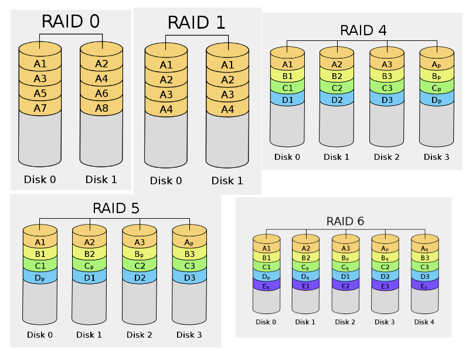

# Almacenamiento

## Fuentes de almacenamiento

* **DAS** (Direct Attached Storage):Dispositivo de almacenamiento conectados directamente al ordenador o servidor. 
* **NAS** (Network Attached Storage): Se comparte por red almacenamiento, normalmente sistema de ficheros.
* **SAN** (Storage Area Network): En una red de almacenamiento se comparte dispositivos de bloques.
* **Cloud** (Object Storage): Almacenamiento en la nube con características de cloud computing.

## Comparativa DAS, NAS y SAN

{ height=80% } 

## Sistemas de ficheros para DAS

* ext2/3/4
* xfs
* jfs
* reiserfs
* vfat
* zfs
* btrfs

## LVM

LVM es una implementación de un gestor de volúmenes lógicos para el núcleo Linux:

* Redimensionado de grupos lógicos.
* Redimensionado de volúmenes lógicos.
* Instantáneas de sólo lectura (LVM2 ofrece lectura y escritura).
* RAID0 de volúmenes lógicos.

## Componentes de LVM

Un LVM se descompone en tres partes:

* **Volúmenes físicos (PV)**: Son los dispositivos de bloque que vamos a usar.
* **Grupos de volúmenes (VG)**: Nos permiten agrupar los volúmenes físicos para crear nuestros volúmenes lógicos.
* **Volúmenes lógicos (LV)**: Es un dispositivos de bloque que podemos formatear

## RAID

* RAID es un sistema que aumenta la fiabilidad de los datos almacenados en discos utilizando mecanismos de redundancia.
* RAID hace dos cosas principalmente:
	* **Duplicar (mirroring)** los datos en varios discos, reduciendo el riesgo asociado al fallo de un disco.
	* **Mejorar el rendimiento dividiendo (stripping)** los datos en varios discos, que trabajan simultáneamente con un flujo unico de datos.

## Tipos de RAID

* **Hardware**: Está implementado completamente dentro de la controladora de disco (controladora RAID), mediante hardware y firmware especializado. Una controladora RAID hardware debe presentar al sistema operativo los discos como un único dispositivo de almacenamiento.
* **Software**: Lo implementa mediante software el sistema operativo de forma independiente de la controladora de disco.
* **BIOS**: Está implementado parcialmente dentro de la controladora de disco, pero utilizan controladores de software específicos para poder comunicarse adecuadamente con el sistema operativo.

## Conceptos

* **Paridad**: Los datos de paridad se utilizan para conseguir redundancia de los datos. Si una unidad falla, es posible recuperar los datos combinando los datos de las otras unidades y los de paridad (operaciones XOR).
* **Disco de reserva**: Disco que se pone en funcionamiento automáticamente al fallar un disco que esté en RAID. Utilizando un **hot spare** se reduce mucho el tiempo de recuperación de los datos.

## Niveles de RAID

{ height=75% }

## NAS

El **almacenamiento conectado en red**, Network Attached Storage (**NAS**), es una tecnología de almacenamiento dedicada a compartir la capacidad de almacenamiento de un servidor con máquinas clientes a través de una red (normalmente TCP/IP).

* Protocolos usados: NFS, SMB/CIFS, ...
* Se comparte sistemas de ficheros completos.
* Normalmente para realizar copias de seguridad y compartir ficheros.

## SAN

## Introducción

Una **red de área de almacenamiento**, en inglés Storage Area Network (**SAN**), es una red de almacenamiento integral. 

* Red dedicada de almacenamiento que proporciona **dispositivos de bloques** a los servidores.
* Los elementos típicos de una SAN son:
	* Red dedicada alta velocidad (cobre o fibra óptica)
	* Equipos o servidores que proporcionan el almacenamiento
	* Servidores que utilizan los dispositivos de bloques
* Los protocolos más utilizados son iSCSI y Fibre Channel Protocol (FCP).

## Esquema de SAN

{ height=75% }

## iSCSI

* Proporciona acceso a dispositivos de bloques sobre TCP/IP.
* Se utiliza fundamentalmente en redes de almacenamiento.
* Alternativa económica a Fibre Channel.
* Utilizado típicamente en redes de cobre de 1 Gbps o 10 Gbps.

## Elementos de iSCSI

* **Unidad lógica (LUN)**: Dispositivo de bloques a compartir por el servidor iSCSI.
* **Target**: Recurso a compartir desde el servidor. Un target incluye uno o varios LUN.
**Initiator**: Cliente iSCSI.
* Multipath
* **IQN** es el formato más extendido para la descripción de los recursos. Ejemplo: **iqn.2020-01.org.gonzalonazareno:sdb4**
* **iSNS**: Protocolo que permite gestionar recursos iSCSI como si fueran Fibre Channel.

## Implementaciones iSCSI

* iSCSI tiene soporte en la mayoría de sistemas operativos.
* En Linux usamos **open-iscsi** como initiator.
* Existen varias opciones en Linux para el servidor iSCSI:
	* Linux-IO (LIO)
	* **tgt**
	* scst
	* istgt

