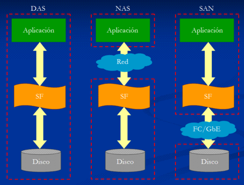
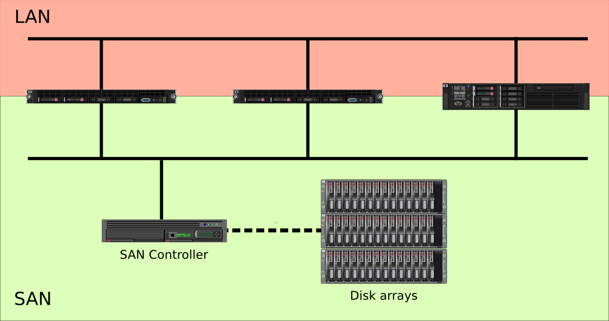

# Almacenamiento

## Fuentes de almacenamiento

* **DAS** (Direct Attached Storage):Dispositivo de almacenamiento conectados directamente al ordenador o servidor. 
* **NAS** (Network Attached Storage): Se comparte por red almacenamiento, normalmente sistema de ficheros.
* **SAN** (Storage Area Network): En una red de almacenamiento se comparte dispositivos de bloques.
* **Cloud** (Object Storage): Almacenamiento en la nube con características de cloud computing.

## Comparativa DAS, NAS y SAN

{ height=80% } 

## NAS

El **almacenamiento conectado en red**, Network Attached Storage (**NAS**), es una tecnología de almacenamiento dedicada a compartir la capacidad de almacenamiento de un servidor con máquinas clientes a través de una red (normalmente TCP/IP).

* Protocolos usados: NFS, SMB/CIFS, ...
* Se comparte sistemas de ficheros completos.
* Normalmente para realizar copias de seguridad y compartir ficheros.

## SAN

Una **red de área de almacenamiento**, en inglés Storage Area Network (**SAN**), es una red de almacenamiento integral. 

* Red dedicada de almacenamiento que proporciona **dispositivos de bloques** a los servidores.
* Los elementos típicos de una SAN son:
	* Red dedicada alta velocidad (cobre o fibra óptica)
	* Equipos o servidores que proporcionan el almacenamiento
	* Servidores que utilizan los dispositivos de bloques
* Los protocolos más utilizados son iSCSI y Fibre Channel Protocol (FCP).

## Esquema de SAN

{ height=75% }

## iSCSI

* Proporciona acceso a dispositivos de bloques sobre TCP/IP.
* Se utiliza fundamentalmente en redes de almacenamiento.
* Alternativa económica a Fibre Channel.
* Utilizado típicamente en redes de cobre de 1 Gbps o 10 Gbps.

## Elementos de iSCSI

* **Unidad lógica (LUN)**: Dispositivo de bloques a compartir por el servidor iSCSI.
* **Target**: Recurso a compartir desde el servidor. Un target incluye uno o varios LUN.
**Initiator**: Cliente iSCSI.
* **IQN** es el formato más extendido para la descripción de los recursos. Ejemplo: **iqn.2020-01.org.gonzalonazareno:sdb4**

## Implementaciones iSCSI

* iSCSI tiene soporte en la mayoría de sistemas operativos.
* En Linux usamos **open-iscsi** como initiator.
* Existen varias opciones en Linux para el servidor iSCSI:
	* Linux-IO (LIO)
	* **tgt**
	* scst
	* istgt

