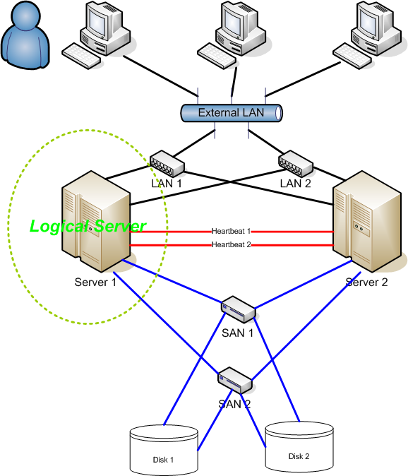
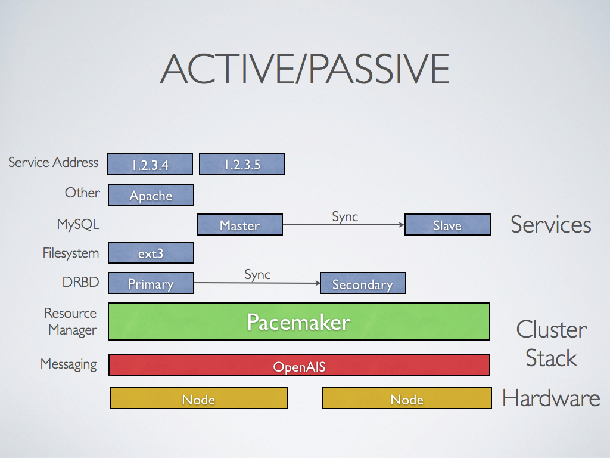
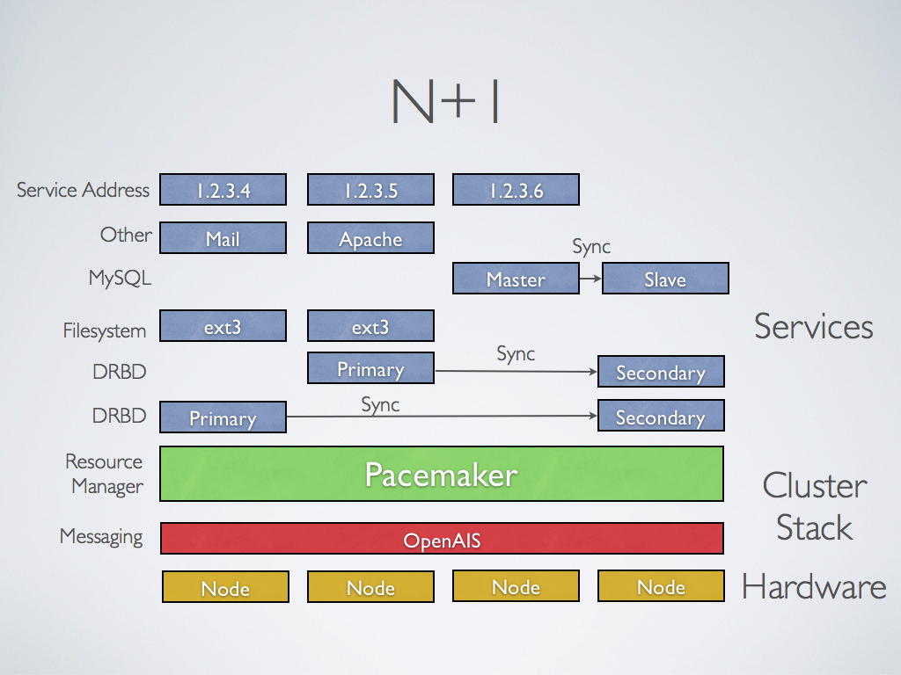
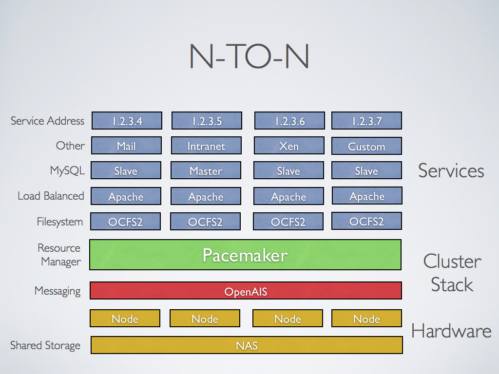
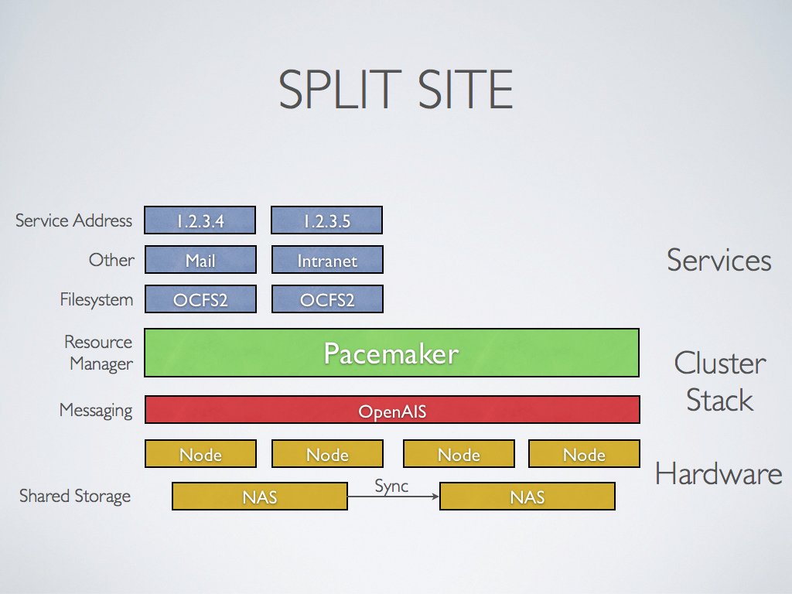

# Introducción a los clúster

## Clúster

* Un **clúster** es un conjunto de equipos independientes que realizan alguna tarea común en la que se comportan como un solo equipo.
* Ofrece uno o varios de los siguientes servicios:
	* **Alto rendimiento**
	* **Alta disponibilidad**
 	* **Balanceo de carga**
	* **Escalabilidad**
* Surgieron como alternativa al **crecimiento vertical** de los ordenadores: Al aumentar los requisitos computacionales, en vez de sustituir el equipo por uno nuevo más potente, se añade una máquina más y se crea un clúster entre ambas.
* Con la generalización del uso de tecnologías de virtualización y cloud computing, los clústeres se están convirtiendo en componentes comunes en todo tipo de instalaciones.
* Los equipos dentro de un clúster reciben el nombre de **nodos**.

## Tipos de clústeres: Clúster de alto rendimiento

* **High Performance Computing Cluster o HPC cluster**
* Se suelen utilizar equipos físicos.
* Imprescindibles para cálculos complejos que requieran gran capacidad computacional.
* En la mayor parte de los casos, los grandes ordenadores han sido sustituidos por clústeres de equipos "convencionales" (arquitectura x86).
* Se utilizan principalmente en centros de investigación, ingeniería y otras actividades que requieran cálculos complejos.
* Visita recomendada: \color{blue}[http://www.top500.org](http://www.top500.org)\color{darkgray} 

## Tipos de clústeres: Alta disponibilidad

* **High availability (HA)**
* Implementa **tolerancia a fallos (failover)** para garantizar el servicio en caso de que ocurra algún fallo.
* Utiliza nodos redundantes que sustituyen o complementan a los existentes.
* Se suelen implementar con balanceo de carga para repartir las peticiones entre varios nodos.
* Ampliamente utilizado en servicios de Internet.
* Es el tipo de clúster que vamos a ver en este curso.

## Balanceo de carga

* Es una propiedad que permite repartir el trabajo entre varios nodos del clúster.
* Se utiliza algún algoritmo para el reparto de tarea entre los nodos del clúster: aleatorio, round robin, carga de los nodos, tiempo de respuesta, ...
* Aunque no es habitual, se puede implementar un clúster de balanceo de carga que no incluya alta disponibilidad.
* Vamos a ver 3 posibilidades:
	* Balanceo por DNS
	* Balanceo por DNS con nombre virtuales
	* Balanceo con software específico: por ejemplo: HAProxy

## Escalabilidad

* Es una propiedad que permite modificar el tamañoo del clúster en función de las necesidades.
* Es difícil y lento implementar un clúster escalable con equipos físicos.
* Se puede automatizar bastante la creación de un clúster escalable con máquinas virtuales.
* Con instancias de cloud se puede ir aún más allá y se habla algunas veces de **elasticidad** en lugar de escalabilidad.
* Tipos de escalado:
	* **Escalado vertical**: Varían las características de los nodos (CPU, RAM, espacio de almacenamiento).
	* **Escalado horizontal**: Varía el número de nodos del clúster.

# Introducción a los clúster de alta disponibilidad

## Clúster de Alta Disponibilidad. Definición

* Un **clúster HA (High Availability)** es un sistema orientado a ofrecer y garantizar servicios en Alta Disponibilidad, es decir,con un alto grado de fiabilidad y de continuidad operativa.
* Se basa en máquinas redundantes (o nodos) que asumen el servicio cuando algún componente del sistema falla.
* Un clúster HA debe ser capaz de detectar cualquier fallo de hardware o de software, reiniciar la aplicación en otro nodo y mantener el servicio sin intervención de operador alguno, garantizando la integridad de los datos del clúster.

## Clúster de Alta Disponibilidad. Esquema

::: columns
:::: {.column width=60%}
{height=70%} 
::::
:::: {.column width=40%}

En un clúster HA hay que eliminar todos los **SPOF (Single Point of Failure)**, mediante redundancia a todos los niveles:

* Hardware
* Almacenamiento
* Redes
::::
:::

## Clúster de Alta Disponibilidad. Conceptos

* **Recurso**: Normalmente asociado a un servicio que queremos poner a prueba de fallos. El recurso pertenece al clúster, no a un nodo y pueden relacionarse o agruparse con otros recursos (**VirtualIP**, **servidor web**, **dispositivo DRBD**, **sistema de fichero**,...).
* **Heartbeat**: Pulso o latido mediante el que se comunican (normalmente por una conexión dedicada y cifrada) los nodos del clúster.
* **Split brain**: Se puede producir cuando se pierde la comunicación entre nodos y toman decisiones por su cuenta.
* **Quorum**: Mecanismo para prevenir split brain, exigiendo que las decisiones se tomen por quorum.
* **Stonith**: **Shoot The Other Node In The Head**: Se utiliza sobre un nodo que no responde, para asegurar que no esté accediendo a los datos y que estos se puedan corromper.

## Clúster de Alta Disponibilidad. Componentes

* Un conjunto de **nodos** que nos ofrecen los servicios del clúster.
* Los **recursos** del clúster son los distintos elementos que controla el software del clúster para asegurar el servicio. Estos recursos pueden ser de distintos tipos, por ejemplo, la ip virtual que nos proporciona el acceso a algún nodo del clúster, un determinado servicio, un sistema de almacenamiento, ... 
* Si algún nodo del clúster falla, necesitamos **un conjunto de estrategias** para que los recursos se activen en otros nodos.
* Necesitamos un **servicio de comunicación entre los nodos** para asegurar que la información del clúster es coherente y que los nodos del clúster están funcionando.
* Normalmente los clúster de alta disponibilidad ofrecen servicios que necesitan de una información que guardaremos en un **almacenamiento compartido**.
* Por último, es necesario tener algún **sistema de detección de errores** para determinar si todos los nodos del clúster funciona de manera adecuada. Profundizaremos en este tema a continuación.

## Creación de un clúster de alta disponibilidad

Para la creación de un clúster de alta disponibilidad vamos a utilizar una pila de programas que mantiene \color{blue}[ClusterLabs](https://clusterlabs.org/)\color{darkgray} (comunidad abierta para el desarrollo de software de clustering y alta disponibilidad de código abierto). Software que vamos a usar:

* **pacemaker**: Es un *crm* (**Cluster Resource Manager**). Es la herramienta que nos permite configurar y mantener los recursos del clúster.
* **corosync**: Es el encargado de mantener la comunicación entre los nodos del clúster.
* **pcs/pcsd**: *pcs* es el cliente de configuración de corosync y pacemaker. pcs también proporciona *pcsd*, que funciona como interfaz gráfica de usuario y servidor remoto para pcs. 

## Quorum, fencing y stonith

* Cómo indicamos anteriormente es necesario que el clúster tenga distintos **métodos de detección de errores** para determinar si algún nodo no está funcionando de manera adecuada. 
* Tenemos que asegurarnos que la información guardada en almacenamiento compartido no pierda la integridad y tenga corrupción de datos.
	* **quorum** y el comportamiento ante un fallo de quorum. Se dice que un cluster tiene quorum cuando más de la mitad de los nodos que forman el clúster esta online. Normalmente, si no tenemos **quorum** se paran los servicios para evitar la corrupción de datos.
	* **fencing**. Si no podemos comunicarnos con el nodo que ha fallado, **fencing** es un mecanismo que usando un **agente de fencing** (usando interface IPMI o SAIs) sea capaz de aislar el nodo (normalmente apagando o reiniciando el nodo) del uso de sus recursos o servicios. Se garantiza  la **integridad de los datos** y que la configuración del clúster sea coherente. 
	* El *fencing* se realiza mediante un mecanismo conocido como **STONITH** ("Shoot The Other Node In The Head") que protege los datos para que no se corrompan por nodos no autorizados.

## Configuración de redundancia: **Activo / Pasivo**

::: columns
:::: {.column width=60%}
{height=70%} 
::::
:::: {.column width=40%}

* **Activo / Pasivo**: En esta configuración tenemos los servidos redundado entre los distintos nodos. Un nodo es el principal, tiene los recursos activos y ofrece el servicio. Si este nodo falla, los recursos se pasan al otro nodo que pasa a hacer el principal.
::::
:::

## Configuración de redundancia: **N + 1**

::: columns
:::: {.column width=60%}
{height=70%} 
::::
:::: {.column width=40%}

* **N + 1**: Es una generación del anterior. En este caso si tenemos clúster ofreciendo más de un servicio,  se proporciona un único nodo adicional que se pone en línea para asumir el papel del nodo que ha fallado. El nodo adicional debe ser capaz de asumir el papel de cualquier de los nodos que han fallado. 

::::
:::

## Configuración de redundancia: **N-to-N o activo / activo**

::: columns
:::: {.column width=60%}
{height=70%} 
::::
:::: {.column width=40%}

* **N-to-N o activo / activo**: Aunque no son exactamente igual, podemos considerarlo muy parecidos. En este caso todos los nodos del cluster pueden ofrecer el servicio. En estos casos se utiliza almacenamiento y sistemas de archivos distribuidos y podemos balancear la carga entre los nodos del clúster.
::::
:::

## Configuración de redundancia: **Split Site**

::: columns
:::: {.column width=60%}
{height=70%} 
::::
:::: {.column width=40%}

* **Split Site**: Es una configuración más avanzada, que nos permite tener dos clústeres Pacemaker separados, donde cada clúster tiene acceso a una red de área de almacenamiento (SAN) separada. Podemos usar DRBD para replicar los datos almacenados en esa SAN, a través de una red dedicada.
::::
:::
