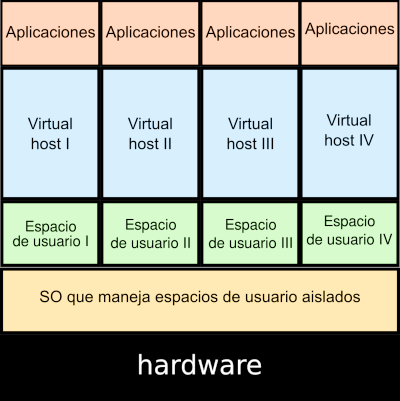

## Virtualización ligera o en contenedores
::: columns
:::: {.column width=40%}
{height=60%} 
::::
:::: {.column width=60%}

* También llamada **virtualización a nivel de sistema operativo**, o **virtualización basada en contenedores**. 
* Sobre el núcleo del sistema operativo se ejecuta una capa de virtualización que permite que existan múltiples instancias aisladas de espacios de usuario (**contenedor**). 
* Por lo tanto, un contenedor es un conjunto de procesos aislados, que se ejecutan en un servidor, y que acceden a un sistema de ficheros propio, tienen una configuración red propio y accede a los recursos del host (memoria y CPU).

::::
:::

## Virtualización ligera o en contenedores

* Tipos:
	* **Contenedores de Sistemas**: El uso que se hace de ellos es muy similar al que hacemos sobre una máquina virtual: se accede a ellos (normalmente por ssh), se instalan servicios, se actualizan, ejecutan un conjunto de procesos, ... Ejemplo: LXC(Linux Container).
	* **Contenedores de Aplicación**: Se suelen usar para el despliegue de aplicaciones web Ejemplo: Docker, Podman, ...

# Introducción a LXC

## Linux Containers

**LinuX Containers (LXC)**, es una tecnología de virtualización ligera o por contenedoreS.
Todo esto ha sido posible por el desarrollo de dos componentes del nucleo de Linux:

* Los **Grupos de Control cgroups**, en concreto en Debian 11 se utiliza cgroupsv2: que limita el uso de recursos (límite de memoria, cpu, I/O o red) para un proceso y sus hijos.
* Los **Espacios de Nombres namespaces**: que proporcionan un punto de vista diferente a un proceso (interfaces de red, procesos, usuarios, etc.).

LXC pertenece a los denominados **contenedores de sistemas**, su gestión y ciclo de vida es similar al de una máquina virtual tradicional. Está mantenido por Canonical y la página oficial es linuxcontainers.org.

## LXD / Incus

* **LXD, Linux Container Daemon**, es una herramienta de gestión de los contenedores y máquinas virtuales del sistema operativo Linux, desarrollada por Canonical.
* **Incus** es la versión de la comunidad.

* Ofrecen una REST API que podemos usar con una simple herramienta de línea de comandos o con herramientas de terceros.
* Gestionan instancias, que pueden ser de tipos: contenedores, usando LXC internamente, y máquinas virtuales usando QEMU internamente.

# Introducción a Docker

## Docker

Docker es una tecnología de virtualización "ligera" cuyo elemento básico es la utilización de contenedores en vez de máquinas virtuales y cuyo objetivo principal es el despliegue de aplicaciones encapsuladas en dichos contenedores.

Establece una nueva metodología en el despliegue de aplicaciones en contenedores:

\centering
**build, ship and run**

## Docker

* “docker”: estibador
* Pertenece a los denominados contenedores de aplicaciones
* Nuevo paradigma. Cambia completamente la forma de desplegar y distribuir una aplicación
* Docker: build, ship and run
* Lo desarrolla la empresa Docker, Inc.
* Instalación y gestión de contenedores simple
* El contenedor ejecuta un comando y se para cuando éste termina, no es un sistema operativo al uso, ni pretende serlo
* Escrito en go
* Software libre (no todos los componentes)

## Software docker

::: columns

:::: {.column width=60%}

* docker engine
  * demonio docker
  * docker API
  * docker CLI
* docker registry
  * Aplicación que permite distribuir las imágenes docker
  * Registro privado (instalado en un servidor local)/ Registro público (El proyecto nos ofrece [**Docker Hub**](https://hub.docker.com/))
* docker-compose
  * Para definir aplicaciones que corren en múltiples contenedores
* docker swarm
  * Orquestador de contenedores
::::

:::: {.column width=40%}

{height=50%}

::::

:::

## Docker en la actualidad

* Docker ha revolucionado el uso de los contenedores, para el despliegue de aplicaciones web.
* En 2015 se crea la [**Cloud Native Computing Foundation (CNCF)**](https://www.cncf.io/) como un proyecto de la Linux Fundation para ayuda en el avance de todos las iniciativas y proyectos sobre la tecnología de contenedores.
* Todas las empresas tecnológicas forman parte de la CNCF. [Ver miembros](https://www.cncf.io/about/members/)
* Aunque la empresa Docker Inc estaba triunfando con el uso de Docker, si quería seguir teniendo peso en el mundo de los contenedores se unió a la CNCF. (Julio de 2016).
* Los dos componentes fundamentales de docker: *runC* y *containerd* son proyectos de software libre independientes de docker.
* Además, las imágenes de contenedores Docker y su distribución se hacen estándar.

## Docker en la actualidad

* Podemos obtener docker de varias formas:

  * **Moby** (proyecto de comunidad) (docker.io de debian)
  * **docker CE** (docker engine proporcionado por Docker inc)
  * **docker EE** (docker engine + servicios de Docker inc)

* Nacen nuevos proyectos que manejan contenedores de aplicación bajo los estándares de la CNCF: 

  * **cri-o**: Creado por Red Hat como alternativa a containerd y pensado solo para funcionar integrado en kubernetes. [https://cri-o.io/](https://cri-o.io/)
  * **podman**: Creado por Red Hat como alternativa a docker. [https://podman.io](https://podman.io)
  * **pouch**: Creado por Alibaba como alternativa a docker. [https://pouchcontainer.io](https://pouchcontainer.io)

## Contenedores y aplicaciones

**¿Qué aplicaciones web son más idóneas para desplegar en contenedores Docker?**

* Si tenemos aplicaciones monolíticas, vamos a usar un esquema **multicapa**, es decir cada servicio (servicio web, servicio de base de datos, ...) se va a desplegar en un contenedor.
* Realmente, las aplicaciones que mejor se ajustan al despliegue en contenedores son la desarrolladas con **microservicios**:
  * Cada componente de la aplicación ("microservicio") se puede desplegar en un contenedor.
  * Comunicación vía HTTP REST y colas de mensajes
  * Facilita enormemente las actualizaciones de versiones de cada componente
  * ...