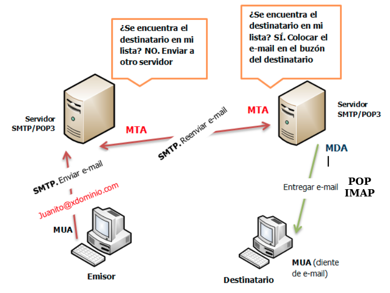

# ¿Cómo funciona el correo electrónico?

## Direcciones de correo electrónico

**usuario@nombre_servicio_correo**

* Normalmente, el nombre del servicio de correo es el **nombre del dominio**.
* Tenemos que determinar la dirección IP del servidor de correo:
	1. Si el nombre detrás de la @ está asociado a un **registro A** en un servidor DNS, ya sabríamos la dirección del servidor de correo.
	2. Si es un nombre de dominio (No tiene IP) o la dirección IP del servidor de correo es distinta, es necesario en el servidor DNS un **registro MX** que indique el nombre del servidor de correo asociado al nombre de dominio.

## Conceptos sobre correo electrónico

* **MUA**: Un MUA (Mail User Agent, Agente de usuario de correo) es un **cliente de correos**: programa que permite la gestión del correo electrónico. 
* **MTA**: Un programa MTA (Mail Transfer Agent, Agente de transferencia de correo) es el **servidor de correos**: transfiere los mensajes de correo electrónico entre máquinas que usan el protocolo **SMTP**. 
* **MDA**: Los agentes MTA utilizan programas MDA (Mail Delivery Agent, Agente de entrega de correo) para entregar el correo electrónico al buzón de un usuario concreto. Esta entrega se puede hacer localmente en el servidor (la realizarán programas llamados LDA (Local Delivery Agent, Agente de entrega local)), o la pueden hacer de forma remota utilizando el protocolo **POP3** o **IMAP**.

## Protocolos

* **SMTP**: El protocolo para transferencia simple de correo (en inglés Simple Mail Transfer Protocol o SMTP) es un protocolo de red utilizado para el intercambio de mensajes de correo electrónico. Existe una mejora del protocolo llamada **ESMTP** (Enhanced Simple Mail Transfer Protocol).
* **POP3**: Mail Delivery Agent [Agente de Entrega de Correo]. Protocolo para recuperar correos electrónicos de un MDA. Su principal característica es que se descargan todos los correos.
* **IMAP**: Internet Message Access Protocol [Protocolo de Acceso a Mensajes de Internet]. Protocolo para recuperar correos electrónicos de un MDA. En este caso, se sincroniza el estado de los correos entre el servidor y el cliente.

## ¿Cómo mandamos y recuperamos un correo electrónico?

{ height=80% }

## Formato de los correos electrónicos

* En la actualidad se utiliza el formato **MIME** para el envío de correos. Nos permite:
	* Texto en conjuntos de caracteres distintos de US-ASCII (antes sólo ASCII).
	* Adjuntos que no son de tipo texto
	* Cuerpos de mensajes con múltiples partes (multi-part)

* Los mensajes tienen unas cabeceras y un cuerpo. Algunas cabeceras importantes:
	* From, Subject, Date, To, Cc, Bcc
	* Return-Path, Delivered-To, Received, ...
	* MIME-Version, Content-Type,...
	* Otras cabeceras referidas a la seguridad: Received-SPF, DKIM-Signature
		
# Servidor de Correos

## Postfix

* **Postfix** es un servidor de correo de **software libre / código abierto**, un programa informático para el enrutamiento y envío de correo electrónico, creado con la intención de que sea una alternativa más rápida, fácil de administrar y segura al ampliamente utilizado **Sendmail**. Anteriormente conocido como VMailer e IBM Secure Mailer, fue originalmente escrito por Wietse Venema durante su estancia en el Thomas J. Watson Research Center de IBM, y continúa siendo desarrollado activamente.

* **Postfix** es el agente de transporte por omisión en diversas distribuciones de Linux y en las últimas versiones del Mac OS X. Para 2016 un estimado de 25% de los servidores de correo electrónico a lo largo de todo el mundo utilizaba Postfix.

## Instalación de postfix

    `apt install postfix`

* Tipo de servidor: Internet Site (vamos a recibir y enviar correo directamente)
* Mailname: **DOMINIO**

## Directivas de configuración

Fichero **`/etc/postfix/main.cf`**:

* **`mydestination`**: Los dominios que serán propios del servidor de correo, es decir, el correo enviado a estos dominios está dirigido a usuarios del propio servidor. Si el usuario existe, el mensaje será almacenado, sino el servidor devolverá un mensaje de error. 
* **`relay_domains`**: Los dominios que serán reenviados. Por lo tanto se permitirán el envío de correos a usuarios de estos dominios.
* **`mynetworks`**: Las IPs desde las que pueden enviarse mensajes.
* **`myorigin`**: El dominio con el que el servidor enviará correo, el cual está configurado en `/etc/mailname`. 

# Gestión de correo electrónico

## Casos que vamos a estudiar

* Gestión del correo desde el servidor
    * Caso 1: Envío local, entre usuarios del mismo servidor
    * Caso 2: Envío de correo desde usuarios del servidor a correos de internet
        * ¿Qué tenemos que hacer para que nuestro correo “llegue a buen puerto”?
    * Caso 3: Recibir correos desde internet a usuarios del servidor
        * Alias, redirecciones y usuarios virtuales
        * Soluciones al problema del spam
* Gestión del correo desde un cliente remoto
    * Caso 4: Recepción de correo electrónico usando nuestro servidor de correos
    * Caso 5: Envío de correo electrónico usando nuestro servidor de correos


##  Caso 1: Envío local, entre usuarios del mismo servidor

Para el envío de correo vamos a usar la utilidad `mail` (se encuentra en el paquete `bsd-mailx`). Y para enviar un correo desde el usuario `debian` al usuario `root`, simplemente ejecutamos:

```
	debian@maquina:~$ mail root@localhost
```

El usuario `root` leerá el correo:
```
	root@maquina:~#  mail
	Mail version 8.1.2 01/15/2001.  Type ? for help.
	"/var/mail/root": 1 message 1 unread
	>U  1 debian@DOMINIO  Sat Jan 16 18:22   79/3597  Re: hola
	& 1
```

Podemos comprobar el log para comprobar que se ha mandado el mensaje.
```
	sudo journalctl -fu postfix@-
```


## Caso 2: Envío de correo desde usuarios del servidor a correos de internet

### Desde el aula

* Configuramos el parámetro relayhost:

```
    relayhost = mail.gonzalonazareno.org
```
* Nuestro servidor de correos es `macaco.gonzalonazareno.org` y accedemos a ella por la VPN:

\scriptsize
```
    # dig mail.gonzalonazareno.org
    ...
    mail.gonzalonazareno.org. 86400	IN	CNAME	macacovpn.gonzalonazareno.org.
    macacovpn.gonzalonazareno.org. 86400 IN	A	172.200.0.1
```

## Caso 2: Envío de correo desde usuarios del servidor a correos de internet

### Desde el VPS

* Con la configuración básica del servidor, seríamos capaces de enviar el correo (no necesitamos un relay).
* Quizás no sea necesario para el envío de correos, pero estaría muy bien que ya tengamos configurado en nuestro DNS el registro MX apuntando a nuestra máquina.
* Actualmente es necesario tener configurado un registro SPF.

## ¿Qué tenemos que hacer para que nuestro correo "llegue a buen puerto"?

* **IP estáticas y limpias**: Nuestra IP no debe estar en una lista de spam.
* **SPF**: Sender Policy Framework (SPF) es un mecanismo de autenticación que mediante un registro DNS de tipo TXT describe las direcciones IPs y nombres DNS autorizados a enviar correo desde nuestro dominio.
* **DKIM**: DomainKeys Identified Mail o DKIM es un método de autenticación pensado principalmente para reducir la suplantación de remitente. DKIM consiste en que se publica a través de DNS la clave pública del servidor de correos y se firman con la correspondiente clave privada todos los mensajes emitidos, así el receptor puede verificar cada correo emitido utilizando la clave pública.
* **DMARC**: Amplia el funcionamiento de SPF y DKIM, mediante la publicación en DNS de la política del sitio, en el que decimos si usamos, SPF, DKIM o ambos, entre otras cosas.

## Caso 3: Recibir correos desde internet a usuarios del servidor

### Desde el aula

* En el curso de correo electrónico está la explicación completa.
* Asegúrate de tener configurado de forma correcta tu registro MX en tu servidor DNS.

### Desde el VPS

* Configura el servidor postfix en tu servidor, teniendo en cuenta que en el fichero `/etc/mailname` este tu nombre de dominio.
* Configura tu DNS para que el registro MX apunte a un nombre de ordenador que está definido como un registro A a tu dirección IP pública

## Alias, redirecciones y usuarios virtuales

* **Alias**: Cuando se define un alias para un determinado usuario se redirige el correo que llegue a otro usuario de la misma máquina. 
* **Redirección**: Se utiliza para enviar el correo que llegue a un usuario a una cuenta de correo exterior. 
* **Usuarios virtuales**: Nos permite usar nombres de usuario que no correspondan con los nombres de los usuarios de sistema.

## Soluciones al problema del spam

* **SMTPd restrintions**: Nuestro servidor puede hacer comprobaciones para restringir la recepción de correos: filtrar dominios de envío, filtrar quien puede hacer relay de nuestro servidor, filtrar si la IP del servidor de envío esta en una lista negra...
* Podemos comprobar los registros **SPF**, **DKIM** y **DMARC** del servidor de envío.
* **Antivirus y antispam**

## Caso 4: Recepción de correo electrónico usando nuestro servidor de correos

Protocolos:

* **POP3**: Mail Delivery Agent [Agente de Entrega de Correo]. Protocolo para recuperar correos electrónicos de un MDA. Su principal característica es que se descargan todos los correos.
* **IMAP**: Internet Message Access Protocol [Protocolo de Acceso a Mensajes de Internet]. Protocolo para recuperar correos electrónicos de un MDA. En este caso, se sincroniza el estado de los correos entre el servidor y el cliente.

## Caso 4: Recepción de correo electrónico usando nuestro servidor de correos

Tipos de buzones:

* **Buzón mbox**: Todos los mensajes están en un fichero, es el tipo de buzón que hemos utilizado hasta ahora, y puede ser válido para el protocolo POP3 donde se descargan todos los correos desde el servidor.
* **Buzón maildir**: Los mensajes se guardan en una carpeta. Es imprescindible para que funcione el protocolo IMAP.

## Caso 4: Recepción de correo electrónico usando nuestro servidor de correos

**Protocolo IMAP**

* **IMAP con STARTTLS**: STARTTLS transforma una conexión insegura en una segura mediante el uso de SSL/TLS. Por lo tanto usando el mismo puerto 143/tcp tenemos cifrada la comunicación.
* **IMAPS**: Versión segura del protocolo IMAP que usa el puerto 993/tcp.

## Caso 5: Envío de correo electrónico usando nuestro servidor de correos

**Protocolo SMTP**

* **ESMTP + STARTTLS**: esmtp (Enhanced Simple Mail Transfer Protocol): En este caso se usa el puerto 587/tcp. Este protocolo tiene nuevas extensiones: como smtp-auth y STARTTLS (STARTTLS transforma una conexión insegura en una segura mediante el uso de SSL/TLS). Es necesario asgurar la comunicación con  **SASL (Simple Authentication and Security Layer)**.
* **SMTPS**: Simple Mail Transfer Protocol Secure: Con este protocolo conseguimos el cifrado de la comunicación entre el cliente y el servidor. Utiliza un puerto no estándar 465/tcp. No es una extensión de smtp. Es muy parecido a HTTPS.
