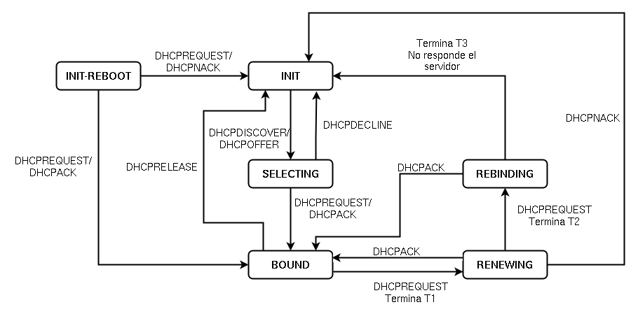

## DHCP

El protocolo de **configuración dinámica de host DHCP** (Dynamic Host Configuration Protocol) es un estándar TCP/IP que simplifica la administración de la configuración IP haciéndola
**automática**. Un servidor gestiona la concesión de direcciones IP de un determinado segmento de red y mantiene una lista actualizada de la correspondencia entre estas direcciones IP ylas direcciones MAC de los equipos que las han solicitado. En el protocolo DHCP, el servidor utiliza el puerto **67/udp** y el cliente el **68/udp**.

## ¿Cómo funciona el protocolo?

* **DHCP discover**: El cliente envía una petición a la dirección de **broadcast 255.255.255.255** **solicitando** una configuración de red única dentro de la red en la que se encuentra.
* **DHCP offer**: El servidor DHCP de la red responde la petición anterior **enviándole** al cliente (identificado por su dirección MAC) los parámetros de la red.

En principio podría terminar aquí, pero hay dos pasos más para evitar conflictos en el caso de que hubiera más de un servidor DHCP en la red:

* **DHCP request**: El cliente **confirma** al servidor DHCP (identificado por su dirección IP) que va a utilizar los parámetros que éste le ha enviado.
* **DHCP acknowledgement**: El servidor **confirma** los parámetros enviados y el **tiempo de validez de la concesión** de dirección IP (*DHCP lease time*).

## Estados del protocolo DHCP

## Estados del protocolo DHCP

### SELECTING

* El cliente comienza en el estado INIT.
* El cliente envía un **broadcast DHCPDISCOVER** (udp/67).
* Antes de enviar el mensaje broadcast DHCPDISCOVER, el cliente DHCP **espera por un tiempo aleatorio** (entre 1 a 10 segundos) para evitar una colisión con otro cliente DHCP.
* El cliente recibe un mensaje **DHCPOFFER** del servidor DHCP. 
* El cliente **confirma** al servidor DHCP con el envio de un paquete **DHCPREQUEST** y el servidor se lo confirmará con el envío del paquete **DHCPACK**.
* El cliente ha recibido su configuración, y comprueba si la dirección IP no está en uso (envía una petición ARP a la dirreción IP asignada).
* Si la dirección IP está en uso, el cliente envía un paquete **DHCPDECLINE** y vuelve al estado INIT.

## Estados del protocolo DHCP

### BOUND

* El cliente está configurado.
* Se establecen 3 tiempos:
	* **T1**: es el temporizador de renovación de alquiler.
	* **T2**: es el temporizador de reenganche.
	* **T3**: es la duración del alquiler.
* Estos tiempos los envía el servidor (al menos el T3). Si el T1 y T2 no se han configurado en el servidor, normalmente:
	* **T1 = 0,5 x T3**
	* **T2 = 0,875 x T3**

## Estados del protocolo DHCP

### RENEWING

* Cuando termina **T1 (tiempo de renovación)** se pasa al estado **RENEWING (renovación)**.
* Se debe negociar un nuevo alquiler para la dirección IP designada, entre el cliente DHCP y el servidor DHCP.
* Si el cliente puede seguir usando su configuración, se vuelve a BOUND, y se empieza a contar el tiempo de nuevo (**se inicializa T1**).
* Si el servidor DHCP original, por algún motivo, no renueva el alquiler, le enviará un mensaje DHCPNACK y el cliente DHCP se moverá al estado INIT.

## Estados del protocolo DHCP

### REBINDING

* Si estando en el estado RENEWING, se termina **T2 (tiempo de reenganche)** el cliente pasa al estado **REBINDING (reengache)**.
* El servidor original DHCP podría no haber respondido porque estaría apagado o porque el enlace con la red habría caído.
* El cliente DHCP enviará un DHCPREQUEST a la red para contactar con cualquier servidor DHCP para extender el alquiler. **Intenta conectar con otro servidor DHCP**.
* Si un servidor DHCP responde con un DHCPACK, el cliente DHCP renueva su alquiler (T3), coloca los temporizadores T1 y T2 y retorna al estado BOUND.
* Si no hay servidor DHCP disponible para renovar alquiler luego de expirar el temporizador T3, el alquiler cesa y el cliente DHCP pasa al estado INIT.

## Estados del protocolo DHCP

### Otras opciones

* El cliente DHCP no siempre tiene que esperar la expiración del alquiler para terminar el uso de una dirección IP. El cliente puede rechazar o revocar la concesión, en este caso manda un **DHCPRELEASE** y vuelve al estado INIT.
* El cliente guarda en su disco duro la configuración que ha recibido. Al **reiniciar el cliente** solicita al servidor DHCP seguir usando esa configuración. Puede ocurrir dos cosa: no ha pasado el tiempo de alquiler y el servidor DHCP lo acepta: pasa al estado BOUND, ha pasado el tiempo de alquiler o el servidor no puede conceder esa configuración pasa el estado INIT.

