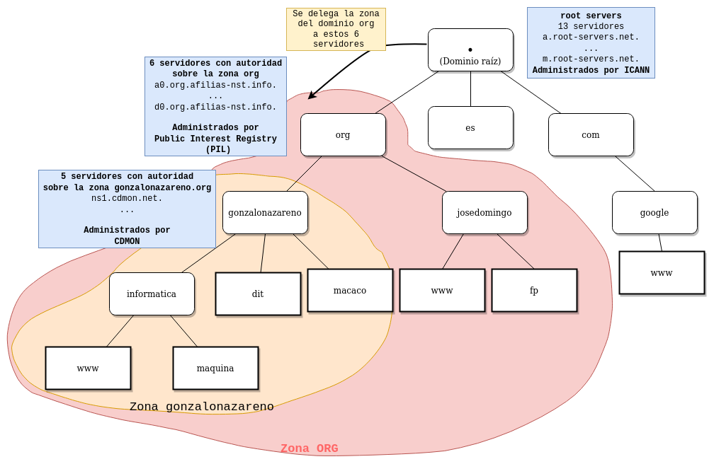

# Conceptos sobre DNS

## DNS

* **DNS: Domain Name Server**: Es un protocolo que nos permite guardar y preguntar por diversa información que guardamos de un nombre de dominio. Ejemplo: dirección IP que corresponde  aun nombre, nombre que corresponde a una dirección, servidor de correo de un dominio,...

## Nombres

* **Host Name**: El nombre de un host es una sola "palabra". Se guarda en el fichero `/etc/hostname`.
* **Fully Qualified Domain Name (FQDN)**: Es el nombre totalmente cualificado, formado por el hostname, seguido de un punto y su correspondiente nombre de dominio. 
* **Domain Name**: El nombre de dominio es una sucesión de nombres concatenados por puntos.
* **Dominio raíz**: Aunque no se suele escribir, los nombres de dominio acaban en un punto. Ese punto se llama **dominio raíz**. Ejemplo: **macaco.gonzalonazareno.org.**.
* **Top Level Domains (TLD)**: Los dominios de nivel superior son aquellos que pertenecen al dominio raíz. Ejemplos de este tipo son "com", "org", "es", ...

## Zonas

* **Zona DNS**: En una zona guardamos información de un nombre de dominio. Dos tipos de zonas:
	* **Zona de resolución directa**:  Conjunto de nombres que pertenecen a un nombre de dominio. Por ejemplo: en la zona **gonzalonazareno.org**, están todos los nombres de este dominio: macaco, babuino, www, dit, ... Entre otra informaciones guardamos las direcciones correspondientes a los nombres.
	* **Zona de resolución inversa**: Nos permite convertir direcciones IP en nombres. Por lo tanto depende del direccionamiento de red que tengamos. 
* **Fichero de zona**: Es un fichero de texto donde se guarda la información que se guarda en la zona. Los distintos tipos de información se guardan usando distintos **registros**.

## Autoridad sobre una Zona

* El **Servidor DNS** que guarda el **fichero de una zona** se denomina **Servidor con Autoridad sobre la Zona**.
* Dentro del fichero de zona el Servidor con Autoridad se indica usando el **registro NS**.
* Se aconseja tener varios servidores con autoridad sobre una zona. Uno será el principal (que se llama **maestro**) y los otros se llaman **esclavos**.
* Los servidores con autoridad sobre la zona raíz ("el punto final") se llaman \color{blue} [root servers](https://es.wikipedia.org/wiki/Servidor_ra%C3%ADz) \color{darkgray}.

## Otros registros de la zona

* **SOA**: Start of authority. Guarda metainformación de la zona.
* **NS**: Guarda el nombre del servidor con autoridad sobre la zona.
* **A**: Guardamos la dirección IPv4 que corresponde con un nombre.
* **AAAA**: Con este registro se guarda una IPv6.
* **CNAME**: Guardamos un nombre alias, es decir otro nombre que tiene una máquina. Normalmente una máquina tiene un nombre (que tendrá un registro A) y los nombres de los servicios que ofrezca dicha máquina se indicaran usando registros CNAME.
* **MX**: Guarda los nombres de los servidores correo correspondiente a un dominio.
* \color{blue}[Todos los registros](https://es.wikipedia.org/wiki/Anexo:Tipos_de_registros_DNS) \color{darkgray}.


## Consulta DNS por recursión

* Nuestro equipo tiene configurado un servidor DNS en **resolv.conf**.
* Cuando quiero acceder a un nombre, hay que resolverlo para encontrar su IP (resolución directa).
* Como hemos visto, por defecto se intenta resolución estática.
* Si no lo tenemos en resolución estática, preguntamos a nuestro DNS, pueden pasar 3 cosas:

    * Si el servidor DNS tiene autoridad sobre el dominio que estamos buscando, el nos responde.
    * Si el servidor DNS tiene guardada la resolución en caché, el nos responde.
    * En otro caso, empieza a hacer las preguntas: a los root server, a los servidores TLD, al servidor con autoridad del dominio buscado,... La respuesta la guarda en caché y no la devuelve.

## Consulta DNS por recursión

{ height=80% }

## Tipos de servidores DNS

* Servidor DNS recursivo
* Servidor DNS forward
* Servidor DNS cache


## Servidor DNS en una red local

¿Y si el servidor DNS que tenemos en el resolv.conf es un servidor que tenemos en nuestra red local?

* Las resoluciones se harán más rápida. Ya que las resoluciones que tenga guardada en cache no tendrá que preguntarla en internet.
* Si tenemos servicios en la red local que hemos nombrado. Podemos crear una zona en ese servidor (El servidor DNS local tendrá autoridad sobre esa zona) que nos resuelva los nombre a direcciones privadas.
* El servidor DHCP de la red local deberá repartir el DNS local a los clientes.

## DNS en el Gonzalo Nazareno

El dominio **gonzalonazareno.org** tiene dos zonas de resolución directa:

* Una en internet, cuyo servidores DNS con autoridad están alojados en la empresa CDMON:
    * Por ejemplo, en esta zona **openstack.gonzalonazareno.org** se resuelve a nuestra ip pública: **5.39.73.79**.
* Una en la intranet, cuyo servidor DNS con autoridad es **macaco** (**172.22.0.1**).
    * En esta zona **openstack.gonzalonazareno.org** se resuelve a **172.22.123.100** (**jupiter**).

## DNS en el Gonzalo Nazareno

Desde mi casa:

\scriptsize
```
dig ns gonzalonazareno.org
;; ANSWER SECTION:
gonzalonazareno.org.    21599    IN    NS    ns2.cdmon.net.
gonzalonazareno.org.    21599    IN    NS    ns4.cdmondns-01.org.
gonzalonazareno.org.    21599    IN    NS    ns1.cdmon.net.
gonzalonazareno.org.    21599    IN    NS    ns5.cdmondns-01.com.
gonzalonazareno.org.    21599    IN    NS    ns3.cdmon.net.

dig openstack.gonzalonazareno.org
;; ANSWER SECTION:
openstack.gonzalonazareno.org. 0 IN	CNAME	satelite.gonzalonazareno.org.
satelite.gonzalonazareno.org. 0	IN	A	5.39.73.79
```

## DNS en el Gonzalo Nazareno

Desde el aula:

\scriptsize
```
dig ns gonzalonazareno.org
;; ANSWER SECTION:
gonzalonazareno.org.	86400	IN	NS	dns.gonzalonazareno.org.

dig openstack.gonzalonazareno.org
;; ANSWER SECTION:
openstack.gonzalonazareno.org. 86400 IN	CNAME	jupiter.gonzalonazareno.org.
jupiter.gonzalonazareno.org. 86400 IN	A	172.22.123.100
```

# Ficheros importantes en la resolución de nombres 

## /etc/nsswitch.conf

Hay varios mecanismos de resolución de nombres y los que utilice una máquina GNU/Linux se especifican en el fichero /etc/nsswitch.conf, que contiene una línea como:

```
hosts: files dns
```

1. Primero **resolución estática**: Se consulta el fichero `/etc/hosts`.
2. En segundo lugar **consulta DNS**: se consultan a los servidores DNS que estén configurados en el fichero `/etc/resolv.conf`.

## /etc/hosts

Fichero para la resolución estática de nombres (normalmente de la red local).

Las líneas de `/etc/hosts` tienen el formato:

\scriptsize
```
dirección_IP nombre_largo nombre_corto
127.0.0.1 localhost.localdomain localhost
192.168.45.123 sauron.mordor.com sauron
```

Nos sirve para indicar el nombre FQDN del "host":

```
$ hostname -f
sauron.mordor.com
```

## /etc/resolv.conf

Fichero que especifica los servidores DNS y los dominios de búsqueda.

Ejemplo:

\scriptsize
```
domain mordor.com 
search mordor.com lacomarca.com minastirith.com
nameserver 124.13.24.1 
nameserver 124.13.17.2
nameserver 64.12.45.12
sortlist 124.13.24.0/255.255.255.0 64.0.0.0
```

## /etc/resolv.conf

* **`nameserver`**, indican las direcciones IP de los servidores DNS que deben ser utilizados. 
* La sección **`sortlist`** aunque opcional es utilizada para indicar la preferencia de los nameserver’s , esto garantiza que el servidor DNS en 124.13.24.1 tendrá preferencia sobre todos los demás.
* El parámetro **`domain`** indica el dominio al cual pertenece el "Host", en este caso `mordor.com`
* El parámetro **`search`** es utilizado como un auxiliar para la resolución de nombres, al acceder a `ssh sauron`. Se intentará acceder a `sauron.mordor.com`, sino funciona a `sauron.lacomarca.com`, y sino funciona a `sauron.minastirith.com`.
