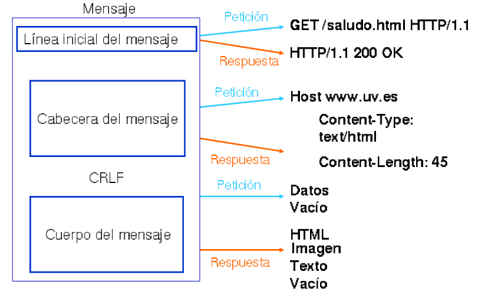
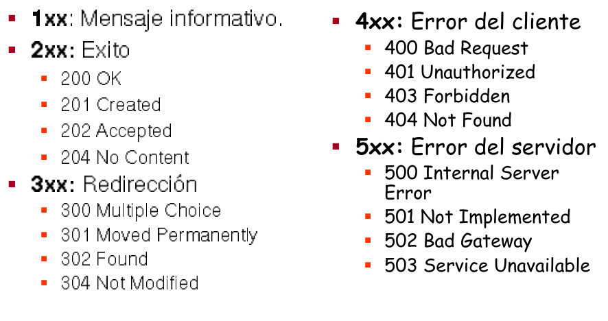

# Protocolo HTTP

## Descripción General

Protocolo de la **capa de aplicación** que permite la comunicación entre servidores, clientes y proxies utilizados en la web.

* La última versión es la **HTTP/1.1**.
* Es un protocolo basado en el esquema **petición/respuesta**.
	* El cliente hace una **PETICIÓN** y...
	* El servidor devuelve una **REPUESTA**.
* Está basado en mensajes de texto plano.
* Es un  protocolo sin manejo de estado. **El servidor no recuerda quién ha hecho la petición**.

## Partes del mensaje de petición y respuestas

{height=80%}

## Partes del mensaje de petición y respuestas

PETICIÓN

* Una línea inicial con el método de solicitud (GET,POST,...), la URL del recurso solicitado y la versión del protocolo.
* Una lista de informaciones relacionadas con la petición (**cabeceras de la petición**).
* Un posible cuerpo de contenido (es posible en las peticiones POST).

RESPUESTA

* Una línea de estado, con la versión del protocolo y un código de éxito o error.
* Una lista de informaciones relacionadas con la petición (**cabeceras de la respuesta**).
* Un cuerpo con el contenido del recurso solicitado.

## Métodos de Petición HTTP

* **GET**: Solicita un documento al servidor. Se pueden enviar datos en la URL.
* **HEAD**: Similar a GET, pero sólo pide las cabeceras HTTP. Por ejemplo, para consultar información sobre el fichero antes de solicitarlo.
* **POST**: Manda datos al servidor para su procesado. Similar a GET, pero además envía datos en el cuerpo del mensaje. La URL corresponde a un página dinámica que trata los datos enviados.
* **PUT**: Almacena el documento enviado en el cuerpo del mensaje.
* **DELETE**: Elimina el documento referenciado en la URL.
* ...

## Códigos de estado en las Respuestas HTTP

{height=75%}

## Cabeceras HTTP

Informaciones de la forma **clave-valor** de las peticiones y respuestas HTTP.

* Cabeceras genéricas.
* Cabeceras de petición..
* Cabeceras de respuesta.

## Cabeceras genéricas

* **Connection**: Indica si la conexión TCP/IP se ha cerrado (closed), o se mantiene abierta. Normalmente los servidores web modernos usan la **persistencia en la conexión** (keep-alive), es decir en una misma conexión TCP/IP se realizan varias peticiones y respuestas.

* El servidor devuelve una cabecera **keep-alive** donde indica o las peticiones y respuestas máximas que se pueden realizar durante la conexión o el tiempo máximo en el que se cerrará la conexión.

\scriptsize
```
		Keep-Alive: timeout=5, max=100
```

## Cabeceras de peticiones

* **Host**: Indica el nombre del servidor al que nos conectamos.
* **User-Agent**: Contiene información como el nombre y versión del navegador y del sistema operativo y el idioma por defecto del cliente.
* **Accept-Language**: Idioma que acepta el cliente. Podemos tener varias versiones de la página con distintos idiomas (**Negociación de contenidos**) se recibirá la que se indique en esta cabecera.
* **Accept-Encoding**: Formatos de codificación que soporta el navegador.
* **Referer**: Contiene la url de referencia. Si un usuario hace click en un enlace, en la página de destino aparecerá como referer la anterior.
* **Cookie**: Envía las cookies guardadas en el cliente.
* ...

## Cabeceras de respuesta

* **Cache-Control**: control de las cachés intermedias (por ejemplo un proxy-caché o un navegador web). Por ejemplo: `max-age=3600, public` se puede cachear y es válido durante 1 hora; `no-cache`: no se puede cachear.
* **Content-Type**: Tipo de documento que se manda (se indica con el tipo MIME), ejemplo: **text/html** fichero html, **mage/png** imgan png, ... El navegador decide entonces como interpretar los contenidos.
* **Content-Length**: Tamaño en bytes del recurso que se ha enviado al cliente.
* **Last-Modified**: Fecha y hora de la última modificación del recurso.
* **Server**: Información del servidor Web.
* **Location**: Cuando se produce una **redirección** la url donde se encuentra el recurso buscado.
* **Set-cookie**: Para que un un sitio web cree o actualiza una cookie en tu navegador.

## Cookies

Las cookie son información que el navegador guarda en memoria o en el disco duro dentro de ficheros texto, a solicitud del servidor.

Las cookies pueden usarse para asociar estado.  Proporcionan una manera de conservar cierta información entre peticiones del cliente.

## Uso de la Cookies

* Guarda información de la sesión.
* Comercio electrónico. Carrito de la compra.
* Personalización de páginas. Idiomas.
* Seguimiento de las visitas a un Web. Carteles publicitarios.
* Almacenamiento del login y password.

## Sesiones

* HTTP es un protocolo sin manejo de estados.
* Las **sesiones** permiten definir varios estados distintos en la aplicación.
* Nos permiten recordar por ejemplo que cliente ha realizado la petición.
* El servidor guarda información: identificados de la sesión, identificados del usuario de sesión, tiempo de expiración,...
* Normalmente para que cada cliente sepa en que sesión se encuentra se guarda informaciónde su identificador en una cookie.

## Autentificación

En determinadas ocasiones para obtener un recurso de un servidor web, el usuario se debe identificar (nombre de usuario y contraseña).

Tenemos dos tipos de autentificación:

* **Autentificación básica**: Poco segura, ya que la credenciales se mandan como texto plano.
* **Autentificación digest**: Es más segura, ya que las credenciales se envían con más seguridad. Se mandan cifrada con un  hash.

## Redirecciones

Una **redirección** se produce, cuando un cliente hace una petición a un recurso, y ese recurso se ha movido de localización dentro del servidor web:

* El servidor devuelve una respuesta con el código de estado: 
	* **301**: El cambio es permanente (se puede cachear, por ejemplo por el navegador web).
	* **302**: El cambio es temporal.
* En esa respuesta el servidor indica la nueva URL en la cabecera **Location**.
* El cliente hace una nueva petición a la nueva URL ofrecida por el servidor.

## Servidores Web

* Los **Servidores Web** son programas que implementan el protocolo HTTP.
* Los más famosos en la actualidad: apache2 y nginx.
* Pueden ofrecer páginas web estáticas (ficheros html, hojas de estilos, imágenes,...), o pueden ofrecer páginas dinámicas generadas por **Lenguajes de Programación Web (PHP, Java, Python,...)**.
* Normalmente necesitan de la ayuda de otro software para ejecutar estos programas: **Servidores de Aplicación**.
* Implementan todas las funcionalidades del protocolo HTTP: redirecciones, autentificación, negociación de contenido,...), aunque...
* La mayoría de estas funcionalidad se han programado con las aplicaciones web construidas con los lenguajes de programación web.

## Funcionalidades HTTP

Veamos algunos ejemplos de funcionalidad que ofrece el protocolo HTTP y que normalmente no se ofrecen por el servidor Web, son ofrecidas por las aplicaciones web dinámicas:

* La **negociación de contenido**, permite, por ejemplo, que el cliente solicite una versión de una página estática en un determinado idioma. Normalmente la traducción de las páginas web se hace directamente como funcionalidad de la aplicación web.
* La **autentificación** nos permite controlar el acceso a recursos del servidor web. Normalmente es la aplicación web la que gestiona el control de acceso según los usuarios que se han logueado en la aplicación.
* Las aplicaciones web también pueden realizar **redirecciones**, aunque esta característica se suele seguir usando a nivel de servidor web.

# Servidor web Apache2

# Servidor web Nginx
