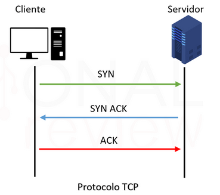
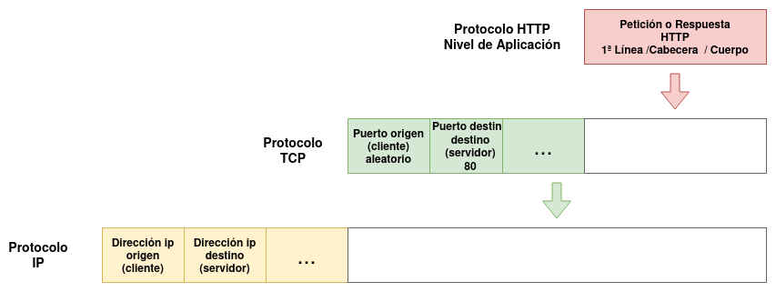
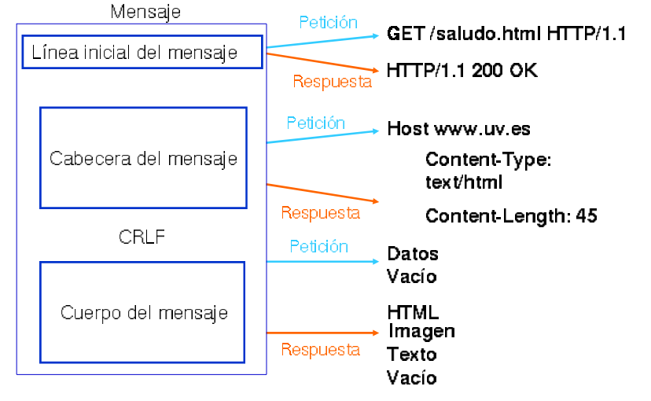
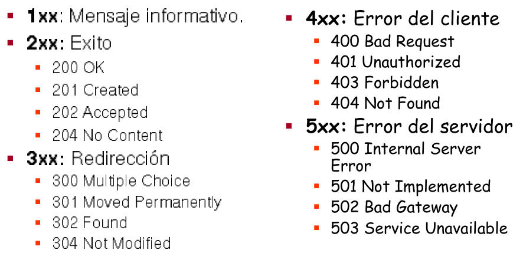
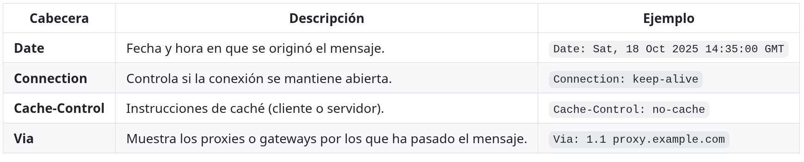
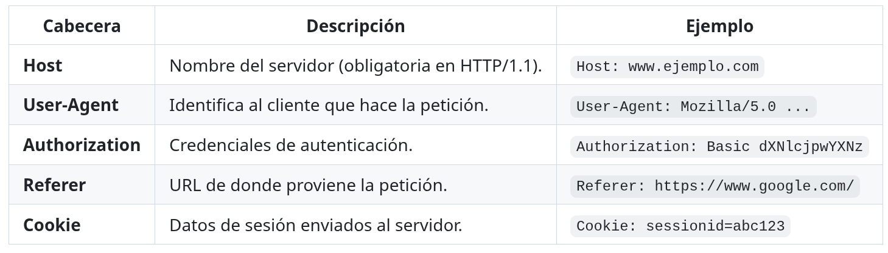
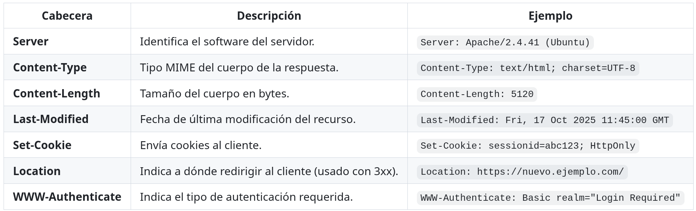
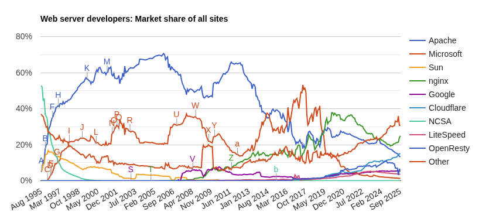
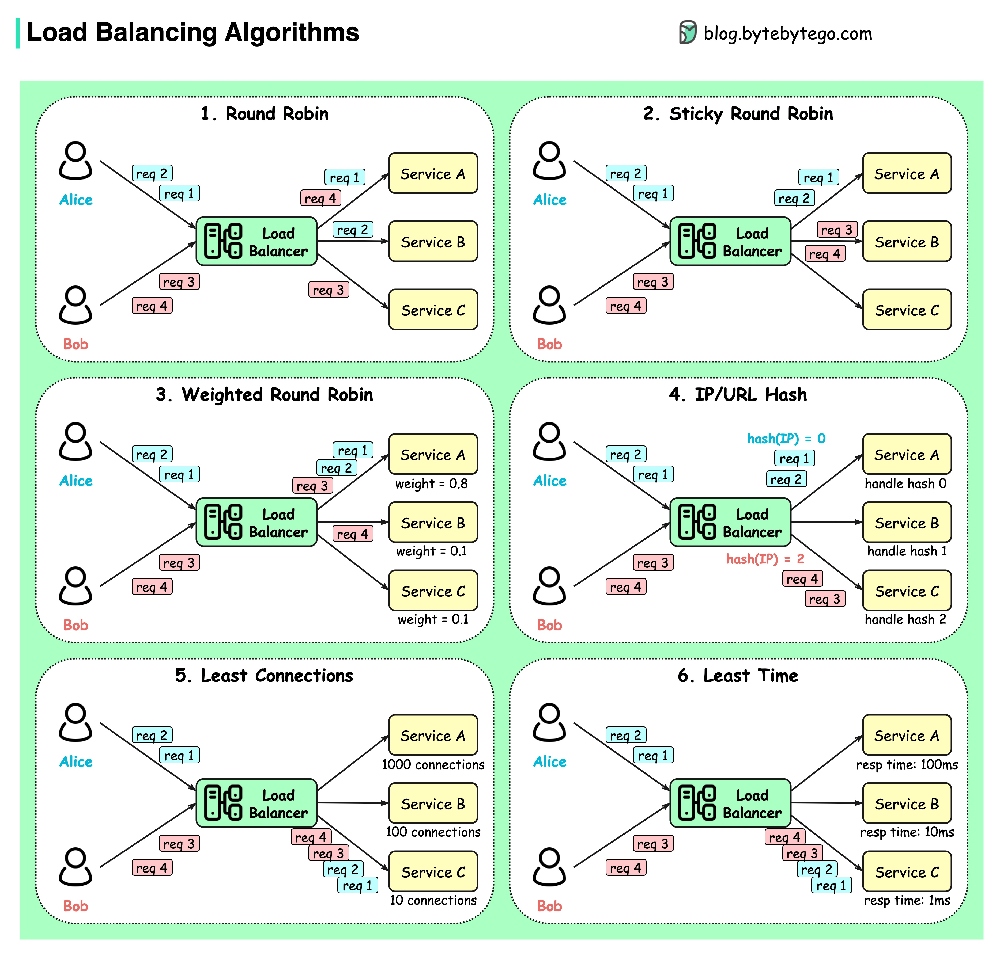

# Protocolo HTTP

## Descripción General

Protocolo de la **capa de aplicación** que permite la comunicación entre servidores, clientes y proxies utilizados en la web.

* La última versión es la **HTTP/1.1**.
* Es un protocolo basado en el esquema **petición/respuesta**.
	* El cliente hace una **PETICIÓN** y...
	* El servidor devuelve una **REPUESTA**.
* Está basado en mensajes de texto plano.
* Es un  protocolo sin manejo de estado. **El servidor no recuerda quién ha hecho la petición**.

## Conexión TCP

{height=40%}

* La versión de **HTTP/1.1** establece **conexiones persistentes (keep-alive)**, es decir:
* En una misma conexión TCP/IP se realizan varias peticiones y respuestas.
* Permiten que **varias peticiones y respuestas** sean transferidas usando la **misma conexión TCP**.
* Más rápido que el **HTTP/1.0**.

## HTTP es un protocolo de la capa de aplicación

{height=75%}

## Partes del mensaje de petición y respuestas

{height=80%}

## Partes del mensaje de petición y respuestas

### PETICIÓN

* Una línea inicial con el método de solicitud (GET,POST,...), la URL del recurso solicitado y la versión del protocolo.
* Una lista de informaciones relacionadas con la petición (**cabeceras de la petición**).
* Un posible cuerpo de contenido (es posible en las peticiones POST).

### RESPUESTA

* Una línea de estado, con la versión del protocolo y un código de éxito o error.
* Una lista de informaciones relacionadas con la petición (**cabeceras de la respuesta**).
* Un cuerpo con el contenido del recurso solicitado.

## Métodos de Petición HTTP

* **GET**: Solicita un documento al servidor. Se pueden enviar datos en la URL.
* **HEAD**: Similar a GET, pero sólo pide las cabeceras HTTP. Por ejemplo, para consultar información sobre el fichero antes de solicitarlo.
* **POST**: Manda datos al servidor para su procesado. Similar a GET, pero además envía datos en el cuerpo del mensaje. La URL corresponde a un página dinámica que trata los datos enviados.
* **PUT**: Almacena el documento enviado en el cuerpo del mensaje.
* **DELETE**: Elimina el documento referenciado en la URL.
* ...

## Códigos de estado en las Respuestas HTTP

{height=75%}

## Cabeceras HTTP

Informaciones de la forma **clave-valor** de las peticiones y respuestas HTTP.

* Cabeceras genéricas.
* Cabeceras de petición..
* Cabeceras de respuesta.

## Cabeceras genéricas

{height=75%}

## Cabeceras de peticiones

{height=75%}

## Cabeceras de respuesta

{height=75%}

## Virtual Host

Un **Virtual Host** (o *host virtual*) permite que un mismo servidor web atienda  
**varios sitios web diferentes** utilizando una sola dirección IP.

* Permite alojar **múltiples dominios** en el mismo servidor.
* Cada dominio puede tener su propio contenido, configuración y registros de acceso.
* Es una técnica fundamental en servidores web como **Apache** o **Nginx**.
* Usamos el tipo **Basado en nombre** : El servidor distingue el sitio web solicitado mediante el **nombre del dominio** incluido en la cabecera `Host` de la petición HTTP.  

## Alias

Un **alias** es una forma de asociar una URL a una ruta diferente dentro del servidor.  
Permiten reorganizar o simplificar el acceso a los recursos sin modificar su ubicación física.

* Se definen en la configuración del servidor web (Apache, Nginx, etc.).
* Permiten “renombrar” directorios o rutas internas.
* Se utilizan para mejorar la estructura del sitio o proteger rutas reales.

## Alias

```
Alias /imagenes/ "/var/www/recursos/img/"
<Directory "/var/www/recursos/img/">
  Options Indexes FollowSymLinks
  AllowOverride None
  Require all granted
</Directory>
```

* Así, una petición a `http://servidor/imagenes/logo.png` accederá realmente a  `/var/www/recursos/img/logo.png`.

## Redirecciones

Una **redirección** ocurre cuando un recurso ha cambiado de ubicación y el servidor indica al cliente la nueva dirección.

* El servidor responde con un código **3xx**, por ejemplo:
  * **301**: El cambio es permanente (puede cachearse).
  * **302**: El cambio es temporal.
* En la respuesta, el servidor indica la nueva URL con la cabecera **Location**.
* El cliente realiza una nueva petición a la URL indicada.

## Autentificación

En ocasiones, para obtener un recurso del servidor web, el usuario debe identificarse mediante un nombre de usuario y una contraseña.

* **Autentificación básica**: Las credenciales se envían codificadas en *Base64* (no cifradas).  
  * Cabecera: `Authorization: Basic dXNlcjpwYXNz`  
  * Solo es segura si se usa junto con **HTTPS**.

* **Autentificación digest**: Más segura: las credenciales se envían como un **hash** calculado.
  * Cabecera: `Authorization: Digest username="user", realm="realm", response="..."`

## Control de acceso

El **control de acceso** permite restringir quién puede acceder a determinados recursos  
o directorios en un servidor web.

Se puede basar en distintos criterios:

* Dirección IP o red de origen.
* Nombre de usuario y contraseña.
* Nombres de dominio utilizado en el acceso.
* Cabeceras HTTP o autenticación previa.

## Cookies

* Las **cookies** son pequeños fragmentos de información que el **navegador** guarda en memoria  
o en disco (ficheros de texto), a solicitud del **servidor web** mediante la cabecera `Set-Cookie`.

* Las cookies permiten **mantener estado** entre peticiones HTTP,  
que de otro modo serían completamente independientes.

## Uso de la Cookies

* Guardar información de la **sesión**.
* **Comercio electrónico**: carrito de la compra.
* **Personalización** de páginas (idiomas, temas, etc.).
* **Seguimiento de visitas** y publicidad.
* **Recordar login y contraseña**.


## Sesiones

* HTTP es un protocolo **sin manejo de estados** (*stateless*).
* Las **sesiones** permiten definir distintos estados en una aplicación.
* Permiten recordar, por ejemplo, qué cliente ha realizado la petición.
* El **servidor** guarda información de la sesión:
  * Identificador de sesión.
  * Usuario asociado.
  * Tiempo de expiración.
* Normalmente, el **cliente** guarda su identificador de sesión en una **cookie**.


# Servidores Web

## Servidores web

* Los **Servidores Web** son programas que implementan el protocolo HTTP.
* Los más famosos en la actualidad: apache2 y nginx.
* Pueden ofrecer páginas web estáticas (ficheros html, hojas de estilos, imágenes,...), o pueden ofrecer páginas dinámicas generadas por **Lenguajes de Programación Web (PHP, Java, Python,...)**.
* Normalmente necesitan de la ayuda de otro software para ejecutar estos programas: **Servidores de Aplicación**.
* Implementan todas las funcionalidades del protocolo HTTP: redirecciones, autentificación, negociación de contenido,...), aunque...
* La mayoría de estas funcionalidad se han programado con las aplicaciones web construidas con los lenguajes de programación web.

## Apache HTTP Server

* Servidor web **HTTP de código abierto**, multiplataforma (Linux, Windows, macOS).  
* Implementa el protocolo **HTTP/1.1** y soporta **HTTP/2** mediante módulos.  
* Desarrollado dentro del proyecto **httpd** de la **Apache Software Foundation**.  
* Surgió a partir del servidor **NCSA HTTPd** (1995), tras el trabajo de Rob McCool.  
* Su nombre proviene del juego de palabras *a patchy server* y de la **tribu Apache**.  
* Fue el **servidor web más usado en Internet desde 1996 hasta 2020**.  
* Destaca por su **estabilidad**, **modularidad** y **gran comunidad** de desarrollo.  
* Se integra fácilmente con lenguajes como **PHP, Python, Perl** o **CGI**.  
* Actualmente la versión estable es la **2.4**, con la **2.5** en desarrollo.

## Nginx

* Servidor **web y proxy inverso** ligero de **alto rendimiento**.  
* Actúa también como **proxy de correo** para los protocolos **IMAP/POP3**.  
* Es **software libre y de código abierto**, bajo licencia **BSD simplificada**.  
* Dispone de una versión comercial llamada **Nginx Plus**.  
* Es **multiplataforma**, disponible para Linux, Windows y otros sistemas.  
* Desarrollado por **Igor Sysoev** en **2004** para optimizar el rendimiento de los sitios del portal ruso **Rambler**.  
* Diseñado para superar a **Apache** en rendimiento y uso de memoria,  
  especialmente al servir **archivos estáticos** o manejar **muchas conexiones simultáneas**.  
* Usa mucha menos memoria y puede procesar **varias veces más peticiones por segundo** que Apache.  
* Es **menos flexible** en configuraciones dinámicas (no tiene ficheros `.htaccess`).  
* Ofrece **menos módulos integrados** que Apache, pero un **rendimiento y escalabilidad superiores**.

## Comparación de uso



# Proxy, proxy inverso y \newline balanceador de carga

## Proxy

* Un **proxy** es un servidor que **intermedia las peticiones** (**capa de aplicación**) entre los clientes y los servidores de Internet.  
* Se utiliza cuando los equipos de una red **no acceden directamente a Internet**, por ejemplo en redes sin NAT o con restricciones.  
* Permite **filtrar y controlar** el tráfico a nivel de aplicación (HTTP):  
  * por dominios, URLs, contenido o franjas horarias.  
* Puede actuar como **caché**, almacenando respuestas para acelerar accesos posteriores y reducir consumo de ancho de banda.  
* Mejora la **seguridad**, anonimato y rendimiento de la red.  
* **Ejemplo:** *Squid*.

## Proxy Inverso

* Un **proxy inverso** recibe las peticiones de los clientes y las **redirecciona a uno o varios servidores internos**.  
* El cliente **no accede directamente** a los servidores backend, sino al proxy inverso.  
* Se utiliza para:
  * **Proteger** servidores internos (ocultando su ubicación real).  
  * **Distribuir carga** entre varios servidores.  
  * **Implementar caché** para contenidos estáticos o respuestas frecuentes.  
  * Añadir **TLS/SSL**, compresión o autenticación centralizada.  
* **Ejemplos:** *Apache HTTP Server*, *Nginx*, *Varnish*, *Traefik*.

## Balanceador de Carga

* Un **balanceador de carga** distribuye las peticiones entrantes entre varios servidores backend.  
* Su objetivo es **optimizar el rendimiento**, **aumentar la disponibilidad** y **evitar la sobrecarga** de un solo servidor.  
* Puede implementarse mediante hardware o software.  
* El balanceador recibe la petición y, según un **algoritmo de distribución**, la reenvía al servidor más adecuado.  
* **Ejemplos:** *Nginx*, *HAProxy*, *Apache mod_proxy_balancer*.

## Algoritmos de Balanceo

{height=70%}

Los algoritmos determinan cómo se reparten las peticiones entre los servidores.

## Algoritmos de Balanceo Estáticos

1. **Round Robin**  
   Las peticiones se envían secuencialmente a cada servidor.  
   Requiere que las instancias sean equivalentes y sin estado.

2. **Sticky Round Robin**  
   Variante que mantiene la afinidad:  
   un mismo cliente siempre se dirige al mismo servidor.

3. **Round Robin Ponderado**  
   Cada servidor tiene un peso asignado; los de mayor peso reciben más peticiones.

4. **Hash**  
   Se aplica una función *hash* (por ejemplo sobre la IP o la URL)  
   para determinar el servidor que atenderá cada petición.

## Algoritmos de Balanceo Dinámicos

1. **Conexiones Mínimas**  
   La nueva petición se envía al servidor con **menos conexiones activas**.

2. **Menor Tiempo de Respuesta**  
   Se elige el servidor que presenta el **tiempo de respuesta más bajo**  
   según mediciones recientes o métricas internas.

