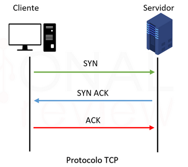
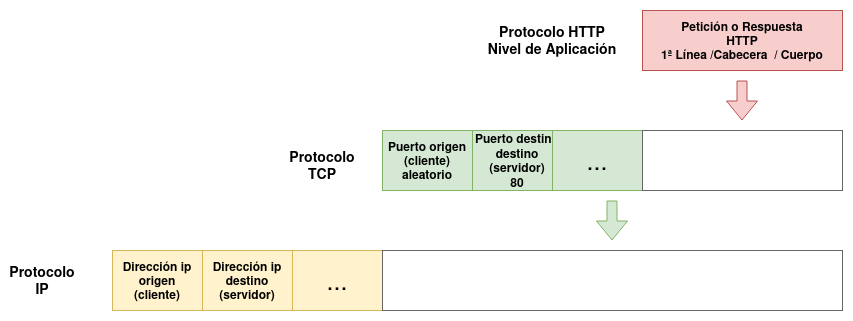
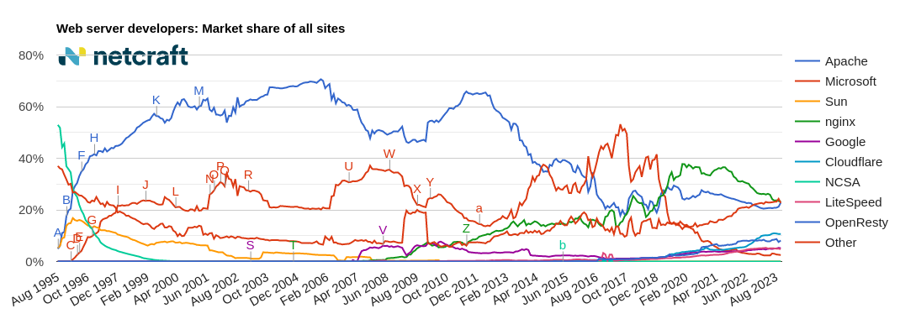

# Protocolo HTTP

## Descripción General

Protocolo de la **capa de aplicación** que permite la comunicación entre servidores, clientes y proxies utilizados en la web.

* La última versión es la **HTTP/1.1**.
* Es un protocolo basado en el esquema **petición/respuesta**.
	* El cliente hace una **PETICIÓN** y...
	* El servidor devuelve una **REPUESTA**.
* Está basado en mensajes de texto plano.
* Es un  protocolo sin manejo de estado. **El servidor no recuerda quién ha hecho la petición**.

## Conexión TCP

{height=40%}

* La versión de **HTTP/1.1** establece **conexiones persistentes (keep-alive)**, es decir:
* En una misma conexión TCP/IP se realizan varias peticiones y respuestas.
* Permiten que **varias peticiones y respuestas** sean transferidas usando la **misma conexión TCP**.
* Más rápido que el **HTTP/1.0**.

## HTTP es un protocolo de la capa de aplicación

{height=75%}

## Partes del mensaje de petición y respuestas

{height=80%}

## Partes del mensaje de petición y respuestas

### PETICIÓN

* Una línea inicial con el método de solicitud (GET,POST,...), la URL del recurso solicitado y la versión del protocolo.
* Una lista de informaciones relacionadas con la petición (**cabeceras de la petición**).
* Un posible cuerpo de contenido (es posible en las peticiones POST).

### RESPUESTA

* Una línea de estado, con la versión del protocolo y un código de éxito o error.
* Una lista de informaciones relacionadas con la petición (**cabeceras de la respuesta**).
* Un cuerpo con el contenido del recurso solicitado.

## Métodos de Petición HTTP

* **GET**: Solicita un documento al servidor. Se pueden enviar datos en la URL.
* **HEAD**: Similar a GET, pero sólo pide las cabeceras HTTP. Por ejemplo, para consultar información sobre el fichero antes de solicitarlo.
* **POST**: Manda datos al servidor para su procesado. Similar a GET, pero además envía datos en el cuerpo del mensaje. La URL corresponde a un página dinámica que trata los datos enviados.
* **PUT**: Almacena el documento enviado en el cuerpo del mensaje.
* **DELETE**: Elimina el documento referenciado en la URL.
* ...

## Códigos de estado en las Respuestas HTTP

{height=75%}

## Cabeceras HTTP

Informaciones de la forma **clave-valor** de las peticiones y respuestas HTTP.

* Cabeceras genéricas.
* Cabeceras de petición..
* Cabeceras de respuesta.

## Cabeceras genéricas

* **Connection**: Indica si la conexión TCP/IP se ha cerrado (closed), o se mantiene abierta. Normalmente los servidores web modernos usan la **persistencia en la conexión** (keep-alive), es decir en una misma conexión TCP/IP se realizan varias peticiones y respuestas.

* El servidor devuelve una cabecera **keep-alive** donde indica o las peticiones y respuestas máximas que se pueden realizar durante la conexión o el tiempo máximo en el que se cerrará la conexión.

\scriptsize
```
		Keep-Alive: timeout=5, max=100
```

## Cabeceras de peticiones

* **Host**: Indica el nombre del servidor al que nos conectamos.
* **User-Agent**: Contiene información como el nombre y versión del navegador y del sistema operativo y el idioma por defecto del cliente.
* **Accept-Language**: Idioma que acepta el cliente. Podemos tener varias versiones de la página con distintos idiomas (**Negociación de contenidos**) se recibirá la que se indique en esta cabecera.
* **Accept-Encoding**: Formatos de codificación que soporta el navegador.
* **Referer**: Contiene la url de referencia. Si un usuario hace click en un enlace, en la página de destino aparecerá como **referer** la anterior.
* **Cookie**: Envía las cookies guardadas en el cliente.
* ...

## Cabeceras de respuesta

* **Cache-Control**: control de las cachés intermedias (por ejemplo un proxy-caché o un navegador web). Por ejemplo: `max-age=3600, public` se puede cachear y es válido durante 1 hora; `no-cache`: no se puede cachear.
* **Content-Type**: Tipo de documento que se manda (se indica con el tipo MIME), ejemplo: **text/html** fichero html, **image/png** imagen png, ... El navegador decide entonces como interpretar los contenidos.
* **Content-Length**: Tamaño en bytes del recurso que se ha enviado al cliente.
* **Last-Modified**: Fecha y hora de la última modificación del recurso.
* **Server**: Información del servidor Web.
* **Location**: Cuando se produce una **redirección** la url donde se encuentra el recurso buscado.
* **Set-cookie**: Para que un un sitio web cree o actualiza una cookie en tu navegador.

## Cookies

Las cookie son información que el navegador guarda en memoria o en el disco duro dentro de ficheros texto, a solicitud del servidor.

Las cookies pueden usarse para asociar estado.  Proporcionan una manera de conservar cierta información entre peticiones del cliente.

## Uso de la Cookies

* Guarda información de la sesión.
* Comercio electrónico. Carrito de la compra.
* Personalización de páginas. Idiomas.
* Seguimiento de las visitas a un Web. Carteles publicitarios.
* Almacenamiento del login y password.

## Sesiones

* HTTP es un protocolo sin manejo de estados.
* Las **sesiones** permiten definir varios estados distintos en la aplicación.
* Nos permiten recordar por ejemplo que cliente ha realizado la petición.
* El servidor guarda información: identificados de la sesión, identificados del usuario de sesión, tiempo de expiración,...
* Normalmente para que cada cliente sepa en que sesión se encuentra se guarda informaciónde su identificador en una cookie.

## Autentificación

En determinadas ocasiones para obtener un recurso de un servidor web, el usuario se debe identificar (nombre de usuario y contraseña).

Tenemos dos tipos de autentificación:

* **Autentificación básica**: Poco segura, ya que la credenciales se mandan como texto plano.
* **Autentificación digest**: Es más segura, ya que las credenciales se envían con más seguridad. Se mandan cifrada con un  hash.

## Redirecciones

Una **redirección** se produce, cuando un cliente hace una petición a un recurso, y ese recurso se ha movido de localización dentro del servidor web:

* El servidor devuelve una respuesta con el código de estado: 
	* **301**: El cambio es permanente (se puede cachear, por ejemplo por el navegador web).
	* **302**: El cambio es temporal.
* En esa respuesta el servidor indica la nueva URL en la cabecera **Location**.
* El cliente hace una nueva petición a la nueva URL ofrecida por el servidor.

## Servidores Web

* Los **Servidores Web** son programas que implementan el protocolo HTTP.
* Los más famosos en la actualidad: apache2 y nginx.
* Pueden ofrecer páginas web estáticas (ficheros html, hojas de estilos, imágenes,...), o pueden ofrecer páginas dinámicas generadas por **Lenguajes de Programación Web (PHP, Java, Python,...)**.
* Normalmente necesitan de la ayuda de otro software para ejecutar estos programas: **Servidores de Aplicación**.
* Implementan todas las funcionalidades del protocolo HTTP: redirecciones, autentificación, negociación de contenido,...), aunque...
* La mayoría de estas funcionalidad se han programado con las aplicaciones web construidas con los lenguajes de programación web.

## Funcionalidades HTTP

Veamos algunos ejemplos de funcionalidad que ofrece el protocolo HTTP y que normalmente no se ofrecen por el servidor Web, son ofrecidas por las aplicaciones web dinámicas:

* La **negociación de contenido**, permite, por ejemplo, que el cliente solicite una versión de una página estática en un determinado idioma. Normalmente la traducción de las páginas web se hace directamente como funcionalidad de la aplicación web.
* La **autentificación** nos permite controlar el acceso a recursos del servidor web. Normalmente es la aplicación web la que gestiona el control de acceso según los usuarios que se han logueado en la aplicación.
* Las aplicaciones web también pueden realizar **redirecciones**, aunque esta característica se suele seguir usando a nivel de servidor web.

# Servidor web Apache2

## Conceptos básicos

* Servidor web HTTP de código abierto
* Plataformas Linux, Windows, Mac y otras
* Implementa el protocolo HTTP/1.1
* Se desarrolla dentro del proyecto HTTP Server (httpd) de la Apache Software Fundation
* Apache es el servidor HTTP más usado ???
* Extremadamente estable

## Un poco de historia

* El proyecto surge del Centro Nacional de Actividades de Supercomputación (National Center for Supercomputing Activities, NCSA) de la Universidad de Illinois.
* Se creó un servidor llamado HTTPd NCSA, el más utilizado hasta 1994.
* Su principal desarrollador, Rob McCool, abandonó el NCSA y el proyecto.
* A partir de entonces varios programadores empiezan a desarrollar “parches” para el servidor.
* El nombre proviene de la tribu Apache (connotación de algo que es firme y enérgico pero no agresivo).

## Un poco de historia

* También en inglés suena igual que servidor parcheado (a patchy server).
* La primera versión que aparece de Apache es la 0.6 en Abril de 1995.
* Apache tiene amplia aceptación en la red: desde 1996, Apache, es el servidor HTTP más usado (hasta el año 2020)
* El servidor Apache es desarrollado y mantenido por una comunidad de usuarios bajo la supervisión de la Apache Software Foundation dentro del proyecto HTTP Server (httpd).
* Actualmente usamos la versión 2.4, y está en desarrollo la 2.5.

# Servidor web Nginx

## Conceptos básicos

* Es un servidor web/proxy inverso ligero de alto rendimiento.
* Es un proxy para protocolos de correo electrónico (IMAP/POP3).
* Es software libre y de código abierto, 
* Licenciado bajo la Licencia BSD simplificada. 
* Existe una versión comercial distribuida bajo el nombre de Nginx Plus.
* Es multiplataforma

## Un poco de historia

* Originalmente, Nginx fue desarrollado para satisfacer las necesidades de varios sitios web de Rambler que recibían unas 500 millones de peticiones al día en septiembre de 2008.
* Su creador es Igor Sysoev.
* Nginx fue inicialmente (año 2004)  desarrollado con el fin explícito de superar el rendimiento ofrecido por el servidor web Apache. Sirviendo archivos estáticos, Nginx usa dramáticamente menos memoria que Apache, y puede manejar aproximadamente cuatro veces más solicitudes por segundo.
* Es menos flexible a la hora de realizar configuraciones (por ejemplo, no tiene la funcionalidad de configuración que ofrecen los fichero `.htaccess` de apache2)
* También tiene muchos menos módulos que apache2.

## Comparación de uso



# Proxy, proxy inverso y \newline balanceador de carga

## Proxy

* **Proxy**: Proporciona conexión a internet, cuando no tenemos enrutadores/NAT. Por lo tanto gestiona la comunicación HTTP, podemos filtrar!!!
* **Caché**: Además guardar ficheros, de tal manera que los futuros accesos no son necesarios acceder a internet.
* Podemos controlar  a nivel de aplicación (Protocolo HTTP) las peticiones de los clientes: podemos filtrar por dominio, por palabras, por horas,...
* Ejemplo: squid

## Proxy inverso

* Un **proxy inverso** es un tipo de servidor proxy que recupera recursos en nombre de un cliente desde uno o más servidores. Por lo tanto el cliente hace la petición al puerto 80 del proxy, y éste es el que hace la petición al servidor web que normalmente está en una red interna no accesible desde el cliente.
* Un proxy inverso también puede tener funciones de **caché** cuando es capaz de guardar información de los servidores internos y ofrecerla en las próximas peticiones.
* Ejemplos: apache2, nginx, varnish, traefick,...

## Balanceador de carga

* Un **Balanceador de carga** es un dispositivo de hardware o software que se pone al frente de un conjunto de servidores que atienden una aplicación y, tal como su nombre lo indica, asigna o balancea las solicitudes que llegan de los clientes a los servidores usando algún algoritmo.
* Al acceder a un nombre de dominio, se accede al balanceador de carga, que decidirá a que servidor backend manda la petición: round robin, menos conexiones, menor tiempo de respuesta, ...
* Ejemplos: apache2, nginx, haproxy, ...

