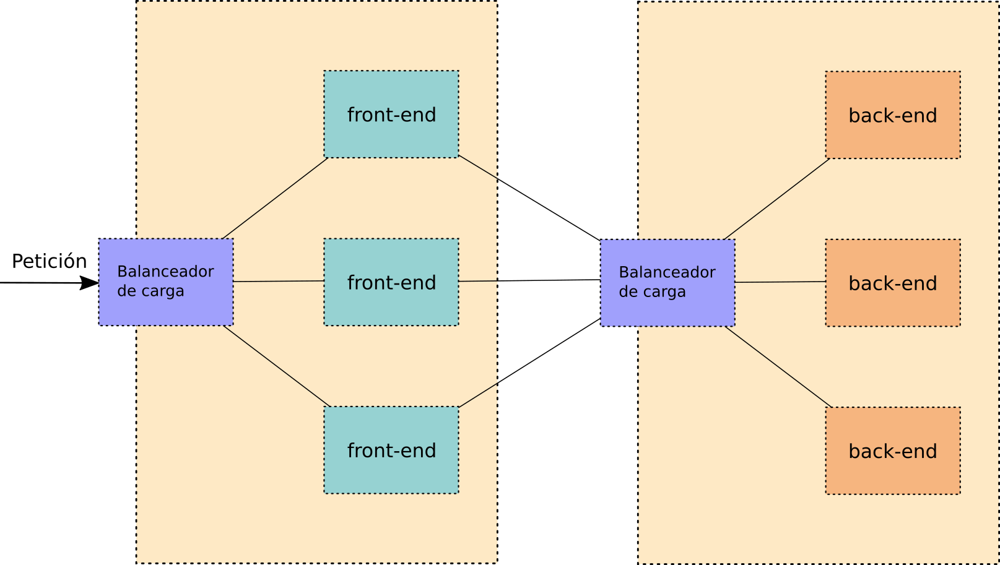

# Orquestadores de contenedores

## Limitaciones de docker (docker engine)

* ¿Qué hacemos con los cambios entre versiones?
* ¿Cómo hacemos los cambios en producción?
* ¿Cómo se balancea la carga entre múltiples contenedores iguales?
* ¿Cómo se conectan contenedores que se ejecuten en diferentes demonios de docker?
* ¿Se puede hacer una actualización de una aplicación sin interrupción?
* ¿Se puede variar a demanda el número de réplicas de un determinado contenedor?
* ¿Es posible mover la carga entre diferentes nodos?

## Orquestadores de contenedores

Surge la necesidad de desarrollar software de orquestadores de contenedores para gestionar de forma coordinada múltiples nodos en los que se estuvieran ejecutando contenedores y para proporcionar funcionalidad no ofrecida por docker engine y que es necesaria en la puesta en producción de la aplicación.

* **Docker Swarm**
* **Apache Mesos**
* **Hashicorp Nomad**
* **Kubernetes**

# El proyecto Kubernetes

## El poryecto k8s

* El proyecto Kubernetes lo inicia Google en 2014 como un software
(libre) para orquestar contenedores.
* Kubernetes no es un proyecto que se desarrolla desde cero, sino que surge de una herramienta interna de Google llamada \color{blue}[Borg](https://kubernetes.io/blog/2015/04/borg-predecessor-to-kubernetes/)\color{darkgray}, de manera que la primera versión es muy funcional.
* Google cede el control del proyecto a la \color{blue}[Cloud Native Compute Foundation (CNCF)](https://www.cncf.io/)\color{darkgray}.

## ¿Qué es Kubernetes?

**Kubernetes** es un software pensado para gestionar completamente el despliegue de aplicaciones sobre contenedores:

* Despliega aplicaciones rápidamente
* Escala las aplicaciones al vuelo
* Integra cambios sin interrupciones
* Permite limitar los recursos a utilizar

## ¿Qué es Kubernetes?

* El nombre del proyecto proviene de una palabra de griego antiguo que
significa timonel y habitualmente se escribe de forma abreviada como
k8s.
* Kubernetes está desarrollado en el lenguaje Go.
* La licencia utilizada en Kubernetes es la \color{blue}[Apache License
v2.0](https://www.apache.org/licenses/LICENSE-2.0.html)\color{darkgray}, licencia de software libre permisiva.
* El código de Kubernetes se gestiona a través de \color{blue}[Github](https://github.com/kubernetes/kubernetes)\color{darkgray}.

## El ecosistema

* Se ha desarrollado un enorme ecosistema de aplicaciones alrededor de k8s que proporcionan algunas funcionalidades que no tiene k8s.

* \color{blue}[https://landscape.cncf.io/](https://landscape.cncf.io/)\color{darkgray}

# Kubernetes

* k8s es un software que se instala en varios nodos que se gestionan de forma coordinada, es decir, un clúster de nodos. 
* Los nodos del clúster pueden ser máquinas físicas o virtuales, pero habitualmente son instancias de nube de infraestructura IaaS (AWS, GCP, OpenStack, etc.).
* Se distingue entre dos tipos de nodos:
	* **Los nodos master (control plane)**: Son los que ejecutan los servicios principales de k8s y ordenan a los otros nodos los contenedores que deben ejecutar. 
    * **Los nodos worker**: Son los que reciben las órdenes de los controladores y en los que se ejecutan los contenedores de las aplicaciones.

## Componentes del nodo master

* **kube-apiserver** Gestiona la API de k8s
* **etcd** Almacén clave-valor que guarda la configuración del clúster
* **kube-scheduler** Selecciona el nodo donde ejecutar los contenedores
* **kube-controller-manager** Ejecuta los controladores de k8s
* **docker/rkt/containerd/...** Ejecuta los contenedores que sean
  necesarios en el controlador
* **cloud-controller-manager** Ejecuta los controladores que
interactúan con el proveedor de nube:
	* nodos
	* enrutamiento
	* balanceadores
	* volúmenes

## Componentes de un nodo worker

* **kubelet** Controla los Pods asignados a su nodo
* **kube-proxy** Permite la conexión a través de la red
* **docker/rkt/containerd/...** Ejecuta los contenedores
* **supervisord** Monitoriza y controla kubelet y docker

## Complementos (addons)

Los elementos anteriores forman la estructura básica de k8s, pero es
muy habitual que se proporcione funcionalidad adicional:

* **Cluster DNS** Proporciona registros DNS para los servicios de
  k8s. Normalmente a través de [CoreDNS](https://coredns.io/)
* **Web UI** Interfaz web para el manejo de k8s
* **Container Resource Monitoring** Recoge métricas de forma
centralizada. Múltiples opciones: [prometheus](https://prometheus.io/), [sysdig](https://sysdig.com/)
* **Cluster-level Logging** Almacena y gestiona los logs de los contenedores

## Alternativas para instalación simple de k8s

* **Minikube** permite desplegar localmente un "clúster" de Kubernetes con un solo nodo. Proyecto oficial de Kubernetes y es la solución más adecuada para aprender a usar k8s, ya que es un proyecto maduro y muy sencillo de instalar.
* **kubeadm**: solución más realista que minikube si se instala un clúster de Kubernetes con varios nodos. Su instalación no es especialmente compleja, pero no está tan automatizada como minikube y necesita más recursos y tiempo para configurarlo.
* **kind** (kubernetes in docker) es un proyecto oficial de Kubernetes más reciente que los dos anteriores y que permite desplegar un clúster de Kubernetes con varios nodos sobre docker. 
* **k3s**: pensada para poner en producción (uso para IoT, edge computing, sistemas d epoco recursos, arquitrtactura arm). Lo comenzó a desarrollar la empresa Rancher y hoy en día lo mantiene la CNCF.

# Despliegues de aplicaciones en Kubernetes

## Despliegue tradicional

{height=75%}

## Despliegue con k8s

{height=75%}

## Recursos de k8s

* Pods: ejecutan los contenedores
* ReplicaSets:
  * Se encargan de que no haya caída del servicio
  * Gestionan la tolerancia a fallos
  * Proporcionan escalabilidad dinámica
* Deployments:
  * Gestionan las actualizaciones continuas
  * Realizan despliegues automáticos
* Services:
  * Gestionan el acceso a los pods
  * Balancean la carga entre los Pods disponibles
* Ingress:
  * Gestionan el acceso desde el exterior a través de nombre
