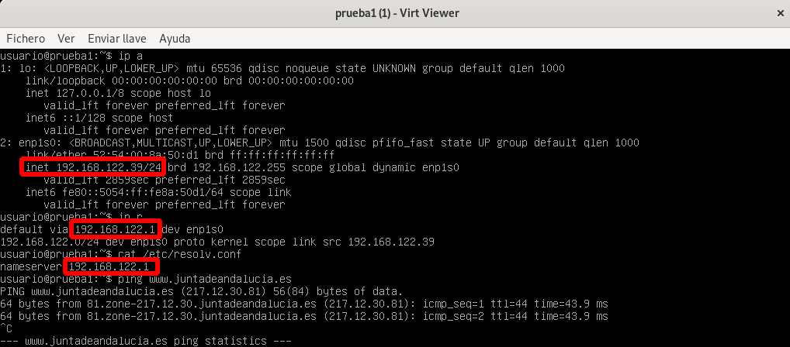
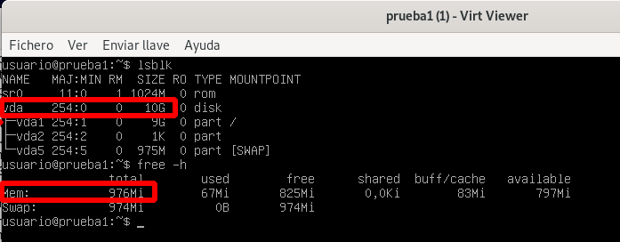
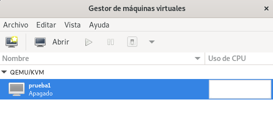

# Introducción QEMU/KKVM + libvirt

## Instalación de QEMU/KVM + libvirt

\small
```bash
root@kvm:~# apt install qemu-system libvirt-clients libvirt-daemon-system

root@kvm:~# adduser usuario libvirt

usuario@kvm:~$ virsh -c qemu:///system list


```
\normalsize 
Si no quieres indicar la conexión, puedes crear una variable de entorno:

\small
```bash
export LIBVIRT_DEFAULT_URI='qemu:///system'
```

## Red disponible por defecto

\small
```bash
usuario@kvm:~$ virsh -c qemu:///system net-list --all
 Nombre    Estado     Inicio automático   Persistente
-------------------------------------------------------
 default   inactivo   no                  si

usuario@kvm:~$ virsh -c qemu:///system net-start default 
La red default se ha iniciado

usuario@kvm:~$ virsh -c qemu:///system net-autostart default
La red default ha sido marcada para iniciarse automáticamente
```

## Red disponible por defecto

Al crear un MV, pode defecto, se conectará a la red `default`, que es un red de tipo **NAT**:

1. En el host tenemos un servidor DHCP (rango: 192.168.122.2 - 192.168.122.254).
2. La puerta de enlace de la MV es la 192.168.122.1, que corresponde al host.
3. El servidor DNS de la MV también es el host.
4. La máquina virtual estará conectada a un Linux Bridge (switch virtual) llamado virbr0.
5. El host también se conecta al bridge virbr0 con la dirección 192.168.122.1.
6. El host hace SNAT para que la MV tenga conectividad al exterior.

## Red disponible por defecto



## Almacenamiento disponible

* Los discos de la MV, por defectos se guardaran en ficheros con formato **qcow2**.
* El directorio donde se guarda es **/var/lib/libvirt/images**.



## Almacenamiento disponible

* Un **Pool de almacenamiento** es un recurso de almacenamiento.
	* Distintos tipos, normalmente es un *Directorio*.
```bash
virsh -c qemu:///system pool-list 
 Nombre    Estado   Inicio automático
---------------------------------------
 default   activo   si
 iso       activo   si
```

## Almacenamiento disponible

* Un **volumen** es un medio de almacenamiento que podemos crear en un pool de almacenamiento en kvm. 
	* Si el pool de almacenamiento es de tipo **dir**, entonces el volumen será un **fichero de imagen**.

\scriptsize
```bash
virsh -c qemu:///system vol-list default
 Nombre          Ruta
--------------------------------------------------------
 prueba1.qcow2   /var/lib/libvirt/images/prueba1.qcow2

 virsh -c qemu:///system vol-list iso
 Nombre                            Ruta
--------------------------------------------------------------------------------------
 debian-11.3.0-amd64-netinst.iso   /home/usuario/iso/debian-11.3.0-amd64-netinst.iso
```

## virt-install

```bash
apt install virtinst
```

Ejemplo:

```bash
virt-install --connect qemu:///system \
			 --virt-type kvm \
			 --name prueba1 \
			 --cdrom ~/iso/debian-11.3.0-amd64-netinst.iso \
			 --os-variant debian10 \
			 --disk size=10 \
			 --memory 1024 \
			 --vcpus 1
```

Para acceder a la MV:

```bash
virt-viewer -c qemu:///system prueba1
```

## Gestión de MV con virsh

```
virsh --help
virsh list --help
```

Subcomandos de virsh...

```
list --all					dominfo <máquina>	
shutdown <máquina>			domifaddr <máquina>	
start <máquina>				domblklist <máquina>
autostart <máquina>
reboot <máquina>
destroy <máquina>
suspend <máquina>
resume <máquina>
undefine --remove-all-storage <máquina>
```

## Definición XML de una máquina

```
virsh -c qemu:///system  dumpxml <máquina>
```

```xml
<domain type='kvm' id='6'>
  <name>prueba1</name>
  <uuid>a88eebdc-8a00-4b9d-bf48-cbed7bb448d3</uuid>
  ...
  <memory unit='KiB'>1048576</memory>
  <currentMemory unit='KiB'>1048576</currentMemory>
  <vcpu placement='static'>1</vcpu>
  ...
  <os>
    <type arch='x86_64' machine='pc-q35-5.2'>hvm</type>
    <boot dev='hd'/>
  </os>
  ...
```

## Definición XML de una máquina

\scriptsize

```xml
	<cpu mode='custom' match='exact' check='full'>
      <model fallback='forbid'>Cooperlake</model>
      <vendor>Intel</vendor>
    ...
	<disk type='file' device='disk'>
      <driver name='qemu' type='qcow2'/>
      <source file='/var/lib/libvirt/images/prueba1.qcow2'/>
      <target dev='vda' bus='virtio'/>
      <address type='pci' domain='0x0000' bus='0x04' slot='0x00' function='0x0'/>
    </disk>
	...
	<interface type='network'>
      <mac address='52:54:00:8a:50:d1'/>
      <source network='default'/>
      <model type='virtio'/>
      <address type='pci' domain='0x0000' bus='0x01' slot='0x00' function='0x0'/>
    </interface>
```

## Modificación de una máquina virtual

* Dos alternativas:
    * Realizar los cambios directamente en el documento XML utilizando el comando **virsh edit**.
    * Utilizando comandos específicos de virsh.
* Hay cambios que se pueden realizar con la máquina funcionando, otros necesitan que la máquina esté parada y otros necesitan un reinicio de la máquina para que se realicen.
* Ejemplo, con la MV parada:

```bash
virsh -c qemu:///system domrename prueba2 prueba1
Domain 'prueba2' XML configuration edited.
```

## Modificación cd las VCPU

Con al máquina parada:
```
virsh -c qemu:///system edit prueba1
...
  <vcpu placement='static'>2</vcpu>
...
```

Otra forma: **virsh setvcpus**

## Modificación de la memoria

Con la máquina parada, modificamos la memoria:

```bash
virsh -c qemu:///system edit prueba1
...
  <memory unit='KiB'>3145728</memory>
  <currentMemory unit='KiB'>1048576</currentMemory>
...
```

O en caliente:

```bash
virsh -c qemu:///system start prueba1

virsh -c qemu:///system setmem prueba1 2048M
```

## virt-manager



## Creación de MV Windows

* Configurar disco y tarjeta de red en modo **VirtIO**.
* Windows no tiene soporte nativo para dispositivos VirtIO.
* Añadimos un CDROM con la [iso](https://fedorapeople.org/groups/virt/virtio-win/direct-downloads/stable-virtio/virtio-win.iso) del de los drivers VirtIO.
* Cargamos los controladores como se indica en los apuntes.

## Creación de MV windows con virt-install

\small
```bash
virt-install --connect qemu:///system \
			 --virt-type kvm \
			 --name prueba4 \
			 --cdrom ~/iso/Win10_21H2_Spanish_x64.iso \
			 --os-variant win10 \
			 --disk size=40,bus=virtio \
			 --disk ~/iso/virtio-win-0.1.217.iso,device=cdrom \
			 --network=default,model=virtio \
			 --memory 2048 \
			 --vcpus 2
```
# Almacenamiento en QEMU/KVM + libvirt

## Almacenamiento

* Un **Pool de almacenamiento** es un recurso de almacenamiento.
* Un **volumen** es un medio de almacenamiento que podemos crear en un pool de almacenamiento en kvm. Son los discos de las MV.

Tipos:

* dir
* logical
* netfs
* iSCSI
* ...

## Tipos de almacenamiento

* **dir**
  * Es un **directorio del host** (sistema de archivo).
  * Los **volúmenes** son imágenes de discos, guardados en ficheros:
    * **raw**: Imagen binaria de disco. Ocupa todo el espacio asignado. Acceso más eficiente. No permite snapshots ni aprovisionamiento dinámico.
    * **qcow2**: formato QEMU copy-on-write. Se asigna un tamaño, pero solo ocupa el espacio de los datos (aprovisonamiento ligero). Se pueden realizar snapshots. Acceso menos eficiente.
    * vdi, vmdk,...: formatos de otros sistemas de virtualización.
  * No ofrece almacenamiento compartido.

## Tipos de almacenamiento

* **logical**
  * El pool controla un **Grupo de Volumenes Lógicos**
  * Los **volúmes** corresponde a volúmenes logícos. El contenedio del disco de la MV se guarda en un LV.
  * No ofrece almacenamiento compartido. No se pueden hacer snapshots. No tiene aprovisionamiento ligero.
* **netfs**
  * Montará un **directorio desde un servidor NAS** (nfs,...).
  * Los **volúmenes** serán imágenes de discos (ficheros).
  * Ofrece almacenamiento compartido.
* **iSCSI**
  * Montará un **disco desde un servidor iSCSI**.
  * Los datos del disco de la MV se guardará en este disco.
  * Ofrece almacenamiento compartido, con las consideraciones que hemos estudiado.

## Gestión de volúmenes

Tenemos 2 formas de gestionar volúmenes. Por ejemplo, podemos **crear un volumen**:

* Usando **libvirt (virsh,virt-manager)**:
  * Tipo de pool: **dir**: Estaríamos creando una imagen de disco (fichero qcow2, raw,...)
  * Tipo de pool: **logiacal**: Estaríamos creando un LV.
* Usando **herramientas específicas**:
  * Tipo de pool: **dir**: 
    * Usando `qemu-img` para crear una imagen de disco (fichero) y luego **actualizar** el pool.
  * Tipo de pool: **logiacal**: 
    * Usando `lvcreate` para crear el LV y luego **actualizar** el pool.
  
## Gestión de Pools de Almacenamiento

```bash
virsh -c qemu:///system ...

pool-list 
pool-info default 
pool-dumpxml default
pool-define
pool-define-as vm-images dir --target /srv/images
pool-build vm-images 
pool-start vm-images 
pool-autostart vm-images 
pool-destroy vm-images 
pool-delete vm-images 
pool-undefine vm-images 
```

## Gestión de volúmenes con libvirt

```bash
virsh -c qemu:///system ...

vol-list default
vol-list default --details
vol-info prueba1.qcow2 default
vol-dumpxml vol.qcow2 default
vol-create-as default vol1.qcow2 --format qcow2 10G 
vol-delete vol1.qcow2 default
```

## Gestión de volúmenes con herramientas específicas

Trabajamos con pool de almacenamiento tipo **dir**.

```bash
cd /var/lib/libvirt/images
qemu-img create -f qcow2 vol2.qcow2 2G

qemu-img info vol2.qcow2

virsh -c qemu:///system pool-refresh vm-images
```

## Creación de MV usando volúmenes existentes

```bash
virt-install --connect qemu:///system \
			 --virt-type kvm \
			 --name prueba4 \
			 --cdrom ~/iso/debian-11.3.0-amd64-netinst.iso \
			 --os-variant debian10 \
			 --disk vol=default/vol1.qcow2 \
			 --memory 1024 \
			 --vcpus 1
```

Otras formas de indicarlo:

* `--disk path=/var/lib/libvirt/images/vol1.qcow2`
* `--pool wm-images,size=10`

## Añadir nuevos discos a MV

\small
```bash
virsh -c qemu:///system ...

attach-disk prueba4 /srv/images/vol2.qcow2 vdb --driver=qemu --type disk \
                                               --subdriver qcow2 \
                                               --persistent

detach-disk prueba4 vdb --persistent
```

## Redimensión de discos en MV

* MV parada:
  * Usando libvirt:

    ```
    virsh -c qemu:///system vol-resize vol2.qcow2 3G --pool vm-images
    ```
  * Usando qemu-img:
    ```
    sudo qemu-img resize /srv/images/vol2.qcow2 3G
    ```
* MV en ejecución:

  ```
  virsh -c qemu:///system ...
  domblklist prueba4 
  blockresize prueba4 /srv/images/vol2.qcow2 3G
  ```

A continuación dentro de laMV redimensionamos el sistema de ficheros con **resize2fs /dev/vdb**.

## Redimensión del sistema de ficheros de una imagen de disco

Redimensionar el SF sin entrar en la MV. Usamos **virt-resize**.

```bash
qemu-img resize vol1.qcow2 10G
cp vol1.qcow2 newvol1.qcow2
virt-resize --expand /dev/sda1 vol1.qcow2 newvol1.qcow2
mv newvol1.qcow2 vol1.qcow2
```

# Clonación e instantáneas

## Clonación

Nos permite crear nuevas MV. Varias métodos:

* A partir de **MV**:
    * **viet-clone**
    * virt-manager
    * Problema: MV clonadas son iguales a las originales.
* A partir de una **plantilla**:
    * Imagen preconfigurada y generalizada. **Copia maestra**.
    * **Clonación completa (Full)**: Copia completa a partir de la plantilla. requiere el mismo espaciod e disco.
    * **Clonación enlazada (Linked)**: La imagen de la plantilla es una imagen base de sólo lectura de la imagen de la nueva MV (**Backing Store**). Requiere menos espcio en disco.

## Clonación desde una MV

* **virt-clone**:
  ```bash
  virt-clone --connect=qemu:///system ...
  
  --original prueba4 --auto-clone

  --original prueba4 \
                    --name prueba5  \
                    --file /var/lib/libvirt/images/prueba5.qcow2 \
                    --auto-clone
  ```
* **virt-manager**

**La MV clonada es igual a la original**, podemos acceder a ella y cambiar el fichero **/etc/hostname** pero aún tendríamos mucha información repetida entre las dos MV.

## Plantillas de MV

* Un plantilla de MV es una imagen preconfigurada y generalizada. **Copia maestra**. A partir de ella creamos nuevas MV que no serán iguales a la original.
* **Clonación completa (Full)**
* **Clonación enlazada (Linked)**
* Creación:
  1. Crear e instalar una MV con tood el software necesario. A partir de esta creamos la plantilla.
  2. Generalizar la imagen. con la MV parada:
      
      ```bash
      sudo virt-sysprep -d prueba1 --hostname plantilla-debian11
      ```
  3. Evitar ejecutar la MV: 
      
      ```bash
      chmod -w prueba1.qcow2 
      virsh -c qemu:///system domrename prueba1 plantilla-prueba1
      ```

## Clonación completa de plantilla

* **virt-clone**

  ```bash
  virt-clone --connect=qemu:///system --original plantilla-prueba1 --name clone1 --auto-clone
  ```
  Si quieres también puedes usar **--file** para indicar el nombre de la nueva imagen.
* **virt-manager**

Problemas al acceder por SSH

* Al generalizar la plantilla hemos borrado las claves SSH de la MV.
* Hay que entrar en la máquina y volver a crearlas.

  ```bash
  echo "clone1" > /etc/hosname
  ssh-keygen -A
  reboot
  ```