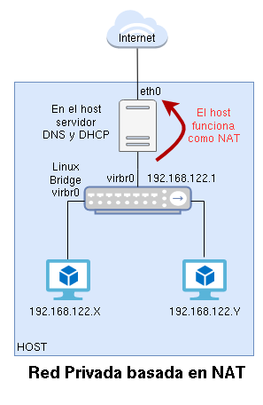
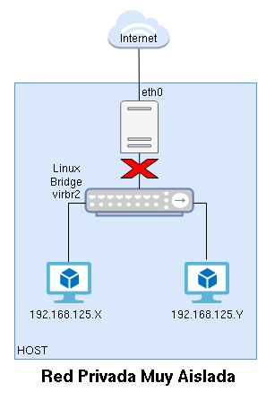
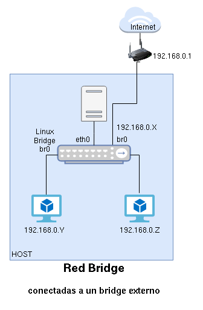
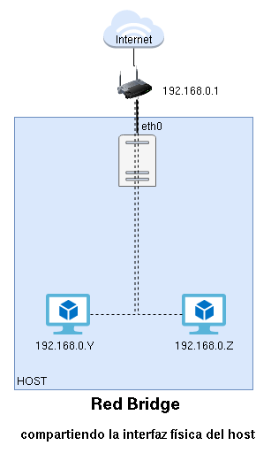

# Introducción QEMU/KKVM + libvirt

## Instalación de QEMU/KVM + libvirt

\small
```bash
root@kvm:~# apt install qemu-system libvirt-clients libvirt-daemon-system

root@kvm:~# adduser usuario libvirt

usuario@kvm:~$ virsh -c qemu:///system list


```
\normalsize 
Si no quieres indicar la conexión, puedes crear una variable de entorno:

\small
```bash
export LIBVIRT_DEFAULT_URI='qemu:///system'
```

## Red disponible por defecto

\small
```bash
usuario@kvm:~$ virsh -c qemu:///system net-list --all
 Nombre    Estado     Inicio automático   Persistente
-------------------------------------------------------
 default   inactivo   no                  si

usuario@kvm:~$ virsh -c qemu:///system net-start default 
La red default se ha iniciado

usuario@kvm:~$ virsh -c qemu:///system net-autostart default
La red default ha sido marcada para iniciarse automáticamente
```

## Red disponible por defecto

Al crear un MV, pode defecto, se conectará a la red `default`, que es un red de tipo **NAT**:

1. En el host tenemos un servidor DHCP (rango: 192.168.122.2 - 192.168.122.254).
2. La puerta de enlace de la MV es la 192.168.122.1, que corresponde al host.
3. El servidor DNS de la MV también es el host.
4. La máquina virtual estará conectada a un Linux Bridge (switch virtual) llamado virbr0.
5. El host también se conecta al bridge virbr0 con la dirección 192.168.122.1.
6. El host hace SNAT para que la MV tenga conectividad al exterior.

## Red disponible por defecto


## Almacenamiento disponible

* Los discos de la MV, por defectos se guardaran en ficheros con formato **qcow2**.
* El directorio donde se guarda es **/var/lib/libvirt/images**.


## Almacenamiento disponible

* Un **Pool de almacenamiento** es un recurso de almacenamiento.
	* Distintos tipos, normalmente es un *Directorio*.
```bash
virsh -c qemu:///system pool-list 
 Nombre    Estado   Inicio automático
---------------------------------------
 default   activo   si
 iso       activo   si
```

## Almacenamiento disponible

* Un **volumen** es un medio de almacenamiento que podemos crear en un pool de almacenamiento en kvm. 
	* Si el pool de almacenamiento es de tipo **dir**, entonces el volumen será un **fichero de imagen**.

\scriptsize
```bash
virsh -c qemu:///system vol-list default
 Nombre          Ruta
--------------------------------------------------------
 prueba1.qcow2   /var/lib/libvirt/images/prueba1.qcow2

 virsh -c qemu:///system vol-list iso
 Nombre                            Ruta
--------------------------------------------------------------------------------------
 debian-11.3.0-amd64-netinst.iso   /home/usuario/iso/debian-11.3.0-amd64-netinst.iso
```

## virt-install

```bash
apt install virtinst
```

Ejemplo:

```bash
virt-install --connect qemu:///system \
			 --virt-type kvm \
			 --name prueba1 \
			 --cdrom ~/iso/debian-11.3.0-amd64-netinst.iso \
			 --os-variant debian10 \
			 --disk size=10 \
			 --memory 1024 \
			 --vcpus 1
```

Para acceder a la MV:

```bash
virt-viewer -c qemu:///system prueba1
```

## Gestión de MV con virsh

```
virsh --help
virsh list --help
```

Subcomandos de virsh...

```
list --all					dominfo <máquina>	
shutdown <máquina>			domifaddr <máquina>	
start <máquina>				domblklist <máquina>
autostart <máquina>
reboot <máquina>
destroy <máquina>
suspend <máquina>
resume <máquina>
undefine --remove-all-storage <máquina>
```

## Definición XML de una máquina

```
virsh -c qemu:///system  dumpxml <máquina>
```

```xml
<domain type='kvm' id='6'>
  <name>prueba1</name>
  <uuid>a88eebdc-8a00-4b9d-bf48-cbed7bb448d3</uuid>
  ...
  <memory unit='KiB'>1048576</memory>
  <currentMemory unit='KiB'>1048576</currentMemory>
  <vcpu placement='static'>1</vcpu>
  ...
  <os>
    <type arch='x86_64' machine='pc-q35-5.2'>hvm</type>
    <boot dev='hd'/>
  </os>
  ...
```

## Definición XML de una máquina

\scriptsize

```xml
	<cpu mode='custom' match='exact' check='full'>
      <model fallback='forbid'>Cooperlake</model>
      <vendor>Intel</vendor>
    ...
	<disk type='file' device='disk'>
      <driver name='qemu' type='qcow2'/>
      <source file='/var/lib/libvirt/images/prueba1.qcow2'/>
      <target dev='vda' bus='virtio'/>
      <address type='pci' domain='0x0000' bus='0x04' slot='0x00' function='0x0'/>
    </disk>
	...
	<interface type='network'>
      <mac address='52:54:00:8a:50:d1'/>
      <source network='default'/>
      <model type='virtio'/>
      <address type='pci' domain='0x0000' bus='0x01' slot='0x00' function='0x0'/>
    </interface>
```

## Modificación de una máquina virtual

* Dos alternativas:
    * Realizar los cambios directamente en el documento XML utilizando el comando **virsh edit**.
    * Utilizando comandos específicos de virsh.
* Hay cambios que se pueden realizar con la máquina funcionando, otros necesitan que la máquina esté parada y otros necesitan un reinicio de la máquina para que se realicen.
* Ejemplo, con la MV parada:

```bash
virsh -c qemu:///system domrename prueba2 prueba1
Domain 'prueba2' XML configuration edited.
```

## Modificación cd las VCPU

Con al máquina parada:
```
virsh -c qemu:///system edit prueba1
...
  <vcpu placement='static'>2</vcpu>
...
```

Otra forma: **virsh setvcpus**

## Modificación de la memoria

Con la máquina parada, modificamos la memoria:

```bash
virsh -c qemu:///system edit prueba1
...
  <memory unit='KiB'>3145728</memory>
  <currentMemory unit='KiB'>1048576</currentMemory>
...
```

O en caliente:

```bash
virsh -c qemu:///system start prueba1

virsh -c qemu:///system setmem prueba1 2048M
```

## virt-manager


## Creación de MV Windows

* Configurar disco y tarjeta de red en modo **VirtIO**.
* Windows no tiene soporte nativo para dispositivos VirtIO.
* Añadimos un CDROM con la [iso](https://fedorapeople.org/groups/virt/virtio-win/direct-downloads/stable-virtio/virtio-win.iso) del de los drivers VirtIO.
* Cargamos los controladores como se indica en los apuntes.

## Creación de MV windows con virt-install

\small
```bash
virt-install --connect qemu:///system \
			 --virt-type kvm \
			 --name prueba4 \
			 --cdrom ~/iso/Win10_21H2_Spanish_x64.iso \
			 --os-variant win10 \
			 --disk size=40,bus=virtio \
			 --disk ~/iso/virtio-win-0.1.217.iso,device=cdrom \
			 --network=default,model=virtio \
			 --memory 2048 \
			 --vcpus 2
```
# Almacenamiento en QEMU/KVM + libvirt

## Almacenamiento

* Un **Pool de almacenamiento** es un recurso de almacenamiento.
* Un **volumen** es un medio de almacenamiento que podemos crear en un pool de almacenamiento en kvm. Son los discos de las MV.

Tipos:

* dir
* logical
* netfs
* iSCSI
* ...

## Tipos de almacenamiento

* **dir**
  * Es un **directorio del host** (sistema de archivo).
  * Los **volúmenes** son imágenes de discos, guardados en ficheros:
    * **raw**: Imagen binaria de disco. Ocupa todo el espacio asignado. Acceso más eficiente. No permite snapshots ni aprovisionamiento dinámico.
    * **qcow2**: formato QEMU copy-on-write. Se asigna un tamaño, pero solo ocupa el espacio de los datos (aprovisionamiento ligero). Se pueden realizar snapshots. Acceso menos eficiente.
    * vdi, vmdk,...: formatos de otros sistemas de virtualización.
  * No ofrece almacenamiento compartido.

## Tipos de almacenamiento

* **logical**
  * El pool controla un **Grupo de Volúmenes Lógicos**
  * Los **volúmes** corresponde a volúmenes logícos. El contenedio del disco de la MV se guarda en un LV.
  * No ofrece almacenamiento compartido. No se pueden hacer snapshots. No tiene aprovisionamiento ligero.
* **netfs**
  * Montará un **directorio desde un servidor NAS** (nfs,...).
  * Los **volúmenes** serán imágenes de discos (ficheros).
  * Ofrece almacenamiento compartido.
* **iSCSI**
  * Montará un **disco desde un servidor iSCSI**.
  * Los datos del disco de la MV se guardará en este disco.
  * Ofrece almacenamiento compartido, con las consideraciones que hemos estudiado.

## Gestión de volúmenes

Tenemos 2 formas de gestionar volúmenes. Por ejemplo, podemos **crear un volumen**:

* Usando **libvirt (virsh,virt-manager)**:
  * Tipo de pool: **dir**: Estaríamos creando una imagen de disco (fichero qcow2, raw,...)
  * Tipo de pool: **logiacal**: Estaríamos creando un LV.
* Usando **herramientas específicas**:
  * Tipo de pool: **dir**: 
    * Usando `qemu-img` para crear una imagen de disco (fichero) y luego **actualizar** el pool.
  * Tipo de pool: **logiacal**: 
    * Usando `lvcreate` para crear el LV y luego **actualizar** el pool.
  
## Gestión de Pools de Almacenamiento

```bash
virsh -c qemu:///system ...

pool-list 
pool-info default 
pool-dumpxml default
pool-define
pool-define-as vm-images dir --target /srv/images
pool-build vm-images 
pool-start vm-images 
pool-autostart vm-images 
pool-destroy vm-images 
pool-delete vm-images 
pool-undefine vm-images 
```

## Gestión de volúmenes con libvirt

```bash
virsh -c qemu:///system ...

vol-list default
vol-list default --details
vol-info prueba1.qcow2 default
vol-dumpxml vol.qcow2 default
vol-create-as default vol1.qcow2 --format qcow2 10G 
vol-delete vol1.qcow2 default
```

## Gestión de volúmenes con herramientas específicas

Trabajamos con pool de almacenamiento tipo **dir**.

```bash
cd /var/lib/libvirt/images
qemu-img create -f qcow2 vol2.qcow2 2G

qemu-img info vol2.qcow2

virsh -c qemu:///system pool-refresh vm-images
```

## Creación de MV usando volúmenes existentes

```bash
virt-install --connect qemu:///system \
			 --virt-type kvm \
			 --name prueba4 \
			 --cdrom ~/iso/debian-11.3.0-amd64-netinst.iso \
			 --os-variant debian10 \
			 --disk vol=default/vol1.qcow2 \
			 --memory 1024 \
			 --vcpus 1
```

Otras formas de indicarlo:

* `--disk path=/var/lib/libvirt/images/vol1.qcow2`
* `--pool wm-images,size=10`

## Añadir nuevos discos a MV

\small
```bash
virsh -c qemu:///system ...

attach-disk prueba4 /srv/images/vol2.qcow2 vdb --driver=qemu --type disk \
                                               --subdriver qcow2 \
                                               --persistent

detach-disk prueba4 vdb --persistent
```

## Redimensión de discos en MV

* MV parada:
  * Usando libvirt:

    ```
    virsh -c qemu:///system vol-resize vol2.qcow2 3G --pool vm-images
    ```
  * Usando qemu-img:
    ```
    sudo qemu-img resize /srv/images/vol2.qcow2 3G
    ```
* MV en ejecución:

  ```
  virsh -c qemu:///system ...
  domblklist prueba4 
  blockresize prueba4 /srv/images/vol2.qcow2 3G
  ```

A continuación dentro de la MV redimensionamos el sistema de ficheros con **resize2fs /dev/vdb**.

## Redimensión del sistema de ficheros de una imagen de disco

Redimensionar el SF sin entrar en la MV. Usamos **virt-resize**.

```bash
qemu-img resize vol1.qcow2 10G
cp vol1.qcow2 newvol1.qcow2
virt-resize --expand /dev/sda1 vol1.qcow2 newvol1.qcow2
mv newvol1.qcow2 vol1.qcow2
```

# Clonación e instantáneas

## Clonación

Nos permite crear nuevas MV. Varias métodos:

* A partir de **MV**:
    * **virt-clone**
    * virt-manager
    * Problema: MV clonadas son iguales a las originales.
* A partir de una **plantilla**:
    * Imagen preconfigurada y generalizada. **Copia maestra**.
    * **Clonación completa (Full)**: Copia completa a partir de la plantilla. requiere el mismo espaciod e disco.
    * **Clonación enlazada (Linked)**: La imagen de la plantilla es una imagen base de sólo lectura de la imagen de la nueva MV (**Backing Store**). Requiere menos espcio en disco.

## Clonación desde una MV

* **virt-clone**:
  ```bash
  virt-clone --connect=qemu:///system ...
  
  --original prueba4 --auto-clone

  --original prueba4 \
                    --name prueba5  \
                    --file /var/lib/libvirt/images/prueba5.qcow2 \
                    --auto-clone
  ```
* **virt-manager**

**La MV clonada es igual a la original**, podemos acceder a ella y cambiar el fichero **/etc/hostname** pero aún tendríamos mucha información repetida entre las dos MV.

## Plantillas de MV

* Un plantilla de MV es una imagen preconfigurada y generalizada. **Copia maestra**. A partir de ella creamos nuevas MV que **no** serán iguales a la original.
* **Clonación completa (Full)**
* **Clonación enlazada (Linked)**
* Creación:
  1. Crear e instalar una MV con todo el software necesario. A partir de esta creamos la plantilla.
  2. Generalizar la imagen. Con la MV parada:
      
      ```bash
      sudo virt-sysprep -d prueba1 --hostname plantilla-debian11
      ```
  3. Evitar ejecutar la MV: 
      
      ```bash
      chmod -w prueba1.qcow2 
      virsh -c qemu:///system domrename prueba1 plantilla-prueba1
      ```

## Clonación completa de plantilla

* **virt-clone**

  ```bash
  virt-clone --connect=qemu:///system \
             --original plantilla-prueba1 
             --name clone1 
             --auto-clone
  ```
  Si quieres también puedes usar **`--file`** para indicar el nombre de la nueva imagen.
* **virt-manager**

## Clonación completa de plantilla

Problemas al acceder por SSH

* Al generalizar la plantilla hemos borrado las claves SSH de la MV.
* Hay que entrar en la máquina y volver a crearlas.


  ```bash
  echo "clone1" > /etc/hosname
  ssh-keygen -A
  reboot
  ```

## Clonación enlazada de plantilla

* La imagen de la MV clonada utiliza la imagen de la plantilla como imagen base (**backing store**) en modo de sóolo lectura.
* La imagen de la nueva MV sólo guarda los cambios del sistema de archivo.
* Requiere menos espacio en disco, pero no puede ejecutarse sin acceso a la imagen de plantilla base.
* Mecanismo:
  1. Creación del nuevo volumen a a partir de la imagen base de la plantilla (backing store).
  2. Creación de la nueva máquina usando virt-install, virt-manager o virt-clone.

## Paso 1: Creación del volumen con backing store

* Para no complicar la creación de volúmenes con backing store vamos a indicar el **tamaño del nuevo volumen igual al de la imagen base**.
* Si es distinto (más grande) tendríamos que **redimensionar el sistema de archivos**.
* Comprobamos el tamaño de la imagen de la plantilla.
  \small
  ```bash
  virsh -c qemu:///system domblkinfo plantilla-prueba1 vda --human
  ```

## Paso 1: Creación del volumen con backing store

* Creamos la nueva imagen usando **virsh**:
  \small
  ```bash
  virsh -c qemu:///system vol-create-as default clone2.qcow2 10G \
                                    --format qcow2 \
                                    --backing-vol prueba1.qcow2 \
                                    --backing-vol-format qcow2
  ```
  \normalsize
* O usando **qemu-img**:
  \small
  ```bash
  cd /var/lib/libvirt/images
  sudo qemu-img create -f qcow2 -b prueba1.qcow2 -F qcow2 clone2.qcow2 10G
  virsh -c qemu:///system pool-refresh default
  ```
  \normalsize
* O usando **virt-manager**.

## Paso 1: Creación del volumen con backing store

* Podemos obtener información de la nueva imagen usando **virsh**:

  ```bash
  virsh -c qemu:///system vol-dumpxml clone2.qcow2 default
  ...
  <backingStore>
      <path>/var/lib/libvirt/images/prueba1.qcow2</path>
      <format type='qcow2'/>
      <permissions>
      ...
  ```
* O usando **qemu-img**:

  ```bash
  sudo qemu-img info /var/lib/libvirt/images/clone2.qcow2
  ...
  backing file: prueba1.qcow2
  backing file format: qcow2
  ...
  ```

## Paso 2: Creación de la nueva MV

* Con **virt-install**
  ```bash
  virt-install --connect qemu:///system \
  			 --virt-type kvm \
  			 --name nueva_prueba \
  			 --os-variant debian10 \
  			 --disk path=/var/lib/libvirt/images/prueba6.qcow2 \
  			 --memory 1024 \
  			 --vcpus 1 \
  			 --import
  ```
  * **`--import`**: No se hace una instalación, sólo se crea la nueva MV con el disco indicado que ya tiene SO. 

## Paso 2: Creación de la nueva MV

* Con **virt-clone**
  ```bash
  virt-clone --connect=qemu:///system \
                  --original plantilla-prueba1 \ 
                  --name clone2 \
                  --file /var/lib/libvirt/images/clone2.qcow2 \
                  --preserve-data
  ```
  * **`--preserve-data`**: No se copia el volumen original al nuevo, simplemente se usa. **Clonación muy rápida**.

* Con **virt-manager**.

## Intantaneas de MV

* Un **snapshot (instantánea)** nos posibilita guardar el estado de una máquina virtual en un determinado momento. 
* Se guarda **el estado del disco y el estado de la memoria**. 
* Podemos **volver a un estado anterior**.
* Necesitamos que la MV tenga un imagen de disco con formato **qcow2**.
* Se pueden hacer con la MV **apagada o encendida**.

## Intantaneas de MV

* Con **virsh**:
  ```bash
  virsh -c qemu:///system snapshot-create-as prueba2 \
                    --name instantánea1 \
                    --description "Creada carpeta importante" \
                    --atomic
  ```
  * **`--atomic`**: evitar cualquier corrupción mientras se toma la instantánea.

  ```bash
  virsh -c qemu:///system snapshot-list prueba2
  sudo qemu-img info /var/lib/libvirt/images/prueba2.qcow2

  virsh -c qemu:///system snapshot-revert prueba2 instantánea1
  ```

  * `snapshot-dumpxml`, `snapshot-info`, `snapshot-delete`
* Con **virt-manager**

# Redes en QEMU/KVM + libvirt

## Introducción a las redes

* Dos grupos:
  * **Redes Virtuales (Privadas)**: Son redes privadas que podemos configurar para que tengan distintas características.
    * Redes de tipo NAT
    * Redes aisladas
    * Redes muy aisladas
  * **Redes Puente (Públicas)**: Las podemos considerar como redes públicas, desde el punto de vista que las máquinas virtuales estarán conectadas a la misma red a la que está conectada el host.
    * Conectadas a un bridge externo
    * Compartiendo la interfaz física del host
* **Puente o bridge/switch** es un dispositivo de interconexión de redes.
  * libvirt usa **Linux Bidge** para gestionar switch virtuales.

## Redes virtuales de tipo NAT

\centering
{height=80%}

## Redes virtuales aisladas (Isolated)

\centering
{height=80%}

## Redes virtuales muy aisladas (Very Isolated)

\centering
{height=80%}

## Redes Puente conectadas a un bridge externo

\centering
{height=80%}

## Redes Puente compartiendo interfaz de red del host

\centering
{height=80%}

## Definición de Redes Virtuales de tipo NAT
* Plantilla XML en **/usr/share/libvirt/networks/default.xml**.
  ```xml
  <network>
  <name>default</name>
  <bridge name='virbr0'/>
  <forward/>
  <ip address='192.168.122.1' netmask='255.255.255.0'>
    <dhcp>
      <range start='192.168.122.2' end='192.168.122.254'/>
    </dhcp>
  </ip>
  </network>
  ```
* Esta es la definición de la red NAT **default**, crea un fichero XML nuevo y realiza las modificaciones de direcciónes IP y nombre del bridge para posteriormente crear otra red NAT.


## Definición de Redes Virtuales Aisladas

```xml
<network>
  <name>red_aislada</name>
  <bridge name='virbr1'/>
  <ip address='192.168.123.1' netmask='255.255.255.0'>
    <dhcp>
      <range start='192.168.123.2' end='192.168.123.254'/>
    </dhcp>
  </ip>
</network>
```

* Al igual que en el tipo NAT, si quitamos la etiqueta **`<dhcp>`** no tendremos un servidor DHCP.

## Definición de Redes Virtuales muy Aisladas

```xml
<network>
  <name>red_muy_aislada</name>
  <bridge name='virbr2'/>
</network>
```

## Gestión de Redes Virtuales

```bash

virsh -c qemu:///system ...

net-list --all
net-define red-nat.xml
net-start red_nat
net-autostart red_nat
net-info red_nat
net-dumpxml red_nat
```

* También podemos gestionar redes con **virt-manager**.

## Creación de un Puente Externo con Linux bridge

* Un **bridge externo** es un bridge virtual conectado al router de la red local. 
* El bridge se creará en el **servidor donde estamos virtualizando (host)**. 
* El **host estará conectado a este bridge** para tener conectividad al exterior.

\centering
{height=70%}

## Creación de un Puente Externo con Linux bridge

* El bridge que vamos a crear lo vamos a llamar **br0**.
* En el host aparecerá una **interfaz de red con el mismo nombre** que representa la conexión al bridge. 
  * Está interfaz de red se configurará de forma estática o dinámica (si la red local tiene un servidor DHCP).
* La **interfaz física de red es eth0** que estará conectada a br0 para que el host tenga conectividad al exterior. 
  * Esa interfaz de red no tendrá asignada dirección IP.
* Posteriormente **conectaremos la MV a este bridge**, y tomaran direcciones IP en el mismo direccionamiento que el host.
* Si conectamos al bridge una **interfaz de tipo wifi** podemos tener problemas de conectividad. No todas las tarjetas inalámbricas permiten la conexión a puentes virtuales.
* Asegurate de tener instalado el paquete **`bridge-utils`**.

## Creación de un Puente Externo con Linux bridge

* Con **NetworkManager** (Si tu host tiene entorno gŕafico Gnome).
* Con **networking** si Debian no tiene entono gráfico.
  * Fichero **`/etc/network/interfaces`**.
* Con **netplan** si estamos trabajando con Ubuntu.

## Gestión de Redes Puentes (Públicas)

* Con **virsh**
  ```xml
  <network>
    <name>red_bridge</name>
    <forward mode="bridge"/>
    <bridge name="br0"/>
  </network>
  ```
  ```bash
  virsh -c qemu:///system net-define red-bridge.xml 
  virsh -c qemu:///system net-start red_bridge
  ```
  * Realmente no hace falta crear este tipo de red, no es obligatorio, porque al crear la MV podremos conectarla a:
    * La red puente (pública) que hemos definido.
    * O al bridge `br0` que hemos creado.

## Redes Puente compartiendo la interfaz física del host

```xml
<network>
  <name>red_interface</name>
  <forward mode="bridge">
    <interface dev="enp1s0"/>
  </forward>
</network>
```

## Crear MV conectada a una red existente

* Con **virt-manager**:
  ```bash
  virt-install --connect qemu:///system \
  			 --virt-type kvm \
  			 --name prueba5 \
  			 --cdrom ~/iso/debian-11.3.0-amd64-netinst.iso \
  			 --os-variant debian10 \
  			 --network network=red_nat \
  			 --disk size=10 \
  			 --memory 1024 \
  			 --vcpus 1
  ```
  * Podemos indicar la red a la que conectamos (**`--network network=red_nat`**) o al puente al que nos coentacmos (**`--network bridge=virbr1`**).
  * Podemos tener varios parámetros **network**.
* Con **virt-manager**.

## Añadir nuevas interfaces de red a MV

* Con **virsh**:

  ```bash
  virsh -c qemu:///system ...
  attach-interface prueba4 network red_nat \
                             --model virtio \
                             --persistent  
  ```
  * Hay que configurar dentro de la MV la configuración de la nueva interfaz.
  * Podemos indicar el puente al que nos conectamos:

  ```bash
  attach-interface prueba4 bridge virbr1 \
                          --model virtio \
                          --persistent  
  ```

## Añadir nuevas interfaces de red a MV (continuación)

  * Para desconectar:

  ```bash
  detach-interface prueba4 bridge \
           --mac 52:54:00:0c:06:2a \
           --persistent 
  ```
* Con **virt-manager**.

## Consideraciones finales

* Si conectamos una MV a una **Red de tipo Aislada**, tendremos que configurar de forma **estática** la interfaz y poner el mismo direccionamiento que hemos configurado para el host. 
* Si conectamos una MV a una **Red de tipo Muy Aislada**, tendremos que configurar de forma **estática** la interfaz y poner el direccionamiento que nos interese. 
* Si conectamos a una **Red de tipo Bridge conectada a un bridge externo**, la máquina virtual se configurará con el mismo direccionamiento que el host. 

# Contenedores LXC

## Introducción a Linux Containers (LXC)

* **LinuX Containers (LXC)**: es una tecnología de **virtualización ligera o por contenedores**, que es un método de virtualización en el que, sobre el núcleo del sistema operativo se ejecuta una capa de virtualización que permite que existan múltiples instancias aisladas de espacios de usuario, en lugar de solo uno. A estas instancias la llamamos **contenedores**.

* **LXC** pertenece a los denominados **contenedores de sistemas**, su gestión y ciclo de vida es similar al de una máquina virtual tradicional. Está mantenido por Canonical y la página oficial es \color{blue}[linuxcontainers.org](https://linuxcontainers.org/)\color{darkgray}.

```bash
    apt install lxc
```

## Creación y gestión de contenedores LXC

* Al crear un contenedor se bajará el sistema de archivos que formará parte de él (**plantilla**).
  * Se baja sólo una vez y se guarda en `/var/cache/lxc/debian/rootfs-<distribución>-amd64/`.
* Como `root`:
  ```
  lxc-create -n contenedor1 -t debian -- -r bullseye
  ```bash
  * `-t`: Nombre de la plantilla.
  * `-r`: Nombre de la versión.
  * Lista de plantillas: \color{blue} [Image server for LXC and LXD](https://images.linuxcontainers.org/) \color{darkgray}.
  * Lista de plantillas: `ls /usr/share/lxc/templates/`

## Creación y gestión de contenedores LXC

```bash
lxc-ls [-f]
lxc-start contenedor1
lxc-stop contenedor1
lxc-attach contenedor1
lxc-attach contenedor1 -- ls -al

lxc-stop [-r] contenedor1
lxc-execute contenedor1 -- ls -al

lxc-info contenedor1
```

## Configuración de contenedores LXC

* Configuración general: `/etc/lxc/default.conf`. 
* Configuración de los contenedores que creemos.
* Al crear el contenedor la configuración se copia en `/var/lib/lxc/contenedor1/config`.
* \color{blue}[Documentación oficial de configuración](https://linuxcontainers.org/lxc/manpages/man5/lxc.container.conf.5.html)\color{darkgray}

```
lxc.net.0.link = lxcbr0
...
lxc.start.auto = 1
...
lxc.cgroup2.memory.max = 512M
lxc.cgroup2.cpuset.cpus = 0
```

## Redes en LXC

* Usando **lxc-net**: Se crea un bridge (**lxcbr0**), y el host hace de DHCP, DNS y SNAT. (10.0.3.0/24).
* Conectar a un bridge existente (creado por libvirt oo por nosotros).
  * Para ello en el fichero `/var/lib/lxc/contenedor1/config`:

  ```
  lxc.net.0.type = veth
  lxc.net.0.hwaddr = 00:16:3e:cf:8f:c3
  lxc.net.0.link = lxcbr0
  lxc.net.0.flags = up

  lxc.net.1.type = veth
  lxc.net.1.hwaddr = 00:16:3e:cf:8f:d3
  lxc.net.1.link = virbr0
  lxc.net.1.flags = up
  ```

## Redes en LXC

* Hemos configurado dos conexiones: la primera **lxc.net.0** y la segunda **lxc.net.1**.
* Tenemos que **reinciar** el contenedor.
* Tenemos que configurar la interfaz.

\scriptsize
```
$ lxc-ls -f
NAME        STATE   AUTOSTART GROUPS IPV4                        IPV6 UNPRIVILEGED 
contenedor1 RUNNING 1         -      10.0.3.10, 192.168.122.196  -    false        
```

## Almacenamiento en LXC

* Queremos montar el directorio `/opt/contenedor1` del host en el contenedor.
* En el contenedor debe existir el directorio de montaje:
  ```bash
  $ lxc-attach contenedor1
  root@contenedor1:~# cd /srv
  root@contenedor1:/srv# mkdir www
  ```
* En la configuración `/var/lib/lxc/contenedor1/config`:
  ```bash
  lxc.mount.entry=/opt/contenedor1 srv/www none bind 0 0
  ```
* Se indica **ruta relativa**: `srv/www`.
* Reiniciamos el contenedor y comprobamos que se ha montado el directorio de forma correcta

## LXD/Incus

* LXD, **Linux Container Daemon**, es una herramienta de gestión de los contenedores y máquinas virtuales del sistema operativo Linux, desarrollada por Canonical.
  * Es similar a libvirt.
  * Utiliza internamente lxc y QEMU/kvm
  * Linea de comando puede producir confusión con lxc, ya que son del tipo:
  ```
  lxc list
  lxc launch
  ```
* **Incus** es un fork del proyecto anterior, también permite la gestión de ocntenedores y máquinas virtuales.
  * Forma parte del proyecto Linux Container.
  * \color{blue}[https://linuxcontainers.org/incus/](https://linuxcontainers.org/incus/)\color{darkgray}
